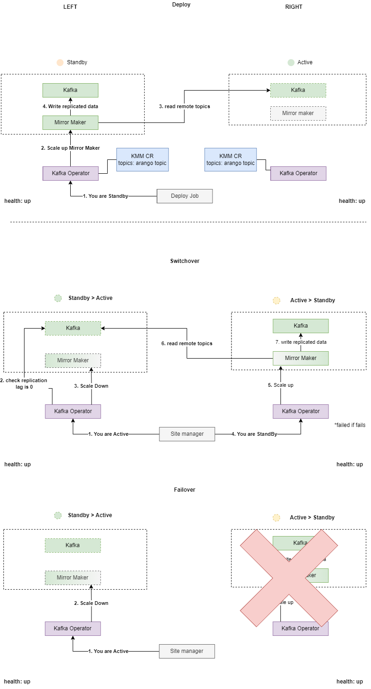
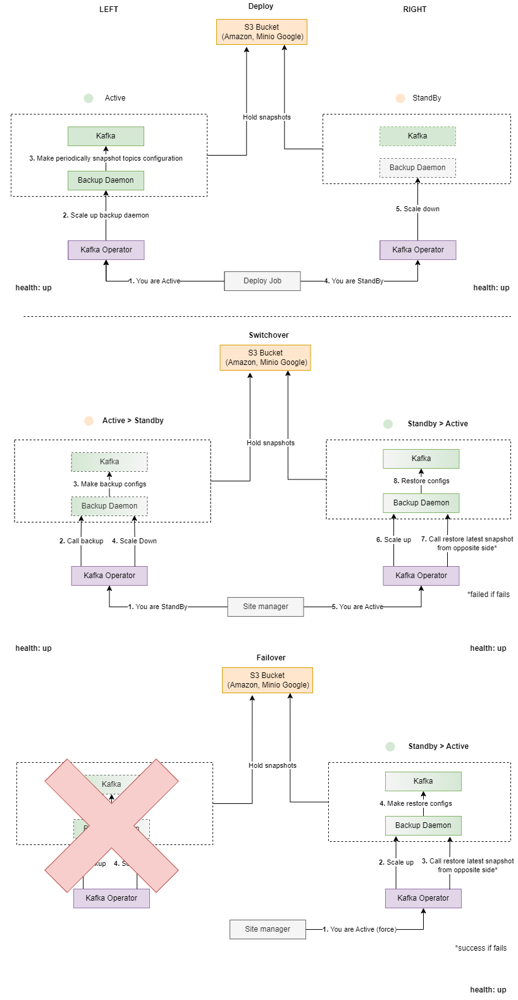

The section provides information about Disaster Recovery in Kafka service.

The topics covered in this section are:

- [Common Information](#common-information)
  - [Kafka Mirror Maker Replication](#kafka-mirror-maker-replication)
  - [Backup and Restore Topics Configuration](#backup-and-restore-topics-configuration)
- [Configuration](#configuration)
- [Google Kubernetes Engine Features](#google-kubernetes-engine-features)
- [Switchover](#switchover)
- [REST API](#rest-api)
- [Detected Problems](#detected-problems)

# Common Information

The Disaster Recovery scheme implies two separate Kafka clusters, one of which is in the `active` mode, and the other is in
the `standby` mode. The ZooKeeper clusters should be installed on both sides in the same mode as the corresponding Kafka cluster.

There are 2 options for the Kafka Disaster Recovery:

* Kafka Mirror Maker replication
* Backup and Restore topics configuration

The necessary option can be selected on deploy step. It is not recommended selecting both options.

## Kafka Mirror Maker Replication

This option enables additional service `Kafka Mirror Maker` on `standby` side which replicates messages and consumer offsets from
remote `active` Kafka to local `standby` Kafka.



The set of topics to replicate can be specified in config map `kafka-kmm-config` or with creating custom resource `KmmConfig`,
more info in [KMM Configuration Guide](kmmConfigurator.md).

**Important**: Please do not configure custom transformations that may exclude messages from replication or change their topic name because
it affects replication check during switchover process.

In case of switchover the Kafka operator waits for all data to be replicated from previous `active` side and then switches the direction of
replication.
In case of failover the Kafka operator does not wait and switches `active` side.

By design, Kafka Mirror Maker has naming convention for replicated topics that implies additional alias at the beginning
of the replicated topics. But in Disaster Recovery scheme it is important to replicate topic names as-is. For this purpose
[Mirror Maker 2 Extensions](https://github.com/strimzi/mirror-maker-2-extensions) library created by [Strimzi](https://strimzi.io)
is added to Kafka Mirror Maker docker image.

In Disaster Recovery scheme the following parameter is automatically added to the Kafka Mirror Maker configuration and overrides the default
behaviour with topic aliases:

```text
replication.policy.class = io.strimzi.kafka.connect.mirror.IdentityReplicationPolicy
```

Moreover, only in Disaster Recovery scheme replication is enabled by default.

By default, the Kafka Mirror Maker records in replicated topics are duplicated. To synchronize groups offsets between Kafka clusters,
the following parameters are added:

```text
emit.checkpoints.enabled = true
emit.checkpoints.interval.seconds = 5
sync.group.offsets.enabled = true
sync.group.offsets.interval.seconds = 5
```

**Pay attention**, the above parameters leave a `lag` of 5 seconds between Kafka clusters. 

If you need to further reduce the `lag`, specify the necessary values for the `emit.checkpoints.interval.seconds` 
and `sync.group.offsets.interval.seconds` parameters in the Kafka Mirror Maker configuration.

To enable this option you need to set property `global.disasterRecovery.mirrorMakerReplication.enabled` to `true`.

## Backup and Restore Topics Configuration

This option allows making backups of topics configurations on `active` side before switching and then to restore them on `standby` side.
It also performs periodically backups on `active` side.



The Kafka backup and restore procedure backups all topics configurations (messages are not a part of backup) and restore only new topics
(existing topics are not updating). Restore also does not remove topics.

In case of switchover the Kafka operator waits the backup was performed successfully on `active` side and then was successfully restored on
`standby` side.
In case of failover the Kafka operator does not guarantee last backup to be restored.

To enable this option you need to set property `global.disasterRecovery.topicsBackup.enabled` to `true`.

# Prerequisites

* `SiteManager` CRD should be deployed before installation.
* For `Topics Backup` mode there should be S3 storage with replication between sides or shared storage available for both sides.
* For `Mirror Maker` mode there should be pod-to-service communications cross Kubernetes DR clusters.

Other prerequisites are specified in corresponding sections below.

# Configuration

The Disaster Recovery (DR) configuration requires two separate Kafka clusters installed on two Kubernetes/OpenShift clusters.
First, you need to configure the parameters for Kafka and all the components that you need to deploy to cloud.
Then, pay attention to the following steps that are significant for Disaster Recovery configuration:

1. The parameter that enables the DR scheme has to be set.
   You need to decide in advance about the mode, `active`, `standby` or `disabled` that is used during current Kafka cluster installation
   and set the value in the following parameters:

    ```yaml
    global:
      ...
      disasterRecovery:
        mode: "active"
        region: "us-central"
    ```

2. The parameter that describes services after which Kafka service switchover has to be run.

    ```yaml
    global:
      ...
      disasterRecovery:
        afterServices: ["zookeeper"]
    ```

3. In DR scheme with enabled `mirrorMakerReplication`, Kafka should be deployed with external access configured.
   You need to specify the following parameters in the Kafka configuration:

   ```yaml
     externalHostNames:
       - <KAFKA_1_EXTERNAL_HOST>
       - ...
       - <KAFKA_N_EXTERNAL_HOST>
     externalPorts:
       - <KAFKA_1_EXTERNAL_PORT>
       - ...
       - <KAFKA_N_EXTERNAL_PORT>
   ```

   Where:

   * `<N>` is the number of Kafka brokers. By default, it is equal to `3`.
   * `<KAFKA_N_EXTERNAL_HOST>` is the full path to the external service created for `kafka-<N>` broker.
     For example, `kafka-1.kafka-service.svc.cluster-1.local`.
   * `<KAFKA_N_EXTERNAL_PORT>` is the advertised service port for external access to `kafka-<N>` broker.
     By default, the value for this parameter is `9094`.

4. In DR scheme with enabled `mirrorMakerReplication`, Kafka Mirror Maker should be deployed (otherwise, it should be disabled),
   and its configuration should contain the following important parameters:

   ```yaml
   mirrorMaker:
     install: true
     regionName: "dc1"
     clusters:
       - {"name": "dc1", "bootstrapServers": "<DC1_INTERNAL_KAFKA>", "username": "<DC1_KAFKA_USERNAME>", "password": "<DC1_KAFKA_PASSWORD>"}
       - {"name": "dc2", "bootstrapServers": "<DC2_EXTERNAL_KAFKA>", "username": "<DC2_KAFKA_USERNAME>", "password": "<DC2_KAFKA_PASSWORD>"}
     topicsToReplicate: "<TOPICS_TO_REPLICATE>"
   ```

   Where:
   * `<DC1_INTERNAL_KAFKA>` is the internal address to the Kafka located in the current cluster. For example, ```kafka.kafka-service:9092```.
   * `<DC2_EXTERNAL_KAFKA>` is the external address to the Kafka located in the remote cluster. For example, ```kafka.kafka-service.svc.cluster-2.local:9094```.
   * `<DC1_KAFKA_USERNAME>` is the username for authentication in the current Kafka cluster.
   * `<DC1_KAFKA_PASSWORD>` is the password for authentication in the current Kafka cluster.
   * `<DC2_KAFKA_USERNAME>` is the username for authentication in the remote Kafka cluster.
   * `<DC2_KAFKA_PASSWORD>` is the password for authentication in the remote Kafka cluster.
   * `<TOPICS_TO_REPLICATE>` is the regular expression or comma-separated list of topics to be replicated from `active` to `standby` Kafka cluster.

   **Note**: When specifying bootstrap servers for the remote cluster, you can specify common external address to Kafka or comma-separated
   list of external addresses for Kafka brokers. **Pay attention**, the remote cluster description should always contain external address
   and port.

5. In DR scheme with enabled `mirrorMakerReplication`, if you have services that demand on the topics replication in Kafka, in corresponding
   service you should configure a `KmmConfig` resource with the names of the topics to be replicated and specify the following parameter in
   the Kafka service configuration:

    ```yaml
    operator:
      ...
      kmmConfiguratorEnabled: true
    ```
   
   For more information about KMM Configurator, refer to the **[KMM Configurator](kmmConfigurator.md)**.

6. In DR scheme with enabled `topicsBackup`, Kafka Backup Daemon should be deployed with S3 support:

    ```yaml
    backupDaemon:
      install: true
      s3:
        enabled: true
        url: "https://s3.storage.com"
        bucket: "kafka-dr"
    ```

For more information about Kafka service parameters, refer to the **[Parameters](installation.md#parameters)** section in the
_Kafka Service Installation Guide_.

## Example

You want to install Kafka service in Disaster Recovery scheme. Each Kafka cluster is located in `kafka-service` namespace,
has secured Kafka with 3 brokers, AKHQ and Kafka Mirror Maker. Both Kubernetes/OpenShift clusters have pre-installed secured ZooKeeper in 
`zookeeper-service` namespace.

**Kafka Mirror Maker Replication**

The configuration for `active` Kafka cluster is as follows:

```yaml
global:
  name: kafka

  disasterRecovery:
    mode: "active"
    mirrorMakerReplication:
      enabled: true
    topicsBackup:
      enabled: false

  secrets:
    kafka:
      disableSecurity: false
      adminUsername: "admin"
      adminPassword: "admin"
      clientUsername: "client"
      clientPassword: "client"
      zookeeperClientUsername: "zclient"
      zookeeperClientPassword: "zclient"
    akhq:
      defaultUsername: "admin"
      defaultPassword: "admin"
    mirrorMaker:
      jolokiaUsername: "admin"
      jolokiaPassword: "admin"

operator:
  kmmConfiguratorEnabled: true

kafka:
  install: true
  replicas: 3
  storage:
    size: 2Gi
    className:
      - storage
  zookeeperConnect: zookeeper.zookeeper-service:2181
  externalHostNames:
    - kafka-1.kafka-service.svc.cluster-1.local
    - kafka-2.kafka-service.svc.cluster-1.local
    - kafka-3.kafka-service.svc.cluster-1.local
  externalPorts:
    - 9094
    - 9094
    - 9094

monitoring:
  install: false

akhq:
  install: true
  ingress:
    host: akhq-kafka-service.cloud.openshift.sdntest.example.com

mirrorMaker:
  install: true
  replicas: 1
  regionName: "dc1"
  clusters:
    - {"name": "dc1", "bootstrapServers": "kafka.kafka-service:9092", "username": "client", "password": "client"}
    - {"name": "dc2", "bootstrapServers": "kafka.kafka-service.svc.cluster-2.local:9094", "username": "client", "password": "client"}
  topicsToReplicate: "topic1,topic2,topic3"
  replicationFactor: 3
```

The configuration for `standby` Kafka cluster is as follows:

```yaml
global:
  name: kafka

  disasterRecovery:
    mode: "standby"
    mirrorMakerReplication:
      enabled: true
    topicsBackup:
      enabled: false

  secrets:
    kafka:
      disableSecurity: false
      adminUsername: "admin"
      adminPassword: "admin"
      clientUsername: "client"
      clientPassword: "client"
      zookeeperClientUsername: "zclient"
      zookeeperClientPassword: "zclient"
    akhq:
      defaultUsername: "admin"
      defaultPassword: "admin"
    mirrorMaker:
      jolokiaUsername: "admin"
      jolokiaPassword: "admin"

operator:
  kmmConfiguratorEnabled: true

kafka:
  install: true
  replicas: 3
  storage:
    size: 2Gi
    className:
      - storage
  zookeeperConnect: zookeeper.zookeeper-service:2181
  externalHostNames:
    - kafka-1.kafka-service.svc.cluster-2.local
    - kafka-2.kafka-service.svc.cluster-2.local
    - kafka-3.kafka-service.svc.cluster-2.local
  externalPorts:
    - 9094
    - 9094
    - 9094

monitoring:
  install: false

akhq:
  install: true
  ingress:
    host: akhq-kafka-service.cloud.openshift.sdntest.example.com

mirrorMaker:
  install: true
  replicas: 1
  regionName: "dc2"
  clusters:
    - {"name": "dc1", "bootstrapServers": "kafka.kafka-service.svc.cluster-1.local:9094", "username": "client", "password": "client"}
    - {"name": "dc2", "bootstrapServers": "kafka.kafka-service:9092", "username": "client", "password": "client"}
  topicsToReplicate: "topic.*"
  replicationFactor: 3
```

**Backup and Restore Topics Configuration**

The configuration for `active` Kafka cluster is as follows:

```yaml
global:
  name: kafka

  disasterRecovery:
    mode: "active"
    region: "us-central"
    mirrorMakerReplication:
      enabled: false
    topicsBackup:
      enabled: true

  secrets:
    kafka:
      disableSecurity: false
      adminUsername: "admin"
      adminPassword: "admin"
      clientUsername: "client"
      clientPassword: "client"
      zookeeperClientUsername: "zclient"
      zookeeperClientPassword: "zclient"
    akhq:
      defaultUsername: "admin"
      defaultPassword: "admin"
    backupDaemon:
      username: "admin"
      password: "admin"
      s3:
        keyId: "s3key"
        keySecret: "s3secret"

operator:
  kmmConfiguratorEnabled: true

kafka:
  install: true
  replicas: 3
  storage:
    size: 2Gi
    className:
      - storage
  zookeeperConnect: zookeeper.zookeeper-service:2181

monitoring:
  install: false

akhq:
  install: true
  ingress:
    host: akhq-kafka-service.cloud.openshift.sdntest.example.com

backupDaemon:
  install: true
  backupSchedule: "*/15 * * * *"
  s3:
    enabled: true
    url: "https://s3.storage.com"
    bucket: "kafka-dr"
```

The configuration for `standby` Kafka cluster is as follows:

```yaml
global:
  name: kafka

  disasterRecovery:
    mode: "standby"
    region: "europe"
    mirrorMakerReplication:
      enabled: false
    topicsBackup:
      enabled: true

  secrets:
    kafka:
      disableSecurity: false
      adminUsername: "admin"
      adminPassword: "admin"
      clientUsername: "client"
      clientPassword: "client"
      zookeeperClientUsername: "zclient"
      zookeeperClientPassword: "zclient"
    akhq:
      defaultUsername: "admin"
      defaultPassword: "admin"
    backupDaemon:
      username: "admin"
      password: "admin"
      s3:
        keyId: "s3key"
        keySecret: "s3secret"

operator:
  kmmConfiguratorEnabled: true

kafka:
  install: true
  replicas: 3
  storage:
    size: 2Gi
    className:
      - storage
  zookeeperConnect: zookeeper.zookeeper-service:2181

monitoring:
  install: false

akhq:
  install: true
  ingress:
    host: akhq-kafka-service.cloud.openshift.sdntest.example.com

backupDaemon:
  install: true
  backupSchedule: "*/15 * * * *"
  s3:
    enabled: true
    url: "https://s3.storage.com"
    bucket: "kafka-dr"
```

# Google Kubernetes Engine Features

To deploy Kafka with enabled MCS support you need to follow the points:

* Kafka Service should be deployed to namespaces with the same names for both clusters. MCS works only if namespace is presented for both
  Kubernetes clusters.
* Fill parameter `global.disasterRecovery.serviceExport.enabled` to `true` (for enabled `mirrorMakerReplication`).
* Fill Parameter `global.disasterRecovery.region` to GKE region (e.g. `us-central`). It means you will have different additional external
  service names to access Kafka for both clusters. The name of external service is build as `{kafka name}-{region name}`,
  e.g. `kafka-us-central` and `kafka-us-central-1[2,3]` for brokers.
* Fill parameters `kafka.externalHostNames` and `mirrorMaker.clusters` with addresses in MCS domain `clusterset`,
  e.g. `kafka-us-central.kafka-service.svc.clusterset.local` (for enabled `mirrorMakerReplication`).
* Prepare Google Storage S3 bucket and service account key and secret (for enabled `topicsBackup`).

**NOTE:** The examples below describe config with enabled Kafka Mirror Maker replication and backup restore topics configurations.
It is not recommended enabling both these options. You need to disable and remove not needed parameters.

The example of configuration for `active` Kafka cluster on `us-central` region is as follows:

```yaml
global:
  name: kafka

  disasterRecovery:
    mode: "active"
    region: "us-central"
    mirrorMakerReplication:
      enabled: true
    topicsBackup:
      enabled: true
    serviceExport:
      enabled: true

  secrets:
    kafka:
      disableSecurity: false
      adminUsername: "admin"
      adminPassword: "admin"
      clientUsername: "client"
      clientPassword: "client"
    mirrorMaker:
      jolokiaUsername: "admin"
      jolokiaPassword: "admin"
    backupDaemon:
      username: "admin"
      password: "admin"
      s3:
        keyId: "s3key"
        keySecret: "s3secret"

operator:
  kmmConfiguratorEnabled: true

kafka:
  install: true
  replicas: 3
  storage:
    size: 2Gi
    className:
      - standard
  zookeeperConnect: zookeeper.zookeeper-service:2181
  externalHostNames:
    - kafka-us-central-1.kafka-service.svc.clusterset.local
    - kafka-us-central-2.kafka-service.svc.clusterset.local
    - kafka-us-central-3.kafka-service.svc.clusterset.local
  externalPorts:
    - 9094
    - 9094
    - 9094
  healthCheckTimeout: 15
  securityContext: {
    "fsGroup": 1000,
    "runAsUser": 1000
  }

mirrorMaker:
  install: true
  replicas: 1
  regionName: "dc1"
  clusters:
    - {"name": "dc1", "bootstrapServers": "kafka.kafka-service:9092", "username": "client", "password": "client"}
    - {"name": "dc2", "bootstrapServers": "kafka-northamerica.kafka-service.svc.clusterset.local:9094", "username": "client", "password": "client"}
  replicationFactor: 3

backupDaemon:
  install: true
  backupSchedule: "*/15 * * * *"
  s3:
    enabled: true
    url: "https://storage.googleapis.com"
    bucket: "kafka-dr"
```

The example of configuration for `standby` Kafka cluster on `northamerica` region is as follows:

```yaml
global:
  name: kafka

  disasterRecovery:
    mode: "standby"
    region: "northamerica"
    mirrorMakerReplication:
      enabled: true
    topicsBackup:
      enabled: true
    serviceExport:
      enabled: true

  secrets:
    kafka:
      disableSecurity: false
      adminUsername: "admin"
      adminPassword: "admin"
      clientUsername: "client"
      clientPassword: "client"
    mirrorMaker:
      jolokiaUsername: "admin"
      jolokiaPassword: "admin"

operator:
  kmmConfiguratorEnabled: true

kafka:
  install: true
  replicas: 3
  storage:
    size: 2Gi
    className:
      - standard
  zookeeperConnect: zookeeper.zookeeper-service:2181
  externalHostNames:
    - kafka-northamerica-1.kafka-service.svc.clusterset.local
    - kafka-northamerica-2.kafka-service.svc.clusterset.local
    - kafka-northamerica-3.kafka-service.svc.clusterset.local
  externalPorts:
    - 9094
    - 9094
    - 9094
  healthCheckTimeout: 15
  securityContext: {
    "fsGroup": 1000,
    "runAsUser": 1000
  }

mirrorMaker:
  install: true
  replicas: 1
  regionName: "dc2"
  clusters:
    - {"name": "dc1", "bootstrapServers": "kafka-us-central.kafka-service.svc.clusterset.local:9094", "username": "client", "password": "client"}
    - {"name": "dc2", "bootstrapServers": "kafka.kafka-service:9092", "username": "client", "password": "client"}
  replicationFactor: 3

backupDaemon:
  install: true
  backupSchedule: "*/15 * * * *"
  s3:
    enabled: true
    url: "https://storage.googleapis.com"
    bucket: "kafka-dr"
```

**NOTE:** MCS feature can work unstable, sometimes it requires redeployment if connectivity between clusters is not established.

# Switchover

You can perform the switchover using the `SiteManager` functionality or Kafka disaster recovery REST server API.

<!-- #GFCFilterMarkerStart# -->
For more information about `SiteManager`, refer to 
[Site Manager](https://github.com/Netcracker/DRNavigator/tree/main/README.md) article.
<!-- #GFCFilterMarkerEnd# -->

If you want to perform a switchover manually, you need to switch `standby` Kafka cluster to `active` mode and then switch `active`
Kafka cluster to `standby` mode. You need to run the following command from within any Kafka pod on the `standby` side:

```sh
curl -XPOST -H "Content-Type: application/json" http://kafka-site-manager.<NAMESPACE>:8080/sitemanager -d '{"mode":"active"}'
```

Then you should run the following command from within any Kafka pod on the `active` side:

```sh
curl -XPOST -H "Content-Type: application/json" http://kafka-site-manager.<NAMESPACE>:8080/sitemanager -d '{"mode":"standby"}'
```

Where `<NAMESPACE>` is the OpenShift/Kubernetes project/namespace of the Kafka cluster side. For example, `kafka-service`.

**NOTE:** If TLS for Disaster Recovery is enabled (`global.tls.enabled` and `global.disasterRecovery.tls.enabled` parameters are set to
`true`), use `https` protocol and `8443` port in API requests rather than `http` protocol and `8080` port.

For more information about Kafka disaster recovery REST server API, see [REST API](#rest-api).

# REST API

Kafka disaster recovery REST server provides three methods of interaction:

* `GET` `healthz` method allows finding out the state of the current Kafka cluster side. If the current Kafka cluster side is `active` or
  `disabled`, only Kafka state is checked. If the current Kafka cluster side is `standby`,
  the Kafka Mirror Maker state is additionally checked. You can run this method from within any Kafka pod as follows:

  ```sh
  curl -XGET http://kafka-site-manager.<NAMESPACE>:8080/healthz
  ```

  Where `<NAMESPACE>` is the OpenShift/Kubernetes project/namespace of the Kafka cluster side. For example, `kafka-service`.

  All Kafka Service disaster recovery REST server endpoints can be secured via Kubernetes JWT Service Account Tokens.
  To enable disaster recovery REST server authentication the `global.disasterRecovery.httpAuth.enabled` deployment parameter must be `true`.
  The example for secured `healthz` endpoint is following:

  ```sh
  curl -XGET -H "Authorization: Bearer <TOKEN>" http://kafka-site-manager.<NAMESPACE>:8080/healthz
  ```

  Where `TOKEN` is Site Manager Kubernetes JWT Service Account Token. The verification service account name and namespace are specified 
  in `global.disasterRecovery.httpAuth.smServiceAccountName` and `global.disasterRecovery.httpAuth.smNamespace` deploy parameters.

  The response to such a request is as follows:

  ```json
  {"status":"up"}
  ```

  Where:
  * `status` is the current state of the Kafka cluster side. The four possible status values are as follows:
    * `up` - All Kafka and Kafka Mirror Maker deployments are ready.
    * `degraded` - Some of Kafka deployments are not ready or Kafka Mirror Maker deployment is not ready.
    * `down` - All Kafka deployments are not ready.
    * `disabled` - The Kafka service is switched off.

* `GET` `sitemanager` method allows finding out the mode of the current Kafka cluster side and the actual state of the switchover procedure.
  You can run this method from within any Kafka pod as follows:

  ```sh
  curl -XGET http://kafka-site-manager.<NAMESPACE>:8080/sitemanager
  ```

  Where `<NAMESPACE>` is the OpenShift/Kubernetes project/namespace of the Kafka cluster side. For example, `kafka-service`.

  All Kafka Service disaster recovery REST server endpoints can be secured via Kubernetes JWT Service Account Tokens.
  To enable disaster recovery REST server authentication the `global.disasterRecovery.httpAuth.enabled` deployment parameter must be `true`.
  The example for secured `sitemanager` GET endpoint is following:

  ```sh
  curl -XGET -H "Authorization: Bearer <TOKEN>" http://kafka-site-manager.<NAMESPACE>:8080/sitemanager
  ```

  Where `TOKEN` is Site Manager Kubernetes JWT Service Account Token. The verification service account name and namespace are specified in
  `global.disasterRecovery.httpAuth.smServiceAccountName` and `global.disasterRecovery.httpAuth.smNamespace` deploy parameters.

  The response to such a request is as follows:

  ```json
  {"mode":"standby","status":"done"}
  ```

  Where:
  * `mode` is the mode in which the Kafka cluster side is deployed. The possible mode values are as follows:
    * `active` - Kafka accepts external requests from clients.
    * `standby` - Kafka does not accept external requests from clients and replication from `active` Kafka is enabled.
    * `disabled` - Kafka does not accept external requests from clients and replication from `active` Kafka is disabled.
  * `status` is the current state of switchover for the Kafka cluster side. The three possible status values are as follows:
    * `running` - The switchover is in progress.
    * `done` - The switchover is successful.
    * `failed` - Something went wrong during the switchover.
  * `comment` is the message which contains a detailed description of the problem and is only filled out if the `status` value is `failed`.

* `POST` `sitemanager` method allows switching mode for the current side of Kafka cluster. You can run this method from within any Kafka pod
  as follows:

  ```sh
  curl -XPOST -H "Content-Type: application/json" http://kafka-site-manager.<NAMESPACE>:8080/sitemanager -d '{"mode":"<MODE>"}'
  ```

  Where:
  * `<NAMESPACE>` is the OpenShift/Kubernetes project/namespace of the Kafka cluster side. For example, `kafka-service`.
  * `<MODE>` is the mode to be applied to the Kafka cluster side. The possible mode values are as follows:
    * `active` - Kafka accepts external requests from clients.
    * `standby` - Kafka does not accept external requests from clients and replication from `active` Kafka is enabled.
    * `disabled` - Kafka does not accept external requests from clients and replication from `active` Kafka is disabled.

  All Kafka Service disaster recovery REST server endpoints can be secured via Kubernetes JWT Service Account Tokens.
  To enable disaster recovery REST server authentication the `global.disasterRecovery.httpAuth.enabled` deployment parameter must be `true`.
  The example for secured `sitemanager` POST endpoint is following:

  ```sh
  curl -XPOST -H "Content-Type: application/json, Authorization: Bearer <TOKEN>" http://kafka-site-manager.<NAMESPACE>:8080/sitemanager
  ```

  Where `TOKEN` is Site Manager Kubernetes JWT Service Account Token. The verification service account name and namespace are specified in
  `global.disasterRecovery.httpAuth.smServiceAccountName` and `global.disasterRecovery.httpAuth.smNamespace` deploy parameters.

  The response to such a request is as follows:

  ```json
  {"mode":"standby"}
  ```

  Where:
  * `mode` is the mode which is applied to the Kafka cluster side. The possible values are `active`, `standby` and `disabled`.
  * `status` is the state of the request on the REST server. The only possible value is `failed`, when something goes wrong while processing
     the request.
  * `comment` is the message which contains a detailed description of the problem and is only filled out if the `status` value is `failed`.

**NOTE:** If TLS for Disaster Recovery is enabled (`global.tls.enabled` and `global.disasterRecovery.tls.enabled` parameters are set 
to `true`), use `https` protocol and `8443` port in API requests rather than `http` protocol and `8080` port.  

# Detected Problems

While working, you may encounter the following problems:

* Kafka in `standby` mode continues to accept requests and writes data. At the moment, access to Kafka in `standby` mode is not restricted,
  so clients should independently switch to the `active` side.
* No guarantee that before a switchover all records are moved from the `active` to the `standby` Kafka side.
* Enabling both modes `disasterRecovery.mirrorMakerReplication.enabled` and `disasterRecovery.topicsBackup.enabled` can cause data
  duplication, because of different replication sequence during switchover scenario.

## Troubleshooting Backup Switchover

If switchover or any other DR operation for enabled `disasterRecovery.topicsBackup.enabled` failed you can try to execute it again for this 
service only.
The DR feature supports retry if operation has not been finished successfully.
You can do it with SiteManager Client or [REST API](#rest-api) described above.
You need to execute it in the sequence `active -> standby` first, `standby -> active` then.
To skip replication validation you can add `"no-wait": true` parameter to `/sitemanager` request's body.

If the automatic switchover operation for active side failed you can also try to perform it manually:

1. Open terminal for `kafka-backup-daemon` pod (scale up it if necessary).
2. Get the list of available backups (vaultIds) using Backup Daemon REST API.
   For example, `curl -u admin:admin -XGET localhost:8080/listbackups`.
3. Find the latest full backup (`"db_list": full backup"`) from another region (`custom_vars.region`).
   For example, `curl -u admin:admin -XGET localhost:8080/listbackups/20210913T1114`.
4. Try to restore it. For example,
   `curl -XPOST -u username:password -v -H "Content-Type: application/json" -d  '{"vault":"20210913T1114"}' localhost:8080/restore`.
5. Check restore job using id you got on previous step status to make sure it finished successfully.
   For example, `curl -u admin:admin -XGET localhost:8080/listbackups/fcds677s826-18s73ds5-smof788`.
