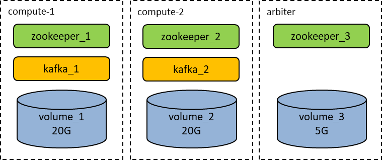

The following topics are covered in this chapter:

<!-- TOC -->
* [General Information](#general-information)
* [Prerequisites](#prerequisites)
  * [Common](#common)
    * [Custom Resource Definitions](#custom-resource-definitions)
      * [KafkaUsers CRD](#kafkausers-crd)
    * [Deployment Permissions](#deployment-permissions)
    * [Pre-deployment Resources](#pre-deployment-resources)
      * [Kafka Service Operator Roles](#kafka-service-operator-roles)
        * [Acceptance Criteria](#acceptance-criteria)
        * [Resources](#resources)
        * [To do](#to-do)
      * [CRD-Init job](#crd-init-job)
        * [Acceptance Criteria](#acceptance-criteria-1)
        * [Resources](#resources-1)
    * [Multiple Availability Zone](#multiple-availability-zone)
  * [Storage](#storage)
    * [Disk Requirements](#disk-requirements)
    * [Permissions](#permissions)
  * [Kubernetes](#kubernetes)
  * [OpenShift](#openshift)
  * [Google Cloud](#google-cloud)
  * [AWS](#aws)
* [Best Practices and Recommendations](#best-practices-and-recommendations)
  * [Kafka Configurations](#kafka-configurations)
    * [Automatic Topic Creation](#automatic-topic-creation)
  * [HWE](#hwe)
    * [Small](#small)
    * [Medium](#medium)
    * [Large](#large)
    * [XLarge](#xlarge)
  * [Topic Configurations](#topic-configurations)
    * [Partitions Number](#partitions-number)
  * [Performance Optimization](#performance-optimization)
* [Parameters](#parameters)
  * [Cloud Integration Parameters](#cloud-integration-parameters)
  * [Global](#global)
    * [External Kafka](#external-kafka)
    * [Disaster Recovery](#disaster-recovery)
    * [Secrets](#secrets)
  * [Operator](#operator)
  * [Kafka](#kafka)
  * [Monitoring](#monitoring)
    * [Lag Exporter](#lag-exporter)
  * [AKHQ](#akhq)
  * [Mirror Maker](#mirror-maker)
  * [Mirror Maker Monitoring](#mirror-maker-monitoring)
  * [Integration Tests](#integration-tests)
    * [Integration test tags description](#integration-test-tags-description)
  * [Backup Daemon](#backup-daemon)
  * [Cruise Control](#cruise-control)
  * [CRD-Init job](#crd-init-job-1)
* [Installation](#installation)
  * [Before You Begin](#before-you-begin)
  * [On-Prem Examples](#on-prem-examples)
    * [HA Scheme](#ha-scheme)
    * [DR scheme](#dr-scheme)
  * [Google Cloud Examples](#google-cloud-examples)
    * [HA Scheme](#ha-scheme-1)
    * [DR Scheme](#dr-scheme-1)
  * [AWS Examples](#aws-examples)
    * [DR Scheme](#dr-scheme-2)
  * [Azure Examples](#azure-examples)
    * [HA Scheme](#ha-scheme-2)
    * [DR Scheme](#dr-scheme-3)
  * [Aiven Kafka](#aiven-kafka)
  * [KRaft](#kraft)
* [Upgrade](#upgrade)
  * [Common](#common-1)
  * [Scale-In Cluster](#scale-in-cluster)
  * [Rolling Upgrade](#rolling-upgrade)
  * [Secured Kafka Mirror Maker Credentials Migration](#secured-kafka-mirror-maker-credentials-migration)
  * [Helm](#helm)
    * [Manual Upgrade](#manual-upgrade)
    * [Manual Uninstalling](#manual-uninstalling)
  * [CRD Upgrade](#crd-upgrade)
  * [Automatic CRD Upgrade](#automatic-crd-upgrade)
  * [Custom Resource Definition Versioning](#custom-resource-definition-versioning)
    * [Apply New Custom Resource Definition Version](#apply-new-custom-resource-definition-version)
    * [Custom Resource Definition with Versioning](#custom-resource-definition-with-versioning)
    * [Custom Resource Definition without Versioning](#custom-resource-definition-without-versioning)
  * [Migration from Joint to Separate Deployment](#migration-from-joint-to-separate-deployment)
    * [Manual Way](#manual-way)
  * [HA to DR Scheme](#ha-to-dr-scheme)
* [Rollback](#rollback)
* [Additional Features](#additional-features)
  * [Cluster with Arbiter Node](#cluster-with-arbiter-node)
    * [Kafka](#kafka-1)
    * [ZooKeeper](#zookeeper)
  * [Kafka Mirror Maker Features](#kafka-mirror-maker-features)
    * [Update Existing Configuration](#update-existing-configuration)
    * [Redeploy with New Configuration](#redeploy-with-new-configuration)
  * [Multi-datacenter Deployment with Cross-datacenter Replication (XDCR)](#multi-datacenter-deployment-with-cross-datacenter-replication-xdcr)
    * [Multi-datacenter Prerequisites](#multi-datacenter-prerequisites)
    * [Mirror Maker deployment](#mirror-maker-deployment)
  * [Multiple Availability Zone Deployment](#multiple-availability-zone-deployment)
    * [Affinity](#affinity)
      * [Replicas Fewer than Availability Zones](#replicas-fewer-than-availability-zones)
    * [Replicas More than Availability Zones](#replicas-more-than-availability-zones)
  * [Broker Racks](#broker-racks)
* [Frequently Asked Questions](#frequently-asked-questions)
  * [What to do if a Kubernetes version is upgraded before application?](#what-to-do-if-a-kubernetes-version-is-upgraded-before-application)
  * [Deploy job failed with status check but application works fine](#deploy-job-failed-with-status-check-but-application-works-fine)
  * [Deploy job failed with unknown fields in kafkaservices.qubership.com](#deploy-job-failed-with-unknown-fields-in-kafkaservicesqubershipcom)
  * [Deploy job failed with some error in templates](#deploy-job-failed-with-some-error-in-templates)
  * [How to deploy several Kafka clusters with one ZooKeeper](#how-to-deploy-several-kafka-clusters-with-one-zookeeper)
<!-- TOC -->

# General Information

This section provides information about the steps to install and configure a Kafka cluster on OpenShift/Kubernetes using Helm.
The chart installs Kafka Service Operator, which manages Kafka, Kafka Monitoring, AKHQ and Kafka Mirror Maker in OpenShift/Kubernetes.

Kafka Service consists of two charts:

* `Kafka` contains only Apache Kafka deployment and its operator.
* `Kafka Services` contains service operator and other supplementary services like AKHQ, Backup Daemon, Cruise Control, Monitoring,
  Mirror Maker.

Both charts can be installed separately, but `Kafka` should be always initially installed before `Kafka Service`
(excluding [external managed Kafka scheme](#external-kafka), where `Kafka` is not installed at all). 

# Prerequisites

## Common

Before you start installation and configuration of Kafka cluster, ensure the following requirements are met:

* Kubernetes 1.21+ or OpenShift 4.10+
* `kubectl` 1.21+ or `oc` 4.10+ CLI
* Helm 3.0+
* All required CRDs are installed

### Custom Resource Definitions

The following Custom Resource Definitions should be installed to the cloud before installation of Kafka:

* `KafkaService` and `KmmConfig` - When you deploy with restricted rights or the CRDs creation is disabled by the Deployer job.
  More info in [Automatic CRD Upgrade](#automatic-crd-upgrade).
* `GrafanaDashboard`, `PrometheusRule`, and `ServiceMonitor` - It should be installed when you deploy Kafka monitoring with
  `global.monitoringType=prometheus`. You have to install the Monitoring Operator service before the Kafka installation.
* `SiteManager` - It is installed when you deploy Kafka with Disaster Recovery support (`global.disasterRecovery.mode`).
  You have to install the SiteManager service before the Kafka installation.

**Important**: To create CRDs, you must have cloud rights for `CustomResourceDefinitions`.
If the deployment user does not have necessary rights, you need to perform the steps described in
the [Deployment Permissions](#deployment-permissions) section before the installation.

**Note**: If you deploy Kafka Service to Kubernetes version less than 1.19, you have to manually install CRDs from:

* `config/crd/old/qubership.com_kafkaservices.yaml`
* `config/crd/old/qubership.com_kmmconfigs.yaml`

and disable automatic CRD creation by Helm.

#### KafkaUsers CRD

If you are going to perform an upgrade from `1.6.0` - `1.8.0` release to the newest one, and the Kafka User Configurator feature **wasn't 
used**, then you need to remove `KafkaUsers` CRD from the cluster before the upgrade.

### Deployment Permissions

To avoid using `cluster-wide` rights during the deployment, the following conditions are required:

* The cloud administrator creates the namespace/project in advance.

* The following grants should be provided for the `Role` of deployment user:

    <details>
    <summary>Click to expand YAML</summary>
    
    ```yaml
    rules:
      - apiGroups:
          - qubership.com
        resources:
          - "*"
        verbs:
          - create
          - get
          - list
          - patch
          - update
          - watch
          - delete
      - apiGroups:
          - ""
        resources:
          - pods
          - services
          - endpoints
          - persistentvolumeclaims
          - configmaps
          - secrets
          - pods/exec
          - pods/portforward
          - pods/attach
          - serviceaccounts
        verbs:
          - create
          - get
          - list
          - patch
          - update
          - watch
          - delete
      - apiGroups:
          - apps
        resources:
          - deployments
          - deployments/scale
          - deployments/status
        verbs:
          - create
          - get
          - list
          - patch
          - update
          - watch
          - delete
          - deletecollection
      - apiGroups:
          - batch
        resources:
          - jobs
        verbs:
          - create
          - get
          - list
          - patch
          - update
          - watch
          - delete
      - apiGroups:
          - ""
        resources:
          - events
        verbs:
          - create
      - apiGroups:
          - apps
        resources:
          - statefulsets
        verbs:
          - create
          - delete
          - get
          - list
          - patch
          - update
      - apiGroups:
          - networking.k8s.io
        resources:
          - ingresses
        verbs:
          - create
          - delete
          - get
          - list
          - patch
          - update
      - apiGroups:
          - rbac.authorization.k8s.io
        resources:
          - roles
          - rolebindings
        verbs:
          - create
          - delete
          - get
          - list
          - patch
          - update
      - apiGroups:
          - integreatly.org
        resources:
          - grafanadashboards
        verbs:
          - create
          - delete
          - get
          - list
          - patch
          - update
      - apiGroups:
          - monitoring.coreos.com
        resources:
          - servicemonitors
          - prometheusrules
        verbs:
          - create
          - delete
          - get
          - list
          - patch
          - update
    ```

    </details>

The following rules require `cluster-wide` permissions.
If it is not possible to provide them to the deployment user, you have to apply the resources manually.

* If Kafka is installed in the disaster recovery mode and authentication on disaster recovery server is enabled,
  cluster role binding for `system:auth-delegator` role must be created.

  ```yaml
  kind: ClusterRoleBinding
  apiVersion: rbac.authorization.k8s.io/v1
  metadata:
    name: token-review-crb-NAMESPACE
  subjects:
    - kind: ServiceAccount
      name: kafka-service-operator
      namespace: NAMESPACE
  roleRef:
    apiGroup: rbac.authorization.k8s.io
    kind: ClusterRole
    name: system:auth-delegator
  ```

* If `integrationTests.install` is set to true and `integrationTests.zookeeperOsProject` is different from Kafka namespace the following
  grants should be provided for the `Role` of deployment user.

    <details>
    <summary>Click to expand YAML</summary>

  ```yaml
  kind: Role
  apiVersion: rbac.authorization.k8s.io/v1
  metadata:
    name: kafka-zookeeper-role
    namespace: ZOOKEEPER_NAMESPACE
  rules:
    - apiGroups:
        - rbac.authorization.k8s.io
      resources:
        - roles
        - rolebindings
      verbs:
        - create
        - delete
        - get
        - list
        - patch
        - update
    - apiGroups:
        - apps
      resources:
        - deployments
        - deployments/scale
        - statefulsets
      verbs:
        - get
        - list
        - patch
        - update
        - watch
    - apiGroups:
        - ""
      resources:
        - services
      verbs:
        - get
        - list
  ```

  </details>

* To avoid applying manual CRD the following grants should be provided for the `ClusterRole` of deployment user:

  ```yaml
    rules:
      - apiGroups: ["apiextensions.k8s.io"]
        resources: ["customresourcedefinitions"]
        verbs: ["get", "create", "patch"]
    ```

* If `operator.kmmConfiguratorEnabled` is set to `true` the following grants should be provided for the `ClusterRole` of deployment user:

    ```yaml
    rules:
    - apiGroups:
        - qubership.com
      resources:
        - kmmconfigs
        - kmmconfigs/status
      verbs:
        - get
        - list
        - watch
        - create
        - update
        - patch
    - apiGroups:
        - ""
      resources:
        - configmaps
      verbs:
        - list
        - watch
    ```

* If `operator.akhqConfigurator.enabled` is set to `true` the following grants should be provided for the `ClusterRole` of deployment user:
    
    ```yaml
    rules:
    - apiGroups:
        - qubership.com
      resources:
        - akhqconfigs
        - akhqconfigs/status
      verbs:
        - get
        - list
        - watch
        - create
        - update
        - patch
    - apiGroups:
        - ""
      resources:
        - configmaps
      verbs:
        - list
        - watch
    ```

* If `operator.kafkaUserConfigurator.enabled` is set to `true` the following grants should be provided for the `ClusterRole` of deployment
  user:

    ```yaml
    rules:
    - apiGroups:
        - qubership.com
      resources:
        - kafkausers
        - kafkausers/status
      verbs:
        - get
        - list
        - watch
        - create
        - update
        - patch
    - apiGroups:
        - ""
      resources:
        - configmaps
      verbs:
        - list
        - watch
    ```

* If `kafka.getRacksFromNodeLabels` is set to `true` the following grants should be provided for the `ClusterRole` of deployment user:

   ```yaml
    - apiGroups:
        - ""
      resources:
        - nodes
      verbs:
        - get
        - list
        - watch
   ```

### Pre-deployment Resources

If it is impossible to provide rights for Role or Role Binding to deployment user, then
need to create that resources before running deploy job.

#### Kafka Service Operator Roles

##### Acceptance Criteria

* `global.restrictedEnvironment` is `true`.
* At least **one** of the `operator.kmmConfiguratorEnabled`, `operator.akhqConfigurator.enabled` parameters is `true`.
* `DISABLE_CRD` is `false`.

##### Resources

* Cluster role:

  ```yaml
  kind: ClusterRole
  apiVersion: rbac.authorization.k8s.io/v1
  metadata:
    name: <NAMESPACE>-service-operator-clusterrole
  rules:
  #kafkaUserConfigurator permissions
    - apiGroups:
        - qubership.com
      resources:
        - kafkausers
        - kafkausers/status
        - kmmconfigs
        - kmmconfigs/status
        - akhqconfigs
        - akhqconfigs/status
      verbs:
        - get
        - list
        - watch
        - create
        - update
        - patch
    - apiGroups:
        - ""
      resources:
        - secrets
      verbs:
        - get
        - list
        - watch
        - create
  #kmmConfigurator permissions
    - apiGroups:
        - ""
      resources:
        - configmaps
      verbs:
        - list
        - watch
  ```

* Cluster Role Binding:

  ```yaml
  kind: ClusterRoleBinding
  apiVersion: rbac.authorization.k8s.io/v1
  metadata:
    name: <NAMESPACE>-service-operator-clusterrolebinding
  subjects:
    - kind: ServiceAccount
      name: kafka-service-operator
      namespace: <NAMESPACE>
  roleRef:
    kind: ClusterRole
    name: <NAMESPACE>-service-operator-clusterrole
    apiGroup: rbac.authorization.k8s.io
  ```

##### To do

* Pre-create `kafka-service-operator-clusterrole` and `kafka-service-operator-clusterrolebinding`.
* Link with `kafka-service-operator` service account via `kafka-service-operator-clusterrolebinding` using `operator.serviceAccount`
  deploy parameter.

#### CRD-Init job

##### Acceptance Criteria

* `global.restrictedEnvironment` is `true`.
* `operator.kafkaUserConfigurator.enabled` is `true`.
* `DISABLE_CRD` is `false`.

##### Resources

* Cluster role:

  ```yaml
  kind: ClusterRole
  apiVersion: rbac.authorization.k8s.io/v1
  metadata:
    name: <NAMESPACE>-kafka-crd-init
  rules:
    - verbs:
        - create
      apiGroups:
        - apiextensions.k8s.io
      resources:
        - customresourcedefinitions
    - verbs:
        - create
        - get
        - update
      apiGroups:
        - apiextensions.k8s.io
      resources:
        - customresourcedefinitions
      resourceNames: 
        - "kafkausers.qubership.com"
        - "akhqconfigs.qubership.com"
        - "kmmconfigs.qubership.com"
  ```

* Cluster Role Binding:

  ```yaml
  kind: ClusterRoleBinding
  apiVersion: rbac.authorization.k8s.io/v1
  metadata:
    name: <NAMESPACE>-kafka-crd-init
  subjects:
    - kind: ServiceAccount
      name: kafka-crd-init
      namespace: <NAMESPACE>
  roleRef:
    apiGroup: rbac.authorization.k8s.io
    kind: ClusterRole
    name: <NAMESPACE>-kafka-crd-init
  ```

### Multiple Availability Zone

If Kubernetes cluster has several availability zones, it is more reliable to start Kafka pods in different availability zones.
For more information, refer to [Multiple Availability Zone Deployment](#multiple-availability-zone-deployment).

## Storage

### Disk Requirements

**Important:** This is strongly not recommended to use **NFS** or any other **network** or **shared** storages as main storage for Kafka or
ZooKeeper, because it can critically degrade performance  up to full cluster failrue.
More info in [Kafka and NFS. Performance Degradation](troubleshooting.md#kafka-and-nfs-performance-degradation) 
and [Kafka and NFS. Invalid Reading Files on Persistent Volumes](troubleshooting.md#kafka-and-nfs-invalid-reading-files-on-persistent-volumes).

The minimal write disk speed for Kafka is **20 Mb/sec**, read speed is **30mb/sec**.

To check your Kafka's disk write speed you can perform the following command from all Kafka pods:

```sh
dd if=/dev/zero of=/var/opt/kafka/data/test bs=1M count=1024 oflag=direct
```

The output shows the disk write speed:

```text
1024+0 records in
1024+0 records out
1073741824 bytes (1.1 GB, 1.0 GiB) copied, 50.59 s, 21.7 MB/s
```

After that you can check Kafka's disk write speed with the following command from all Kafka pods:

```sh
dd if=/var/opt/kafka/data/test bs=1M count=1024 of=/dev/nul
```

The output shows the disk read speed:

```text
1024+0 records in
1024+0 records out
1073741824 bytes (1.1 GB, 1.0 GiB) copied, 8.76353 s, 123 MB/s
```

### Permissions

If you use predefined `hostPath` persistent volumes, set the appropriate `UID` and `GID` on the `hostPath` directories and rule for SELinux:

   ```sh
   chown -R 1000:1000 /var/lib/origin/openshift.local.volumes/<pv-name>
   chcon -R unconfined_u:object_r:container_file_t:s0 /var/lib/origin/openshift.local.volumes/<pv-name>
   ```

**Note**: `1000` UID is the default value. If user is different from `1000`, you need to annotate project with corresponding user.

These labels are generated automatically when you use the `pv-creator` utility to create them.

## Kubernetes

* It is required to upgrade the component before upgrading Kubernetes. Follow the information in tags regarding Kubernetes
  certified versions.

## OpenShift

* It is required to upgrade the component before upgrading OpenShift. Follow the information in tags regarding OpenShift
  certified versions.
* The following annotations should be specified for the project:

  ```sh
  oc annotate --overwrite ns ${OS_PROJECT} openshift.io/sa.scc.supplemental-groups='1000/1000'
  oc annotate --overwrite ns ${OS_PROJECT} openshift.io/sa.scc.uid-range='1000/1000'
  ```
  
## Google Cloud

The `Google Storage` bucket is created if a backup is needed.

## AWS

See detailed prerequisites an appropriate doc [AWS Prerequisites](/docs/public/managed/amazon.md#prerequisites)

# Best Practices and Recommendations

## Kafka Configurations

### Automatic Topic Creation

It is recommended to disable automatic topic creation for Kafka and create topics with corresponding API on applications side or via MaaS. 
The automatic topic creation may lead to unexpected topics with default settings and partitions which could lead to incorrect behaviour. 

To disable automatic topic creation you need to specify the following deployment parameter for Kafka and perform upgrade operation:

```yaml
kafka:
  environmentVariables:
    - CONF_KAFKA_AUTO_CREATE_TOPICS_ENABLE=false
```

**Note:** Start from version `1.0.0` of `kafka` and `kafka-service` applications the topic automatic creation is disabled
by default on Kafka server side.

## HWE

The provided values do not guarantee that these values are correct for all cases. It is a general recommendation.
Resources should be calculated and estimated for each project case with test load on the SVT stand, especially the HDD size.

**Note** : Specified HDD allows storing specified throughput data with 1-1.5 hours retention.

Pay attention on `YAML` example, it contains some recommended values (`kafka.environmentVariables`)
for Kafka threads and buffer settings for each type of instances.

**Important**: Each type of instance is designed for specific load and the number of partition per broker (including replicas).
It is strongly not recommended to exceed the specified number of partitions, it can decrease the performance of whole Kafka cluster.
Follow the [Partitions Number](#partitions-number) to find more information about Kafka topics partitions.
It is strongly not recommended to have more than 4000 partitions per broker.

### Small

Recommended for development purposes, PoC, and demos. **100 partitions** per broker, 10Mb/sec.

| Module              | CPU   | RAM, Gi | Heap, Gb | Storage, Gb   |
|---------------------|-------|---------|----------|---------------|
| Kafka (x3)          | 0.5   | 1       | 0.5      | 30 (20mb/sec) |
| Kafka Monitoring    | 0.1   | 0.3     |          | 0             |
| Kafka Backup Daemon | 0.1   | 0.2     |          | 1             |
| Kafka Mirror Maker  | 0.4   | 0.5     | 0.2      | 0             |
| Kafka Operator      | 0.1   | 0.2     |          | 0             |
| **Total (Rounded)** | **2** | **4**   |          | **91**        |

<details>
<summary>Click to expand YAML</summary>

```yaml
operator:
  resources:
    requests:
      cpu: 50m
      memory: 128Mi
    limits:
      cpu: 100m
      memory: 256Mi
kafka:
  heapSize: 512
  resources:
    requests:
      cpu: 200m
      memory: 1Gi
    limits:
      cpu: 500m
      memory: 1Gi
  environmentVariables:
    - CONF_KAFKA_NUM_REPLICA_FETCHERS=2
    - CONF_KAFKA_AUTO_CREATE_TOPICS_ENABLE=false
mirrorMaker:      
  heapSize: 256
  resources:
    requests:
      memory: 512Mi
      cpu: 50m
    limits:
      memory: 512Mi
      cpu: 400m      
monitoring:
  resources:
    requests:
      cpu: 50m
      memory: 128Mi
    limits:
      cpu: 100m
      memory: 256Mi
backupDaemon:
  resources:
    requests:
      cpu: 50m
      memory: 128Mi
    limits:
      cpu: 100m
      memory: 256Mi
```

</details>

### Medium

Recommended for deployments with average load. **1000-2000 partitions** per broker, 200mb/sec.

| Module              | CPU   | RAM, Gi | Heap, Gb | Storage, Gb     |
|---------------------|-------|---------|----------|-----------------|
| Kafka (x3)          | 2     | 8       | 2-4      | 500 (200mb/sec) |
| Kafka Monitoring    | 0.1   | 0.3     |          | 0               |
| Kafka Backup Daemon | 0.1   | 1       |          | 1               |
| Kafka Mirror Maker  | 1     | 2       | 1.536    | 0               |
| Kafka Operator      | 0.1   | 0.2     |          | 0               |
| **Total (Rounded)** | **7** | **27**  |          | **1501**        |

<details>
<summary>Click to expand YAML</summary>

```yaml
operator:
  resources:
    requests:
      cpu: 100m
      memory: 128Mi
    limits:
      cpu: 200m
      memory: 256Mi
kafka:
  heapSize: 2048
  resources:
    requests:
      cpu: 1000m
      memory: 8Gi
    limits:
      cpu: 2000m
      memory: 8Gi
  environmentVariables:
    - CONF_KAFKA_NUM_IO_THREADS=16
    - CONF_KAFKA_NUM_NETWORK_THREADS=6
    - CONF_KAFKA_NUM_REPLICA_FETCHERS=4
    - CONF_KAFKA_REPLICA_SOCKET_RECEIVE_BUFFER_BYTES=131072
    - CONF_KAFKA_SOCKET_RECEIVE_BUFFER_BYTES=204800
    - CONF_KAFKA_SOCKET_SEND_BUFFER_BYTES=204800
    - CONF_KAFKA_AUTO_CREATE_TOPICS_ENABLE=false
mirrorMaker:      
  heapSize: 1536
  resources:
    requests:
      memory: 2Gi
      cpu: 200m
    limits:
      memory: 2Gi
      cpu: 1000m      
monitoring:
  resources:
    requests:
      cpu: 50m
      memory: 128Mi
    limits:
      cpu: 150m
      memory: 384Mi
backupDaemon:
  resources:
    requests:
      cpu: 100m
      memory: 1Gi
    limits:
      cpu: 100m
      memory: 1Gi
```

</details>

### Large

Recommended for deployments with high load. **2000-3000 partitions** per broker, 300mb/sec.

| Module              | CPU    | RAM, Gi | Heap, Gb | Storage, Gb |
|---------------------|--------|---------|----------|-------------|
| Kafka (x3)          | 4      | 16      | 4-6      | 1000        |
| Kafka Monitoring    | 0.1    | 0.5     |          | 0           |
| Kafka Backup Daemon | 0.1    | 1       |          | 1           |
| Kafka Mirror Maker  | 2      | 4       | 3        | 0           |
| Kafka Operator      | 0.2    | 0.2     |          | 0           |
| **Total (Rounded)** | **14** | **54**  |          | **3001**    |

<details>
<summary>Click to expand YAML</summary>

```yaml
operator:
  resources:
    requests:
      cpu: 100m
      memory: 128Mi
    limits:
      cpu: 200m
      memory: 256Mi
kafka:
  heapSize: 4096
  resources:
    requests:
      cpu: 2000m
      memory: 16Gi
    limits:
      cpu: 4000m
      memory: 16Gi
  environmentVariables:
    - CONF_KAFKA_NUM_IO_THREADS=32
    - CONF_KAFKA_NUM_NETWORK_THREADS=12
    - CONF_KAFKA_NUM_REPLICA_FETCHERS=12
    - CONF_KAFKA_REPLICA_SOCKET_RECEIVE_BUFFER_BYTES=1310720
    - CONF_KAFKA_SOCKET_RECEIVE_BUFFER_BYTES=2048000
    - CONF_KAFKA_SOCKET_SEND_BUFFER_BYTES=2048000
    - CONF_KAFKA_AUTO_CREATE_TOPICS_ENABLE=false
mirrorMaker:
  heapSize: 3000
  resources:
    requests:
      memory: 4Gi
      cpu: 400m
    limits:
      memory: 4Gi
      cpu: 2000m
monitoring:
  resources:
    requests:
      cpu: 50m
      memory: 128Mi
    limits:
      cpu: 200m
      memory: 512Mi
backupDaemon:
  resources:
    requests:
      cpu: 100m
      memory: 1Gi
    limits:
      cpu: 100m
      memory: 1Gi
```

</details>

### XLarge

Recommended for deployments with high load and big number of partitions. **4000 partitions** per broker, 400mb/sec.

| Module              | CPU    | RAM, Gi | Heap, Gb | Storage, Gb |
|---------------------|--------|---------|----------|-------------|
| Kafka (x3)          | 8      | 32      | 6-8      | 1000        |
| Kafka Monitoring    | 0.1    | 0.5     |          | 0           |
| Kafka Backup Daemon | 0.1    | 1       |          | 1           |
| Kafka Mirror Maker  | 2      | 4       | 3        | 0           |
| Kafka Operator      | 0.2    | 0.2     |          | 0           |
| **Total (Rounded)** | **26** | **102** |          | **3001**    |

<details>
<summary>Click to expand YAML</summary>

```yaml
operator:
  resources:
    requests:
      cpu: 100m
      memory: 128Mi
    limits:
      cpu: 200m
      memory: 256Mi
kafka:
  heapSize: 8192
  resources:
    requests:
      cpu: 2000m
      memory: 32Gi
    limits:
      cpu: 8000m
      memory: 32Gi
  environmentVariables:
    - CONF_KAFKA_NUM_IO_THREADS=32
    - CONF_KAFKA_NUM_NETWORK_THREADS=12
    - CONF_KAFKA_NUM_REPLICA_FETCHERS=12
    - CONF_KAFKA_REPLICA_SOCKET_RECEIVE_BUFFER_BYTES=1310720
    - CONF_KAFKA_SOCKET_RECEIVE_BUFFER_BYTES=2048000
    - CONF_KAFKA_SOCKET_SEND_BUFFER_BYTES=2048000
    - CONF_KAFKA_AUTO_CREATE_TOPICS_ENABLE=false
mirrorMaker:
  heapSize: 3000
  resources:
    requests:
      memory: 4Gi
      cpu: 400m
    limits:
      memory: 4Gi
      cpu: 2000m
monitoring:
  resources:
    requests:
      cpu: 50m
      memory: 128Mi
    limits:
      cpu: 100m
      memory: 512Mi
backupDaemon:
  resources:
    requests:
      cpu: 100m
      memory: 1Gi
    limits:
      cpu: 100m
      memory: 1Gi
```

</details>

## Topic Configurations

### Partitions Number

Calculating the optimal number of partitions for a Kafka topic is a key task in ensuring efficient performance and scalability of
the Kafka setup. Here is a short guide on how to do this:

**Understand Your Requirements:**

- Throughput Needs: Determine the throughput requirements for the Kafka topics.
  This includes understanding the rate at which messages are produced and consumed.
- Consumer Parallelism: Consider the number of consumers that will be reading from the topic.
  More partitions allow more consumers to read in parallel.

**Estimate Partition Throughput:**

- Each partition has a maximum throughput it can handle, which depends on the infrastructure and Kafka configuration.
  You need to estimate this based on your setup (typically, a single Kafka partition can handle up to 10 MB/s, but this can vary).

**Calculate Partitions Based on Throughput:**

- Divide the total desired throughput by the throughput per partition to get a rough number of partitions.
- For example, if you need 100MB/s throughput and each partition can handle 10MB/s, you would start with 10 partitions.

**Consider Consumer Parallelism:**

- Ensure that you have at least as many partitions as the number of consumers in the largest consumer group.
  If you have 5 consumers, you should have at least 5 partitions.

**Factor in Future Growth:**

- It's wise to add some extra partitions to accommodate future growth.
  However, having too many partitions can also have drawbacks like increased latency and resource usage.

**Balance with Broker Capacity:**

- Your Kafka brokers can handle a certain number of partitions. Having too many partitions can overload the brokers.
  Ensure the total number of partitions (across all topics) is within the capacity of your Kafka cluster. 
  Each Kafka instance type has recommended maximum partitions number per broker, find them in [HWE](#hwe).

**Monitor and Adjust:**

- After setting up the partitions, monitor the performance with Kafka Monitoring dashboard and client metrics.
  Look for signs of uneven load distribution or bottlenecks. Adjust the number of partitions as needed.

Remember, the ideal number of partitions is a balance between sufficient parallelism for consumers and producers,
and not overwhelming the Kafka cluster with too many partitions. Partitions number must not be determined arbitrarily.
It is imperative that any specification of partitions number be preceded by thorough analysis, design, and calculations,
adhering to the guidelines and recommendations above.

## Performance Optimization

Depending on provided HWE and usage specifics Kafka cluster and Kafka clients should be appropriately 
configured to use provided resources in most efficient way. 

To apply necessary configuration, please
refer to [Performance Guide](/docs/public/performance.md).

# Parameters

## Cloud Integration Parameters

| Parameter                       | Type    | Mandatory | Default value                 | Description                                                       |
|---------------------------------|---------|-----------|-------------------------------|-------------------------------------------------------------------|
| SERVICE_NAME                    | string  | yes       | `"kafka"` or `kafka-services` | The name of the Service exposed for the database.                 |
| PART_OF                         | string  | yes       | `"kafka"` or `kafka-services` | Microservice belonging to a group.                                |
| DELIMITER                       | string  | yes       | `"-"`                         | Delimiter for labels.                                             |
| ARTIFACT_DESCRIPTOR_VERSION     | string  | yes       | `""`                          | Artifact descriptor version which is installed.                   |
| STORAGE_RWO_CLASS               | string  | yes       | `""`                          | This parameter specifies the storage class.                       |
| MONITORING_ENABLED              | boolean | no        | `true`                        | Specifies whether Monitoring component is to be deployed or not.  |
| PRODUCTION_MODE                 | boolean | no        | `false`                       | Whether AKHQ client ingress is to be enabled.                     |
| SERVER_HOSTNAME                 | string  | no        | `""`                          | This parameter specifies service hostname.                        |
| INFRA_KAFKA_FS_GROUP            | string  | no        | `""`                          | This parameter specifies fs group.                                |
| INFRA_KAFKA_ADMIN_USERNAME      | string  | yes       | `""`                          | The username of the internal administrator Kafka user.            |
| INFRA_KAFKA_ADMIN_PASSWORD      | string  | yes       | `""`                          | The password of the internal administrator Kafka user.            |
| INFRA_KAFKA_CLIENT_USERNAME     | string  | yes       | `""`                          | The username of the external Kafka user that is used by clients.  |
| INFRA_KAFKA_CLIENT_PASSWORD     | string  | yes       | `""`                          | The password of  the external Kafka user that is used by clients. |
| INFRA_ZOOKEEPER_CLIENT_USERNAME | string  | no        | `""`                          | The username of the ZooKeeper client user.                        |
| INFRA_ZOOKEEPER_CLIENT_PASSWORD | string  | no        | `""`                          | The password of the ZooKeeper client user.                        |
| INFRA_KAFKA_ZOOKEEPER_ADDRESS   | string  | yes       | `""`                          | The ZooKeeper connection string.                                  |
| INFRA_KAFKA_REPLICAS            | integer | no        | `3`                           | The number of Kafka servers.                                      |

## Global

| Parameter                                  | Type    | Mandatory | Default value | Description                                                                                                                                                                                                                                                                                                                                                                                                                                                                                                                                                                                                                                                                                                                |
|--------------------------------------------|---------|-----------|---------------|----------------------------------------------------------------------------------------------------------------------------------------------------------------------------------------------------------------------------------------------------------------------------------------------------------------------------------------------------------------------------------------------------------------------------------------------------------------------------------------------------------------------------------------------------------------------------------------------------------------------------------------------------------------------------------------------------------------------------|
| global.name                                | string  | no        | kafka         | The custom resource name that is used to form service names for for Kafka, Kafka monitoring, Kafka Mirror Maker and Kafka Mirror Maker monitoring.                                                                                                                                                                                                                                                                                                                                                                           |
| global.waitForPodsReady                    | boolean | no        | true          | Whether the operator should wait for the pods to be ready in order to publish the status to the Custom Resource.                                                                                                                                                                                                                                                                                                                                                                                                                                                                                                                                                                                                           |
| global.podReadinessTimeout                 | integer | no        | 600           | The timeout in seconds for how long the operator should wait for the pods to be ready for each service.                                                                                                                                                                                                                                                                                                                                                                                                                                                                                                                                                                                                                    |
| global.ipv6                                | boolean | no        | false         |                                                                                                                                                                                                                                                                                                                                                                                                                                                                                                                                                                                                                                                                                                                            |
| global.monitoringType                      | string  | no        | prometheus    | The monitoring type of output plugin that is used for Kafka and Kafka Mirror Maker monitoring. The possible values are `influxdb` and `prometheus`. If the value of this parameter is `influxdb`, you need to check and specify the parameters necessary for InfluxDB plugin such as `global.smDbHost`, `global.smDbName`, `global.secrets.monitoring.smDbUsername`, and `global.secrets.monitoring.smDbPassword`. If the value of this parameter is prometheus, you need to check and specify the parameters necessary for Prometheus plugin such as `global.secrets.monitoring.prometheusUsername` and `global.secrets.monitoring.prometheusPassword`. All monitoring components in the Kafka service use this parameter. |
| global.customLabels                        | object  | no        | {}            | The custom labels for all pods that are related to the Kafka Service. These labels can be overridden by the component `customLabel` parameter.                                                                                                                                                                                                                                                                                                                                                                                                                                                                                                                                                                             |
| global.installDashboard                    | boolean | no        | true          | Specifies whether Kafka and Kafka Mirror Maker Grafana dashboards are to be applied or not. All monitoring components in the Kafka service use this parameter.                                                                                                                                                                                                                                                                                                                                                                                                                                                                                                                                                             |
| global.velero.preHookBackupEnabled         | boolean | no        | true          | Whether Velero backup pre-hook with Kafka Backup Daemon command is to be enabled. If parameter is set to `true`, Kafka Backup Daemon initiates backup of topics configurations and writes to the storage before Velero backup procedure. Applicable only for External Kafka. If local storage on Backup Daemon is used it also saves file with `backup-id` to the disk. For more information about Velero backup hooks, see [Backup Hooks](https://velero.io/docs/v1.9/backup-hooks/).                                                                                                                                                                                                                                     |
| global.velero.postHookRestoreEnabled       | boolean | no        | true          | Whether Velero restore post-hook with Kafka Backup Daemon command is to be enabled. If parameter is set to `true`, Kafka Backup Daemon initiates restore of topics configurations from latest `backup-id` is stored on local disk after Velero restore procedure. Applicable only for External Kafka with local storage on Backup Daemon, otherwise restore hook should be added manually. For more information about Velero backup hooks, see [Restore Hooks](https://velero.io/docs/v1.9/restore-hooks/).                                                                                                                                                                                                                |
| global.smDbHost                            | string  | no        | ""            | The host of the System Monitoring database. You must specify this parameter only if global.monitoringType parameter value is equal to `influxdb`. For example, `http://search.openshift.sdntest.example.com:8086`.All monitoring components in the Kafka service use this parameter.                                                                                                                                                                                                                                                                                                                                                                                                                                       |
| global.smDbName                            | string  | no        | ""            | The name of the database in System Monitoring. You must specify this parameter only if global.monitoringType parameter value is equal to `influxdb`. For example, `cloud_search_openshift_sdntest_example_com`. All monitoring components in the Kafka service use this parameter.                                                                                                                                                                                                                                                                                                                                                                                                                                         |
| global.securityContext                     | object  | no        | {}            | The pod security context for all pods which are related to the Kafka Service. The security context can be overridden by the component `securityContext` parameter.                                                                                                                                                                                                                                                                                                                                                                                                                                                                                                                                                         |
| global.cloudIntegrationEnabled             | boolean | no        | true          | The parameter specifies whether to apply global cloud parameters instead of parameters described in Kafka service (INFRA_ZOOKEEPER_CLIENT_USERNAME, INFRA_ZOOKEEPER_CLIENT_PASSWORD, INFRA_KAFKA_ADMIN_USERNAME, INFRA_KAFKA_ADMIN_PASSWORD, INFRA_KAFKA_CLIENT_USERNAME, INFRA_KAFKA_CLIENT_PASSWORD, INFRA_KAFKA_REPLICAS, MONITORING_ENABLED, STORAGE_RWO_CLASS). If it is set to false or global parameter is absent, corresponding parameter from Kafka service is applied.                                                                                                                                                                                                                                           |
| global.tls.enabled                         | boolean | no        | false         | Whether to use TLS to connect to all Kafka services.                                                                                                                                                                                                                                                                                                                                                                                                                                                                                                                                                                                                                                                                       |
| global.tls.cipherSuites                    | list    | no        | []            | The list of cipher suites that are used to negotiate the security settings for a network connection using TLS or SSL network protocol. By default, all the available cipher suites are supported.                                                                                                                                                                                                                                                                                                                                                                                                                                                                                                                          |
| global.tls.allowNonencryptedAccess         | boolean | no        | true          | Whether to allow non-encrypted access to Kafka or not.                                                                                                                                                                                                                                                                                                                                                                                                                                                                                                                                                                                                                                                                     |
| global.tls.generateCerts.enabled           | boolean | no        | true          | Whether to generate TLS certificates by Helm or not.                                                                                                                                                                                                                                                                                                                                                                                                                                                                                                                                                                                                                                                                       |
| global.tls.generateCerts.certProvider      | string  | no        | cert-manager  | The provider used to generate TLS certificates. The possible values are `helm` and `cert-manager`.                                                                                                                                                                                                                                                                                                                                                                                                                                                                                                                                                                                                                         |
| global.tls.generateCerts.durationDays      | integer | no        | 365           | The TLS certificate validity duration in days.                                                                                                                                                                                                                                                                                                                                                                                                                                                                                                                                                                                                                                                                             |
| global.tls.generateCerts.clusterIssuerName | string  | no        | ""            | The name of the `ClusterIssuer` resource. If the parameter is not set or empty, the `Issuer` resource in the current Kubernetes namespace is used. It is used when the `global.tls.generateCerts.certProvider` parameter is set to `cert-manager`.                                                                                                                                                                                                                                                                                                                                                                                                                                                                         |
| global.restrictedEnvironment               | boolean | no        | false         | Whether the deployment is being performed in a restricted access environment.                                                                                                                                                                                                                                                                                                                                                                                                                                                                                                                                                                                                                                              |

### External Kafka

| Parameter                             | Type    | Mandatory | Default value | Description                                                                                                                                                                                                                                                          |
|---------------------------------------|---------|-----------|---------------|----------------------------------------------------------------------------------------------------------------------------------------------------------------------------------------------------------------------------------------------------------------------|
| global.externalKafka.enabled          | boolean | no        | false         | Specifies whether to use external Kafka.                                                                                                                                                                                                                             |
| global.externalKafka.bootstrapServers | string  | no        | ""            | The hostnames and ports of external Kafka. Should be presented as comma-separated list of `host:port` pairs. For example, `b-1.test-kafka-cluster.amazonaws.com:9094,b-2.test-kafka-cluster.us-east-1.amazonaws.com:9094,b-3.test-kafka-cluster.amazonaws.com:9094`. |
| global.externalKafka.replicas         | string  | no        | ""            | The number of external Kafka servers                                                                                                                                                                                                                                 |
| global.externalKafka.saslMechanism    | string  | no        | SCRAM-SHA-512 | The SASL mechanism that is used in external Kafka.                                                                                                                                                                                                                   |
| global.externalKafka.enableSsl        | boolean | no        | false         | Specifies whether to use SSL to connect Kafka. **Note**: Most of the vendors use SSL for connections to Kafka.                                                                                                                                                       |
| global.externalKafka.sslSecretName    | string  | no        | ""            | The secret that contains SSL certificates. It is required if `externalKafka.enableSsl` parameter is set to `true`.                                                                                                                                                   |
| global.externalKafka.username         | string  | no        | ""            | The username of external Kafka user to connect, if `SCRAM` authentication is enabled on cluster. User should have admin rights.                                                                                                                                      |
| global.externalKafka.password         | string  | no        | ""            | The password of external Kafka user to connect, if `SCRAM` authentication is enabled on cluster. User should have admin rights.                                                                                                                                      |

### Disaster Recovery

| Parameter                                                                | Type    | Mandatory | Default value            | Description                                                                                                                                                                                                                                                                                                          |
|--------------------------------------------------------------------------|---------|-----------|--------------------------|----------------------------------------------------------------------------------------------------------------------------------------------------------------------------------------------------------------------------------------------------------------------------------------------------------------------|
| global.disasterRecovery.image                                            | string  | no        | Calculates automatically | The Disaster Recovery Kafka Service operator container image.                                                                                                                                                                                                                                                        |
| global.disasterRecovery.customLabels                                     | object  | no        | {}                       | The custom labels for the Disaster Recovery in `json` format.                                                                                                                                                                                                                                                        |
| global.disasterRecovery.siteManagerEnabled                               | boolean | no        | true                     | Whether to use Site Manager.                                                                                                                                                                                                                                                                                         |
| global.disasterRecovery.tls.enabled                                      | boolean | no        | true                     | Whether to use TLS to connect to Disaster Recovery.                                                                                                                                                                                                                                                                  |
| global.disasterRecovery.tls.cipherSuites                                 | list    | no        | []                       | The list of cipher suites that are used to negotiate the security settings for a network connection using TLS or SSL network protocol and overrides `global.tls.cipherSuites` parameter.                                                                                                                             |
| global.disasterRecovery.tls.allowNonencryptedAccess                      | boolean | no        | false                    | Specifies whether to use SSL to connect DRD.                                                                                                                                                                                                                                                                         |
| global.disasterRecovery.tls.certificates.crt                             | string  | no        | ""                       | The certificate in BASE64 format. It is required if `global.tls.enabled` parameter is set to `true`, `global.tls.generateCerts.certProvider` parameter is set to `helm` and `global.tls.generateCerts.enabled` parameter is set to `false`.                                                                          |
| global.disasterRecovery.tls.certificates.key                             | string  | no        | ""                       | The private key in BASE64 format. It is required if `global.tls.enabled` parameter is set to `true`, `global.tls.generateCerts.certProvider` parameter is set to `helm` and `global.tls.generateCerts.enabled` parameter is set to `false`.                                                                          |
| global.disasterRecovery.tls.certificates.ca                              | string  | no        | ""                       | The root CA certificate in BASE64 format. It is required if `global.tls.enabled` parameter is set to `true`, `global.tls.generateCerts.certProvider` parameter is set to `helm` and `global.tls.generateCerts.enabled` parameter is set to `false`.                                                                  |
| global.disasterRecovery.tls.secretName                                   | string  | no        | ""                       | The secret that contains SSL certificates. It is required if `ssl.enabled` parameter is set to `true`. The default value is `{name}-drd-tls-secret`, where `{name}` is the value of the `global.name` parameter.                                                                                                     |
| global.disasterRecovery.tls.subjectAlternativeName.additionalDnsNames    | list    | no        | []                       | The list of additional DNS names to be added to the "Subject Alternative Name" field of SSL certificate. If access to Kafka DRD for external clients is enabled, DNS names from externalHostNames parameter must be specified in here.                                                                               |
| global.disasterRecovery.tls.subjectAlternativeName.additionalIpAddresses | list    | no        | []                       | The list of additional IP addresses to be added to the "Subject Alternative Name" field of SSL certificate. If access to Kafka DRD for external clients is enabled, IP addresses from externalHostNames parameter must be specified in here.                                                                         |
| global.disasterRecovery.httpAuth.enabled                                 | boolean | no        | false                    | Specifies if authentication should be enabled or not                                                                                                                                                                                                                                                                 |
| global.disasterRecovery.httpAuth.smSecureAuth                            | boolean | no        | false                    | Whether the `smSecureAuth` mode is enabled for Site Manager or not.                                                                                                                                                                                                                                                  |
| global.disasterRecovery.httpAuth.smNamespace                             | string  | no        | site-manager             | The name of Kubernetes Namespace from which site manager API calls will be done.                                                                                                                                                                                                                                     |
| global.disasterRecovery.httpAuth.smServiceAccountName                    | string  | no        | sm-auth-sa               | The name of Kubernetes Service Account under which site manager API calls will be done.                                                                                                                                                                                                                              |
| global.disasterRecovery.httpAuth.customAudience                          | string  | no        | sm-services              | The name of custom audience for rest api token, that is used to connect with services. It is necessary if Site Manager installed with `smSecureAuth=true` and has applied custom audience (`sm-services` by default). It is considered if `global.disasterRecovery.httpAuth.smSecureAuth` parameter is set to `true` |
| global.disasterRecovery.httpAuth.restrictedEnvironment                   | boolean | no        | false                    | If the parameter is `true` the `system:auth-delegator` cluster role will be bound to Kafka Service operator service account. The cluster role will be not bound if the disaster recovery mode is disabled, or the disaster recovery server authentication is disabled.                                               |
| global.disasterRecovery.mode                                             | string  | no        | ""                       | Specifies whether the current side is active during service installation in Disaster Recovery mode. If you do not specify this parameter, the service is deployed in a regular mode, not Disaster Recovery mode.                                                                                                     |
| global.disasterRecovery.region                                           | string  | no        | ""                       | The region of cloud where current instance of Kafka service is installing. For example, `us-central`. Should be specified if `global.disasterRecovery.serviceExport.enabled` is `true`. The parameter should be uniq for each region of cloud.                                                                       |
| global.disasterRecovery.afterServices                                    | list    | no        | []                       | The list of `SiteManager` names for services after which the Kafka service switchover is to be run.                                                                                                                                                                                                                  |
| global.disasterRecovery.serviceExport.enabled                            | boolean | no        | false                    | Specifies whether to create resource `net.gke.io/v1 ServiceExport`. Should be enabled only on GKE cluster with configured MCS, more detailed in [GKE Features](disaster-recovery.md#google-kubernetes-engine-features). If enabled, the parameter `global.disasterRecovery.region` should be also specified.         |
| global.disasterRecovery.resources.requests.cpu                           | string  | no        | 10m                      | The minimum number of CPUs the container should use.                                                                                                                                                                                                                                                                 |
| global.disasterRecovery.resources.requests.memory                        | string  | no        | 10Mi                     | The minimum amount of memory the container should use. The value can be specified with SI suffixes (E, P, T, G, M, K, m) or their power-of-two-equivalents (Ei, Pi, Ti, Gi, Mi, Ki).                                                                                                                                 |
| global.disasterRecovery.resources.limits.cpu                             | string  | no        | 32m                      | The maximum number of CPUs the container can use.                                                                                                                                                                                                                                                                    |
| global.disasterRecovery.resources.limits.memory                          | string  | no        | 32Mi                     | The maximum amount of memory the container can use. The value can be specified with SI suffixes (E, P, T, G, M, K, m) or their power-of-two-equivalents (Ei, Pi, Ti, Gi, Mi, Ki).                                                                                                                                    |
| global.disasterRecovery.mirrorMakerReplication.enabled                   | boolean | no        | false                    | Specifies whether to enable Kafka replication via Kafka Mirror Maker. Parameter must be enabled to install Kafka Mirror Maker in Disaster Recovery mode.                                                                                                                                                             |
| global.disasterRecovery.topicsBackup.enabled                             | boolean | no        | false                    | Specifies whether to enable Kafka topic configuration replication via Kafka Backup Daemon.                                                                                                                                                                                                                           |

The possible values for `global.disasterRecovery.mode` are follows:

* `active` is the mode in which Kafka accepts external requests from clients.
* `standby` is the mode in which Kafka does not accept external requests from clients and replication from `active` Kafka is enabled.
* `disabled` is the mode in which Kafka does not accept external requests from clients and replication from `active` Kafka is disabled.

**Important**: If Kafka replication is not required, the `disasterRecovery` section must be empty.

**Note**: You need to set this parameter during primary initialization via `clean install` or `reinstall`.
Do not change it with `upgrade` process. To change the mode use the `SiteManager` functionality or Kafka disaster recovery REST server API.

**Note**: Enabling both modes `disasterRecovery.mirrorMakerReplication.enabled` and `disasterRecovery.topicsBackup.enabled` can cause data
duplication, because of different replication sequence during switchover scenario.
It is recommended enabling only one of the replication modes in the same time.

For more information, see [Kafka Service Disaster Recovery](disaster-recovery.md) section in the _Cloud Platform Disaster Recovery Guide_.

### Secrets

| Parameter                                             | Type    | Mandatory | Default value | Description                                                                                                                                                                                                                                                                                                                                                                                                                              |
|-------------------------------------------------------|---------|-----------|---------------|------------------------------------------------------------------------------------------------------------------------------------------------------------------------------------------------------------------------------------------------------------------------------------------------------------------------------------------------------------------------------------------------------------------------------------------|
| global.secrets.kafka.disableSecurity                  | boolean | no        | false         | Disables security, particularly the authentication when set to `true`.                                                                                                                                                                                                                                                                                                                                                                   |
| global.secrets.kafka.adminUsername                    | string  | yes       | ""            | The username of the internal administrator Kafka user. Kafka itself uses these credentials. This value is required. You must specify it explicitly during installation. If the property `global.secrets.kafka.disableSecurity` is set to `true`, the value may be omitted. The password for this user is `global.secrets.kafka.adminPassword`.                                                                                           |
| global.secrets.kafka.adminPassword                    | string  | yes       | ""            | The password of the internal administrator Kafka user.                                                                                                                                                                                                                                                                                                                                                                                   |
| global.secrets.kafka.clientUsername                   | string  | yes       | ""            | The username of the external Kafka user that is used by clients. The client (producers/consumers) uses these credentials to establish a connection with Kafka. The value is required, and you must specify it explicitly during installation. <br/>**Note**: If the property `global.secrets.kafka.disableSecurity` is set to `true`, the value may be omitted.The password for this user is `global.secrets.kafka.clientPassword`.      |
| global.secrets.kafka.clientPassword                   | string  | yes       | ""            | The password of  the external Kafka user that is used by clients.                                                                                                                                                                                                                                                                                                                                                                        |
| global.secrets.kafka.zookeeperClientUsername          | string  | no        | ""            | The username of the ZooKeeper client user. If the value is empty, Kafka tries to connect to ZooKeeper without authentication.                                                                                                                                                                                                                                                                                                            |
| global.secrets.kafka.zookeeperClientPassword          | string  | no        | ""            | The password of the ZooKeeper client user. The ZooKeeper client uses these credentials to establish connection with the ZooKeeper server.                                                                                                                                                                                                                                                                                                |
| global.secrets.monitoring.prometheusUsername          | string  | no        | ""            | The username for authentication in Prometheus client. You must specify this parameter only if `global.monitoringType` parameter value is equal to `prometheus`.                                                                                                                                                                                                                                                                          |
| global.secrets.monitoring.prometheusPassword          | string  | no        | ""            | the password for authentication in Prometheus client. You must specify this parameter only if `global.monitoringType` parameter value is equal to `prometheus`.                                                                                                                                                                                                                                                                          |
| global.secrets.monitoring.smDbUsername                | string  | no        | ""            | The name of the database user in System Monitoring. You should specify this parameter if the `monitoring.monitoringType` parameter is equal to `influxdb` and authentication is enabled in System Monitoring.                                                                                                                                                                                                                            |
| global.secrets.monitoring.smDbPassword                | string  | no        | ""            | The password of the database user in System Monitoring. You should specify this parameter if the `monitoring.monitoringType` parameter is equal to `influxdb` and authentication is enabled in System Monitoring.                                                                                                                                                                                                                        |
| global.secrets.backupDaemon.username                  | string  | no        | ""            | The username of the Kafka Backup Daemon API user. This parameter enables the Kafka Backup Daemon authentication. The password for this user is `global.secrets.backupDaemon.password`. If the parameter value is empty, Kafka Backup Daemon deploys with disabled authentication.                                                                                                                                                        |
| global.secrets.backupDaemon.password                  | string  | no        | ""            | The password of the Kafka Backup Daemon API user. This parameter enables the Kafka Backup Daemon authentication. If the parameter value is empty, Kafka Backup Daemon deploys with disabled authentication.                                                                                                                                                                                                                              |
| global.secrets.backupDaemon.s3.keyId                  | string  | no        | ""            | The URL of the S3 storage. For example, `https://s3.amazonaws.com`.                                                                                                                                                                                                                                                                                                                                                                      |
| global.secrets.backupDaemon.s3.keySecret              | string  | no        | ""            | The key ID for the S3 storage. User must have access to the bucket.                                                                                                                                                                                                                                                                                                                                                                      |
| global.secrets.akhq.defaultUsername                   | string  | no        | ""            | The username of default AKHQ user. To access AKHQ web UI these credentials are used. This value is required if other basic or LDAP users are not going to be configured. After AKHQ deployment, you can configure them via security configuration. For more information, see [AKHQ Security Configuration for Kafka](security/akhq.md#akhq-security-configuration). The password for this user is `global.secrets.akhq.defaultPassword`. |
| global.secrets.akhq.defaultPassword                   | string  | no        | ""            | The password of default AKHQ user. To access AKHQ web UI these credentials are used. This value is required if other basic or LDAP users are not going to be configured. After AKHQ deployment, you can configure them via security configuration. For more information, see [AKHQ Security Configuration for Kafka](security/akhq.md#akhq-security-configuration).                                                                      |
| global.secrets.akhq.schemaRegistryUsername            | string  | no        | ""            | The username of Schema Registry user. If it is empty, AKHQ will connect to provided schema-registry without authentication.                                                                                                                                                                                                                                                                                                              |
| global.secrets.akhq.schemaRegistryPassword            | string  | no        | ""            | The password of Schema Registry user.                                                                                                                                                                                                                                                                                                                                                                                                    |
| global.secrets.cruiseControl.adminUsername            | string  | yes       | ""            | The username for the Cruise Control UI admin user. The value is required, and you must specify it explicitly during installation in case `cruiseControt.install: true`. The password for this user is `global.secrets.cruiseControl.adminPassword`.                                                                                                                                                                                      |
| global.secrets.cruiseControl.adminPassword            | string  | yes       | ""            | The password for the Cruise Control UI admin user.                                                                                                                                                                                                                                                                                                                                                                                       |
| global.secrets.cruiseControl.viewerUsername           | string  | no        | ""            | The username for the Cruise Control UI viewer user. The password for this user is `global.secrets.cruiseControl.viewerPassword`.                                                                                                                                                                                                                                                                                                         |
| global.secrets.cruiseControl.viewerPassword           | string  | no        | ""            | The password for the Cruise Control UI viewer user.                                                                                                                                                                                                                                                                                                                                                                                      |
| global.secrets.integrationTests.zabbix.username       | string  | no        | ""            | The username for authentication in Zabbix monitoring system.                                                                                                                                                                                                                                                                                                                                                                             |
| global.secrets.integrationTests.zabbix.password       | string  | no        | ""            | The password for authentication in Zabbix monitoring system.                                                                                                                                                                                                                                                                                                                                                                             |
| global.secrets.integrationTests.idp.username          | string  | no        | ""            | The name of user of Identity Provider.                                                                                                                                                                                                                                                                                                                                                                                                   |
| global.secrets.integrationTests.idp.password          | string  | no        | ""            | The password of Identity Provider.                                                                                                                                                                                                                                                                                                                                                                                                       |
| global.secrets.integrationTests.idp.registrationToken | string  | no        | ""            | The registration token of Identity Provider.                                                                                                                                                                                                                                                                                                                                                                                             |
| global.secrets.integrationTests.prometheus.user       | string  | no        | ""            | The username for authentication on Prometheus/VictoriaMetrics secured endpoints.                                                                                                                                                                                                                                                                                                                                                         |
| global.secrets.integrationTests.prometheus.password   | string  | no        | ""            | The password for authentication on Prometheus/VictoriaMetrics secured endpoints.                                                                                                                                                                                                                                                                                                                                                         |

**Note**: The username's and passwords can contain only the following symbols:

* Alphabets: `a-zA-Z`
* Numerals: `0-9`
* Punctuation marks: `.`, `;`, `!`, `?`
* Mathematical symbols: `-`, `+`, `*`, `/`, `%`
* Brackets: `(`, `)`, `{`, `}`, `<`, `>`
* Additional symbols: `_`, `|`, `&`, `@`, `$`, `^`, `#`, `~`

## Operator

| Parameter                                            | Type    | Mandatory | Default value            | Description                                                                                                                                                                                                                                                                                                                   |
|------------------------------------------------------|---------|-----------|--------------------------|-------------------------------------------------------------------------------------------------------------------------------------------------------------------------------------------------------------------------------------------------------------------------------------------------------------------------------|
| operator.dockerImage                                 | string  | no        | Calculates automatically | The image of Kafka Service Operator.                                                                                                                                                                                                                                                                                          |
| operator.replicas                                    | integer | no        | 1                        | The number of Kafka service operator pods.                                                                                                                                                                                                                                                                                    |
| operator.kmmConfiguratorEnabled                      | boolean | no        | false                    | Specifies whether Kafka service operator manages `KmmConfig` custom resources or not. The property should be set to `true` only if Kafka Mirror Maker is installed.                                                                                                                                                           |
| operator.watchNamespace                              | list    | no        | []                       | The comma separated list of namespaces which operator watches and processes all Custom Resources for Custom Resource Definitions, which are managed by operator. The default value is an empty string that means the operator watches all Kubernetes namespaces.                                                              |
| operator.serviceAccount                              | string  | no        | ""                       | The name of the service account that is used to deploy Kafka service. If this parameter is empty, the service account, the required role, role binding, cluster role and cluster role binding are created automatically with default names, `kafka-service-operator`.                                                         |
| operator.affinity                                    | object  | no        | {}                       | The affinity scheduling rules in `json` format.                                                                                                                                                                                                                                                                               |
| operator.tolerations                                 | list    | no        | []                       | The list of toleration policies for Kafka service operator pod in `json` format.                                                                                                                                                                                                                                              |
| operator.priorityClassName                           | string  | no        | ""                       | The priority class to be used by the Kafka Service Operator pod. You should create the priority class beforehand. For more information about this feature, refer to [https://kubernetes.io/docs/concepts/configuration/pod-priority-preemption/](https://kubernetes.io/docs/concepts/configuration/pod-priority-preemption/). |
| operator.customLabels                                | object  | no        | {}                       | The custom labels for the Kafka Service operator pod in `json` format.                                                                                                                                                                                                                                                        |
| operator.securityContext                             | object  | no        | {}                       | The pod security context for the Kafka Service operator pod.                                                                                                                                                                                                                                                                  |
| operator.akhqConfigurator.enabled                    | boolean | no        | false                    | Specifies whether the AKHQ protobuf deserialization controller is to be started or not.                                                                                                                                                                                                                                       |
| operator.akhqConfigurator.watchNamespace             | string  | no        | ""                       | The comma separated list of namespaces which operator watches and processes `AkhqConfig` custom resources to organize protobuf deserialization keys auto collect.                                                                                                                                                             |
| operator.kafkaUserConfigurator.enabled               | boolean | no        | false                    | Specifies whether the KafkaUser controller is to be started or not.                                                                                                                                                                                                                                                           |
| operator.kafkaUserConfigurator.secretCreatingEnabled | boolean | no        | true                     | Specifies whether grants on creating secrets in different namespaces should be provided to the KafkaUser Service Account.                                                                                                                                                                                                     |
| operator.kafkaUserConfigurator.watchNamespace        | string  | no        | ""                       | The comma separated list of namespaces which operator watches and processes `KafkaUser` custom resources to organize Kafka Users declarative creating.                                                                                                                                                                        |
| operator.resources.requests.cpu                      | string  | no        | 25m                      | The minimum number of CPUs the container should use.                                                                                                                                                                                                                                                                          |
| operator.resources.requests.memory                   | string  | no        | 128Mi                    | The minimum amount of memory the container should use. The value can be specified with SI suffixes (E, P, T, G, M, K, m) or their power-of-two-equivalents (Ei, Pi, Ti, Gi, Mi, Ki).                                                                                                                                          |
| operator.resources.limits.cpu                        | string  | no        | 100m                     | The maximum number of CPUs the container can use.                                                                                                                                                                                                                                                                             |
| operator.resources.limits.memory                     | string  | no        | 128Mi                    | The maximum amount of memory the container can use. The value can be specified with SI suffixes (E, P, T, G, M, K, m) or their power-of-two-equivalents (Ei, Pi, Ti, Gi, Mi, Ki).                                                                                                                                             |

## Kafka

| Parameter                                              | Type    | Mandatory | Default value                 | Description                                                                                                                                                                                                                                                                                                                                                                                                                                                                                                                                                                                                                                                                                                                                                                                                                              |
|--------------------------------------------------------|---------|-----------|-------------------------------|------------------------------------------------------------------------------------------------------------------------------------------------------------------------------------------------------------------------------------------------------------------------------------------------------------------------------------------------------------------------------------------------------------------------------------------------------------------------------------------------------------------------------------------------------------------------------------------------------------------------------------------------------------------------------------------------------------------------------------------------------------------------------------------------------------------------------------------|
| kafka.install                                          | boolean | no        | true                          | Whether The Kafka component is to be deployed or not. The value should be equal to `true` to install Kafka                                                                                                                                                                                                                                                                                                                                                                                                                                                                                                                                                                                                                                                                                                                               |
| kafka.dockerImage                                      | string  | no        | Calculates Automatically      | The Docker image of Kafka.                                                                                                                                                                                                                                                                                                                                                                                                                                                                                                                                                                                                                                                                                                                                                                                                               |
| kafka.affinity                                         | object  | no        | {}                            | The affinity scheduling rules. Specify the value in `json` format. The parameter can be empty                                                                                                                                                                                                                                                                                                                                                                                                                                                                                                                                                                                                                                                                                                                                            |
| kafka.tolerations                                      | list    | no        | []                            | The list of toleration policies for Kafka pods. Specify the value in `json` format. The parameter can be empty                                                                                                                                                                                                                                                                                                                                                                                                                                                                                                                                                                                                                                                                                                                           |
| kafka.priorityClassName                                | string  | no        | ""                            | The priority class to be used to assign priority to Kafka pods. You should create the priority class beforehand. For more information, refer to [https://kubernetes.io/docs/concepts/configuration/pod-priority-preemption/](https://kubernetes.io/docs/concepts/configuration/pod-priority-preemption/)                                                                                                                                                                                                                                                                                                                                                                                                                                                                                                                                 |
| kafka.disruptionBudget.enabled                         | boolean | no        | false                         | Whether to create a PodDisruptionBudget to prevent voluntary degrading of the Kafka cluster. For more detailed information about this feature, refer to [https://kubernetes.io/docs/concepts/workloads/pods/disruptions](https://kubernetes.io/docs/concepts/workloads/pods/disruptions).                                                                                                                                                                                                                                                                                                                                                                                                                                                                                                                                                |
| kafka.disruptionBudget.maxUnavailable                  | integer | no        | 0                             | The maximum number of Kafka pods that can be evicted.                                                                                                                                                                                                                                                                                                                                                                                                                                                                                                                                                                                                                                                                                                                                                                                    |
| kafka.replicas                                         | integer | no        | 3                             | The number of Kafka servers.                                                                                                                                                                                                                                                                                                                                                                                                                                                                                                                                                                                                                                                                                                                                                                                                             |
| kafka.scaling.reassignPartitions                       | boolean | no        | false                         | Whether operator reassigns partitions of topics to distribute them evenly among all brokers. The default value is `true` in case of cluster scaling. For more information about Kafka cluster scaling, see [Kafka Cluster Scaling](scaling.md) Partitions reassignment also can be run without cluster scaling, for that purpose set `kafka.scaling.reassignPartitions` to `true` explicitly and run update` job                                                                                                                                                                                                                                                                                                                                                                                                                         |
| kafka.scaling.brokerDeploymentScaleInEnabled           | boolean | no        | true                          | Whether Kafka Broker Scale-In operation is enabled during upgrade.                                                                                                                                                                                                                                                                                                                                                                                                                                                                                                                                                                                                                                                                                                                                                                       |
| kafka.scaling.allBrokersStartTimeoutSeconds            | integer | no        | 600                           | The timeout in seconds to wait until all brokers are up before starting partitions reassignment in case of cluster scaling. For more information about Kafka cluster scaling, see [Kafka Cluster Scaling](scaling.md)                                                                                                                                                                                                                                                                                                                                                                                                                                                                                                                                                                                                                    |
| kafka.scaling.topicReassignmentTimeoutSeconds          | integer | no        | 300                           | The timeout in seconds to wait until partitions reassignment is completed for a single topic in case of cluster scaling. For more information about Kafka cluster scaling, see [Kafka Cluster Scaling](scaling.md)                                                                                                                                                                                                                                                                                                                                                                                                                                                                                                                                                                                                                       |
| kafka.resources.requests.cpu                           | string  | no        | 50m                           | The minimum number of CPUs the container should use.                                                                                                                                                                                                                                                                                                                                                                                                                                                                                                                                                                                                                                                                                                                                                                                     |
| kafka.resources.requests.memory                        | string  | no        | 512Mi                         | The minimum amount of memory the container should use. The value can be specified with SI suffixes (E, P, T, G, M, K, m) or their power-of-two-equivalents (Ei, Pi, Ti, Gi, Mi, Ki).                                                                                                                                                                                                                                                                                                                                                                                                                                                                                                                                                                                                                                                     |
| kafka.resources.limits.cpu                             | string  | no        | 400m                          | The maximum number of CPUs the container can use.                                                                                                                                                                                                                                                                                                                                                                                                                                                                                                                                                                                                                                                                                                                                                                                        |
| kafka.resources.limits.memory                          | string  | no        | 512mi                         | The maximum amount of memory the container can use. The value can be specified with SI suffixes (E, P, T, G, M, K, m) or their power-of-two-equivalents (Ei, Pi, Ti, Gi, Mi, Ki).                                                                                                                                                                                                                                                                                                                                                                                                                                                                                                                                                                                                                                                        |
| kafka.securityContext                                  | object  | no        | {}                            | The pod-level security attributes and common container settings. The parameter value can be empty and specified in `json` format. For example, you can add `{"fsGroup": 1000}`.                                                                                                                                                                                                                                                                                                                                                                                                                                                                                                                                                                                                                                                          |
| kafka.heapSize                                         | integer | no        | 256                           | The heap size of JVM in Mi.                                                                                                                                                                                                                                                                                                                                                                                                                                                                                                                                                                                                                                                                                                                                                                                                              |
| kafka.terminationGracePeriod                           | integer | no        | 1800                          | The duration in seconds after the processes running in the pod are sent a termination signal and the time when the processes are forcibly halted with a kill signal.                                                                                                                                                                                                                                                                                                                                                                                                                                                                                                                                                                                                                                                                     |
| kafka.rollbackTimeout                                  | integer | no        | 3600                          | The time in seconds to wait until the readiness probe succeeds in the pod. When the time exceeds, a previous deployment rolls back. Sometimes Kafka recovers and cannot start for a long time, in that case `rollbackTimeout` can be increased.                                                                                                                                                                                                                                                                                                                                                                                                                                                                                                                                                                                          |
| kafka.healthCheckTimeout                               | integer | no        | 30                            | The time in seconds to wait until the health check completed. When time is exceeded, a readiness probe is failed.                                                                                                                                                                                                                                                                                                                                                                                                                                                                                                                                                                                                                                                                                                                        |
| kafka.enableAuditLogs                                  | boolean | no        | false                         | Enables Kafka audit logs in CEF format when set to `true`. Enabling this feature can produce many log entries. For more information, see [Audit Logs](security/kafka.md#audit-logs).                                                                                                                                                                                                                                                                                                                                                                                                                                                                                                                                                                                                                                                     |
| kafka.enableAuthorization                              | boolean | no        | true                          | Enables Kafka authorization when set to `true`.                                                                                                                                                                                                                                                                                                                                                                                                                                                                                                                                                                                                                                                                                                                                                                                          |
| kafka.tokenRolesPath                                   | string  | no        | resource_access.account.roles | The path to the field in the token where roles are. This field value should be an array or a string, where roles are separated by spaces ( ). If the specified path is not in the token, the list of roles will be empty.                                                                                                                                                                                                                                                                                                                                                                                                                                                                                                                                                                                                                |
| kafka.zookeeperConnect                                 | string  | yes       | zookeeper:2181                | The ZooKeeper connection string. This is a series of comma-separated `host:port` pairs, each corresponding to a ZooKeeper server, for example `127.0.0.1:3000,127.0.0.1:3001,127.0.0.1:3002`. You can also append an optional chroot string to the URLs to specify the root directory for all Kafka znodes, for example `127.0.0.1:3000,127.0.0.1:3001,127.0.0.1:3002/kafka`. If you use a chroot string, ensure to manually create this znode in ZooKeeper. **Important:** The value of this parameter must be unique for Kafka clusters. If you need to deploy several Kafka clusters with the one ZooKeeper please refer to [How to deploy several Kafka clusters with one ZooKeeper](#how-to-deploy-several-kafka-clusters-with-one-zookeeper).                                                                                      |
| kafka.zookeeperEnableSsl                               | boolean | no        | false                         | Whether to enable TLS-based encryption for communication with ZooKeeper.                                                                                                                                                                                                                                                                                                                                                                                                                                                                                                                                                                                                                                                                                                                                                                 |
| kafka.zookeeperSslSecretName                           | string  | no        | ""                            | The secret that contains SSL certificates for ZooKeeper. The parameter can be specified if `kafka.zookeeperEnableSsl` parameter is equal to `true` and it is necessary to configure TLS certificates.                                                                                                                                                                                                                                                                                                                                                                                                                                                                                                                                                                                                                                    |
| kafka.zookeeperSetACL                                  | boolean | no        | false                         | Enables Kafka to use secure ACLs when creating ZooKeeper znodes. For more information about ACLs, refer to [ZooKeeper Automatic ACLs](security/kafka.md#zookeeper-automatic-acls). The value can be empty.                                                                                                                                                                                                                                                                                                                                                                                                                                                                                                                                                                                                                               |
| kafka.createExternalServices                           | boolean | no        | false                         | Whether to create additional `NodePort` services for each Kafka broker for external access. The services are created during deployment with node port number which is specified in parameter `kafka.externalPorts` for each broker in accordance with sequence. Specified port numbers should be unique for the Kubernetes cluster. More info in [Kafka External Access](external-access.md).                                                                                                                                                                                                                                                                                                                                                                                                                                            |
| kafka.externalTrafficPolicy                            | string  | no        | Cluster                       | Whether this Service desires to route external traffic to node-local or cluster-wide endpoints. There are two available options: `Cluster` (default) and `Local`. `Cluster` obscures the client source IP and may cause a second hop to another node, but should have good overall load-spreading. `Local` preserves the client source IP and avoids a second hop for LoadBalancer and NodePort type Services, but risks potentially imbalanced traffic spreading. For `NodePort` access to Kafka Local` option is recommended, but you need to make sure specified `kafka.externalHostNames` are the right external node DNS name or IP address for Kafka brokers in right order.                                                                                                                                                       |
| kafka.externalHostNames                                | list    | no        | []                            | The broker host names for external access as a comma-separated list. The value can be empty. Specify the value for this parameter if you need to provide the external that is outside OpenShift/Kubernetes cluster, access for Kafka brokers.                                                                                                                                                                                                                                                                                                                                                                                                                                                                                                                                                                                            |
| kafka.externalPorts                                    | list    | no        | []                            | The advertised broker ports for external access as a comma-separated list. The value can be empty. Specify the value for this parameter if you need to provide the external that is outside OpenShift/Kubernetes cluster, access for Kafka brokers. If `kafka.externalPorts` parameter is empty and `kafka.externalHostNames` parameter is specified, the default value `9094` is used as advertised port for each broker.                                                                                                                                                                                                                                                                                                                                                                                                               |
| kafka.oauth.clockSkew                                  | integer | no        | 10                            | The time in seconds during which expired access token is valid.                                                                                                                                                                                                                                                                                                                                                                                                                                                                                                                                                                                                                                                                                                                                                                          |
| kafka.oauth.jwkSourceType                              | string  | no        | ""                            | The type of the source for Public Keys which are used for OAuth token validation. * Explanation for `kafka.oauth.jwkSourceType`: `jwks` - Kafka uses JWKs endpoint of Identity Provider to obtain public keys. To access to HTTPS JWKs endpoint of Identity Providers you need to install trusted TLS certificates for Kafka. For more information, refer to [Import Trusted Certificates](trusted-certificates.md) section in the _Cloud Platform Maintenance Guide_. `keystore` - Kafka uses internal Java Keystore to obtain public certificates. To enable access token validation using Java keystore you need to install public certificates of Identity Provider for Kafka. For more information, refer to [Import Public Certificates](public-certificates.md) section in the _Cloud Platform Maintenance Guide_.                |
| kafka.oauth.jwksConnectionTimeout                      | integer | no        | 1000                          | The time in milliseconds to connect to IdP JWKS endpoint.                                                                                                                                                                                                                                                                                                                                                                                                                                                                                                                                                                                                                                                                                                                                                                                |
| kafka.oauth.jwksReadTimeout                            | integer | no        | 100                           | The time in milliseconds to get response from IdP JWKS endpoint.                                                                                                                                                                                                                                                                                                                                                                                                                                                                                                                                                                                                                                                                                                                                                                         |
| kafka.oauth.jwksSizeLimit                              | integer | no        | 51200                         | The maximum entity size in bytes to send to IdP JWKS endpoint.                                                                                                                                                                                                                                                                                                                                                                                                                                                                                                                                                                                                                                                                                                                                                                           |
| kafka.idpWhitelist                                     | string  | no        | ""                            | The whitelist of trusted identity provider issuers that can be used to verify the OAuth2 access token signature. Each entry of this list is a pair of `external` and `internal` URLs. An entry can contain only an `external` or `internal` value or both of them. If an internal URL is present in the mapping, it is used for calls to IdP. If an internal URL is missing in the mapping, an external URL is used for calls to IdP. If the whitelist does not contain the access token issuer URL, then requests with this token are declined as unauthorized. The default value is empty; it means that all requests with OAuth2 authorization are declined. Make sure the value is a string in JSON format, for example, ```"[{'internal': 'http://idp.project:8080', 'external': 'https://idp-project.openshift.example.com'}]"```. |
| kafka.tls.enabled                                      | boolean | no        | true                          | Whether to use SSL to connect Kafka.                                                                                                                                                                                                                                                                                                                                                                                                                                                                                                                                                                                                                                                                                                                                                                                                     |
| kafka.tls.certificates.crt                             | string  | no        | ""                            | The certificate in BASE64 format. It is required if `global.tls.enabled` parameter is set to `true`, `global.tls.generateCerts.certProvider` parameter is set to `helm` and `global.tls.generateCerts.enabled` parameter is set to `false`.                                                                                                                                                                                                                                                                                                                                                                                                                                                                                                                                                                                              |
| kafka.tls.certificates.key                             | string  | no        | ""                            | The private key in BASE64 format. It is required if `global.tls.enabled` parameter is set to `true`, `global.tls.generateCerts.certProvider` parameter is set to `helm` and `global.tls.generateCerts.enabled` parameter is set to `false`.                                                                                                                                                                                                                                                                                                                                                                                                                                                                                                                                                                                              |
| kafka.tls.certificates.ca                              | string  | no        | ""                            | The root CA certificate in BASE64 format. It is required if `global.tls.enabled` parameter is set to `true`, `global.tls.generateCerts.certProvider` parameter is set to `helm` and `global.tls.generateCerts.enabled` parameter is set to `false`.                                                                                                                                                                                                                                                                                                                                                                                                                                                                                                                                                                                      |
| kafka.tls.secretName                                   | string  | no        | ""                            | The secret that contains SSL certificates. It is required if `kafka.ssl.enabled` parameter is set to `true`. If `global.tls.generateCerts.enabled` parameter is set to `true`, the default value is `{name}-tls-secret`, where `{name}` is the value of global.name` parameter.                                                                                                                                                                                                                                                                                                                                                                                                                                                                                                                                                          |
| kafka.tls.cipherSuites                                 | list    | no        | []                            | The list of cipher suites that are used to negotiate the security settings for a network connection using TLS or SSL network protocol and overrides `global.tls.cipherSuites` parameter.                                                                                                                                                                                                                                                                                                                                                                                                                                                                                                                                                                                                                                                 |
| kafka.tls.enableTwoWaySsl                              | boolean | no        | false                         | Whether to enable two-way SSL authentication or not.                                                                                                                                                                                                                                                                                                                                                                                                                                                                                                                                                                                                                                                                                                                                                                                     |
| kafka.tls.subjectAlternativeName.additionalDnsNames    | list    | no        | []                            | The list of additional DNS names to be added to the "Subject Alternative Name" field of SSL certificate. If access to Kafka for external clients is enabled, DNS names from `kafka.externalHostNames` parameter must be specified in here.                                                                                                                                                                                                                                                                                                                                                                                                                                                                                                                                                                                               |
| kafka.tls.subjectAlternativeName.additionalIpAddresses | list    | no        | []                            | The list of additional IP addresses to be added to the "Subject Alternative Name" field of SSL certificate. If access to Kafka for external clients is enabled, IP addresses from `kafka.externalHostNames` parameter must be specified in here.                                                                                                                                                                                                                                                                                                                                                                                                                                                                                                                                                                                         |
| kafka.environmentVariables                             | list    | no        | []                            | The list of additional environment variables for Kafka deployments in `key=value` format. The parameter value can be empty.                                                                                                                                                                                                                                                                                                                                                                                                                                                                                                                                                                                                                                                                                                              |
| kafka.storage.size                                     | string  | no        | 1Gi                           | The size of the persistent volume in Gi.                                                                                                                                                                                                                                                                                                                                                                                                                                                                                                                                                                                                                                                                                                                                                                                                 |
| kafka.storage.volumes                                  | list    | no        | []                            | The list of persistent volume names that are used to bind with the persistent volume claims. The number of persistent volume names must be equal to the value of replicas` parameter.                                                                                                                                                                                                                                                                                                                                                                                                                                                                                                                                                                                                                                                    |
| kafka.storage.labels                                   | list    | no        | []                            | The list of labels that is used to bind suitable persistent volumes with the persistent volume claims. The number of labels must be equal to the value of replicas` parameter, one label per persistent volume in `key=value` format. You must specify this parameter only for the label selector volume binding.                                                                                                                                                                                                                                                                                                                                                                                                                                                                                                                        |
| kafka.storage.nodes                                    | list    | no        | []                            | The list of node names that is used to schedule on which nodes the pods run. This parameter is mandatory if Kafka uses storage.                                                                                                                                                                                                                                                                                                                                                                                                                                                                                                                                                                                                                                                                                                          |
| kafka.storage.className                                | list    | yes       | []                            | The list of storage class names used to dynamically provide volumes. The number of storage classes should be equal to `1` if one storage class is used for all persistent volumes or the value of `replicas` parameter if persistent volumes use different storage classes. If this parameter is empty (set to `""`), the persistent volumes without storage class are bound with the persistent volume claims. You should specify this parameter only for the dynamic volume provisioning and for the label selector volume binding.                                                                                                                                                                                                                                                                                                    |
| kafka.getRacksFromNodeLabels                           | boolean | no        | false                         | Whether to set rack names for brokers using values from nodes labels. The default value is `false` that means racks are not set for brokers using values from nodes labels. If this parameter is set to `true`, the user deploying the service must have rights to create Cluster Roles and Cluster Role Bindings, or, otherwise, Service Account with Cluster Role and Cluster Role Binding should be pre-created.                                                                                                                                                                                                                                                                                                                                                                                                                      |
| kafka.nodeLabelNameForRack                             | string  | no        | ""                            | The name of a node label containing information which can be used as a broker rack. Typically, it is a label containing Availability Zone information. You must specify this parameter if `getRacksFromNodeLabels` parameter is set to `true`. For more information about broker racks, refer to [Kafka Official Documentation](https://kafka.apache.org/documentation/#basic_ops_racks).                                                                                                                                                                                                                                                                                                                                                                                                                                                |
| kafka.racks                                            | list    | no        | []                            | The list of rack names for brokers. The number of racks should be equal to `replicas` number. You must specify this parameter if it is necessary to set a rack for each broker, but `getRacksFromNodeLabels = false` and it is required to specify rack names explicitly. For example, when you cannot get such information from node labels. For more information about broker racks, refer to [Kafka Official Documentation](https://kafka.apache.org/documentation/#basic_ops_racks). This parameter can be empty; in this case racks are not set for brokers.                                                                                                                                                                                                                                                                        |
| kafka.rollingUpdate                                    | boolean | no        | false                         | Specifies either to redeploy Kafka pods during update one by one or all in the same time. If `true` is specified, after every Kafka broker update there is a check of all brokers status.                                                                                                                                                                                                                                                                                                                                                                                                                                                                                                                                                                                                                                                |
| kafka.customLabels                                     | object  | no        | {}                            | The custom labels for all Kafka broker pods.                                                                                                                                                                                                                                                                                                                                                                                                                                                                                                                                                                                                                                                                                                                                                                                             |
| kafka.debugContainer                                   | boolean | no        | false                         | Whether additional container is to be created in Kafka Pod to manage filesystem.                                                                                                                                                                                                                                                                                                                                                                                                                                                                                                                                                                                                                                                                                                                                                         |
| kafka.ccMetricReporterEnabled                          | boolean | no        | false                         | Whether Cruise Control metric reporter enabled.                                                                                                                                                                                                                                                                                                                                                                                                                                                                                                                                                                                                                                                                                                                                                                                          |
| kafka.kraft.enabled                                    | boolean | no        | false                         | Whether installation of Kafka in KRaft mode is enabled.  For more information refer to [KRaft](#kraft)                                                                                                                                                                                                                                                                                                                                                                                                                                                                                                                                                                                                                                                                                                                                   |
| kafka.kraft.migration                                  | boolean | no        | false                         | Whether migration of Kafka in ZooKeeper mode to KRaft mode is enabled.  For more information refer to [KRaft](#kraft)                                                                                                                                                                                                                                                                                                                                                                                                                                                                                                                                                                                                                                                                                                                    |
| kafka.kraft.migrationTimeout                           | integer | no        | 600                           | The timeout for Kafka pods during Kraft migration.                                                                                                                                                                                                                                                                                                                                                                                                                                                                                                                                                                                                                                                                                                                                                                                       |
| kafka.migrationController.affinity                     | object  | no        | {}                            | The affinity scheduling rules. Specify the value in `json` format. The parameter can be empty                                                                                                                                                                                                                                                                                                                                                                                                                                                                                                                                                                                                                                                                                                                                            |
| kafka.migrationController.tolerations                  | list    | no        | []                            | The list of toleration policies for Kafka controller pod. Specify the value in `json` format. The parameter can be empty                                                                                                                                                                                                                                                                                                                                                                                                                                                                                                                                                                                                                                                                                                                 |
| kafka.migrationController.resources.requests.cpu       | string  | no        | 50m                           | The minimum number of CPUs the container should use.                                                                                                                                                                                                                                                                                                                                                                                                                                                                                                                                                                                                                                                                                                                                                                                     |
| kafka.migrationController.resources.requests.memory    | string  | no        | 600Mi                         | The minimum amount of memory the container should use. The value can be specified with SI suffixes (E, P, T, G, M, K, m) or their power-of-two-equivalents (Ei, Pi, Ti, Gi, Mi, Ki).                                                                                                                                                                                                                                                                                                                                                                                                                                                                                                                                                                                                                                                     |
| kafka.migrationController.resources.limits.cpu         | string  | no        | 400m                          | The maximum number of CPUs the container can use.                                                                                                                                                                                                                                                                                                                                                                                                                                                                                                                                                                                                                                                                                                                                                                                        |
| kafka.migrationController.resources.limits.memory      | string  | no        | 800mi                         | The maximum amount of memory the container can use. The value can be specified with SI suffixes (E, P, T, G, M, K, m) or their power-of-two-equivalents (Ei, Pi, Ti, Gi, Mi, Ki).                                                                                                                                                                                                                                                                                                                                                                                                                                                                                                                                                                                                                                                        |
| kafka.migrationController.securityContext              | object  | no        | {}                            | The pod-level security attributes and common container settings. The parameter value can be empty and specified in `json` format. For example, you can add `{"fsGroup": 1000}`.                                                                                                                                                                                                                                                                                                                                                                                                                                                                                                                                                                                                                                                          |
| kafka.migrationController.heapSize                     | integer | no        | 256                           | The heap size of JVM in Mi.                                                                                                                                                                                                                                                                                                                                                                                                                                                                                                                                                                                                                                                                                                                                                                                                              |
| kafka.migrationController.storage.size                 | string  | no        | 1Gi                           | The size of the persistent volume in Gi.                                                                                                                                                                                                                                                                                                                                                                                                                                                                                                                                                                                                                                                                                                                                                                                                 |
| kafka.migrationController.storage.volumes              | list    | no        | []                            | The list of persistent volume names that are used to bind with the persistent volume claims. The number of persistent volume names must be equal to the value of replicas` parameter.                                                                                                                                                                                                                                                                                                                                                                                                                                                                                                                                                                                                                                                    |
| kafka.migrationController.storage.labels               | list    | no        | []                            | The list of labels that is used to bind suitable persistent volumes with the persistent volume claims. The number of labels must be equal to the value of replicas` parameter, one label per persistent volume in `key=value` format. You must specify this parameter only for the label selector volume binding.                                                                                                                                                                                                                                                                                                                                                                                                                                                                                                                        |
| kafka.migrationController.storage.nodes                | list    | no        | []                            | The list of node names that is used to schedule on which nodes the pods run. This parameter is mandatory if Kafka controller uses storage.                                                                                                                                                                                                                                                                                                                                                                                                                                                                                                                                                                                                                                                                                               |
| kafka.migrationController.storage.className            | list    | no        | []                            | The list of storage class names used to dynamically provide volumes. The number of storage classes should be equal to `1` if one storage class is used for all persistent volumes or the value of `replicas` parameter if persistent volumes use different storage classes. If this parameter is empty (set to `""`), the persistent volumes without storage class are bound with the persistent volume claims. You should specify this parameter only for the dynamic volume provisioning and for the label selector volume binding.                                                                                                                                                                                                                                                                                                    |
| kafka.autoRestartOnSecretChange                        | boolean | no        | true                          | The parameter specifies whether to restart Kafka and supplementary pods on credentials secret change.                                                                                                                                                                                                                                                                                                                                                                                                                                                                                                                                                                                                                                                                                                                                    |

## Monitoring

| Parameter                                                 | Type    | Mandatory | Default value            | Description                                                                                                                                                                                                                                                                                                         |
|-----------------------------------------------------------|---------|-----------|--------------------------|---------------------------------------------------------------------------------------------------------------------------------------------------------------------------------------------------------------------------------------------------------------------------------------------------------------------|
| monitoring.install                                        | boolean | no        | true                     | Whether Kafka Monitoring component is to be deployed or not. The value should be equal to `true` to install Kafka Monitoring.                                                                                                                                                                                       |
| monitoring.dockerImage                                    | string  | no        | Calculates automatically | The Docker image of Kafka Monitoring.                                                                                                                                                                                                                                                                               |
| monitoring.affinity                                       | object  | no        | {}                       | The affinity scheduling rules. Specify the value in `json` format. The parameter can be empty.                                                                                                                                                                                                                      |
| monitoring.tolerations                                    | list    | no        | []                       | The list of toleration policies for Kafka Monitoring pods. Specify the value in `json` format. The parameter can be empty.                                                                                                                                                                                          |
| monitoring.priorityClassName                              | string  | no        | ""                       | The priority class to be used to assign priority to Kafka monitoring pod. You should create the priority class beforehand. For more information, refer to [https://kubernetes.io/docs/concepts/configuration/pod-priority-preemption/](https://kubernetes.io/docs/concepts/configuration/pod-priority-preemption/). |
| monitoring.resources.requests.cpu                         | string  | no        | 50m                      | The minimum number of CPUs the container should use.                                                                                                                                                                                                                                                                |
| monitoring.resources.requests.memory                      | string  | no        | 128Mi                    | The minimum amount of memory the container should use. The value can be specified with SI suffixes (E, P, T, G, M, K, m) or their power-of-two-equivalents (Ei, Pi, Ti, Gi, Mi, Ki).                                                                                                                                |
| monitoring.resources.limits.cpu                           | string  | no        | 200m                     | The maximum number of CPUs the container can use.                                                                                                                                                                                                                                                                   |
| monitoring.resources.limits.memory                        | string  | no        | 256Mi                    | The maximum amount of memory the container can use. The value can be specified with SI suffixes (E, P, T, G, M, K, m) or their power-of-two-equivalents (Ei, Pi, Ti, Gi, Mi, Ki).                                                                                                                                   |
| monitoring.kafkaExecPluginTimeout                         | string  | no        | 10s                      | The value of timeout for the Kafka exec Telegraf plugin.                                                                                                                                                                                                                                                            |
| monitoring.enableAdditionalMetrics                        | boolean | no        | true                     | Whether additional metrics will be collected or not. The value should be equal to "true" to make Kafka exec Telegraf plugin run additional script.                                                                                                                                                                  |
| monitoring.dataCollectionInterval                         | string  | no        | 10s                      | The interval value to collect metrics for Telegraf. The default value is `10s`.                                                                                                                                                                                                                                     |
| monitoring.kafkaTotalBrokerCount                          | integer | no        | 3                        | The number of brokers in Kafka cluster.                                                                                                                                                                                                                                                                             |
| monitoring.thresholds.gcCountAlert                        | integer | no        | 10                       | The threshold that is used for garbage collections count rate (`Kafka_GC_Count_Alert`) alert.                                                                                                                                                                                                                       |
| monitoring.thresholds.lagAlert                            | integer | no        | 1000                     | The threshold that is used for partition lag (`Kafka_Lag_Alert`) alert. This parameter makes sense only if `monitoring.lagExporter.enabled` parameter is set to `true`.                                                                                                                                             |
| monitoring.thresholds.partitionCountAlert                 | integer | no        | 4000                     | The threshold that is used for partition count (`KafkaPartitionCountAlert`) alert.                                                                                                                                                                                                                                  |
| monitoring.thresholds.brokerSkewAlert                     | integer | no        | 50                       | The threshold in percentage that is used for broker skew (`KafkaBrokerSkewAlert`) alert.                                                                                                                                                                                                                            |
| monitoring.thresholds.brokerSkewAlertPartitionCount       | integer | no        |                          | The threshold in partitions that is used for broker skew (`KafkaBrokerSkewAlert`) alert.                                                                                                                                                                                                                            |
| monitoring.thresholds.brokerLeaderSkewAlert               | integer | no        | 50                       | The threshold in percentage that is used for broker leader skew (`KafkaBrokerLeaderSkewAlert`) alert.                                                                                                                                                                                                               |
| monitoring.thresholds.brokerLeaderSkewAlertPartitionCount | integer | no        |                          | The threshold in partitions that is used for broker leader skew (`KafkaBrokerLeaderSkewAlert`) alert. The default value is equal to `kafka.replicas`.                                                                                                                                                               |
| monitoring.securityContext                                | object  | no        | {}                       | The pod-level security attributes and common container settings. The parameter value can be empty and specified in `json` format. For example, you can add `{"fsGroup": 1000}`.                                                                                                                                     |
| monitoring.monitoringCoreosGroup                          | boolean | no        | false                    | The monitoringCoreosGroup verbs for Kafka service operator role. The verbs are presented in role if the parameter value is set to `true` otherwise are not presented.                                                                                                                                               |
| monitoring.serviceMonitorEnabled                          | boolean | no        | true                     | Whether ServiceMonitor resources applies or not.                                                                                                                                                                                                                                                                    |
| monitoring.customLabels                                   | object  | no        | {}                       | The labels for Kafka Service monitoring pod.                                                                                                                                                                                                                                                                        |
| monitoring.serviceMonitor.clusterStateScrapeInterval      | string  | no        | 60s                      | The interval between scrape metrics from the state metrics of the Kafka cluster endpoint.                                                                                                                                                                                                                           |
| monitoring.serviceMonitor.clusterStateScrapeTimeout       | string  | no        | 10s                      | The timeout of scrape metrics from the state metrics of the Kafka cluster endpoint.                                                                                                                                                                                                                                 |
| monitoring.serviceMonitor.jmxScrapeInterval               | string  | no        | 60s                      | The interval between scrape JMX metrics from the state metrics of the Kafka cluster endpoint.                                                                                                                                                                                                                       |
| monitoring.serviceMonitor.jmxScrapeTimeout                | string  | no        | 10s                      | The timeout of scrape JMX metrics from the state metrics of the Kafka cluster endpoint.                                                                                                                                                                                                                             |
| monitoring.serviceMonitor.kmmScrapeInterval               | string  | no        | 60s                      | The interval between scrape metrics from the Kafka Mirror Maker monitoring endpoint.                                                                                                                                                                                                                                |
| monitoring.serviceMonitor.kmmScrapeTimeout                | string  | no        | 10s                      | The timeout of scrape metrics from the Kafka Mirror Maker monitoring endpoint.                                                                                                                                                                                                                                      |
| monitoring.serviceMonitor.lagExporterScrapeInterval       | string  | no        | 60s                      | The interval between scrape metrics from the Kafka lag exporter endpoint.                                                                                                                                                                                                                                           |
| monitoring.serviceMonitor.lagExporterScrapeTimeout        | string  | no        | 10s                      | The timeout of scrape metrics from the Kafka lag exporter endpoint.                                                                                                                                                                                                                                                 |

### Lag Exporter

| Parameter                                            | Type    | Mandatory | Default value            | Description                                                                                                                                                                                                                                                                                                                                                                                                     |
|------------------------------------------------------|---------|-----------|--------------------------|-----------------------------------------------------------------------------------------------------------------------------------------------------------------------------------------------------------------------------------------------------------------------------------------------------------------------------------------------------------------------------------------------------------------|
| monitoring.lagExporter.enabled                       | boolean | no        | false                    | Whether Kafka Lag Exporter is to be deployed or not. The value should be equal to `true` to install the Kafka Lag Exporter.                                                                                                                                                                                                                                                                                     |
| monitoring.lagExporter.service.image                 | string  | no        | Calculates automatically | The Docker image of Kafka Lag Exporter.                                                                                                                                                                                                                                                                                                                                                                         |
| monitoring.lagExporter.service.port                  | integer | no        | 8000                     | The port to run the Prometheus endpoint on.                                                                                                                                                                                                                                                                                                                                                                     |
| monitoring.lagExporter.pollIntervalSeconds           | integer | no        | 30                       | Specifies how often to poll Kafka for latest and group offsets in seconds.                                                                                                                                                                                                                                                                                                                                      |
| monitoring.lagExporter.lookupTableSize               | integer | no        | 60                       | The maximum window size of the look-up table per partition.                                                                                                                                                                                                                                                                                                                                                     |
| monitoring.lagExporter.clientGroupId                 | string  | no        | kafkalagexporter         | The consumer group id of Kafka Lag Exporter's client connections.                                                                                                                                                                                                                                                                                                                                               |
| monitoring.lagExporter.kafkaClientTimeoutSeconds     | integer | no        | 60                       | The connection timeout when making API calls to Kafka.                                                                                                                                                                                                                                                                                                                                                          |
| monitoring.lagExporter.kafkaRetries                  | integer | no        | 5                        | The number of retry when getting the consumer groups.                                                                                                                                                                                                                                                                                                                                                           |
| monitoring.lagExporter.cluster.name                  | string  | no        | kafka                    | The unique cluster name for this Kafka connection detail object.                                                                                                                                                                                                                                                                                                                                                |
| monitoring.lagExporter.cluster.bootstrapBrokers      | list    | no        | []                       | The comma-separated list of Kafka broker hostnames. The parameter can be empty. If the parameter is empty, list of brokers will be generated automatically.                                                                                                                                                                                                                                                     |
| monitoring.lagExporter.cluster.topicWhitelist        | list    | no        | [.\*]                    | The list of regular expressions of monitored topics. For example, if you only wish to expose certain topics, use either `["^topic.+"]` or `["topic1", "topic2"]`.The parameter can be empty.                                                                                                                                                                                                                    |
| monitoring.lagExporter.cluster.topicBlacklist        | list    | no        | []                       | The list of regular expressions of not monitored topics. For example, if you wish to not expose certain topics, use either `["^unmonitored-topic.+"]` or `["unmonitored-topic1", "unmonitored-topic2"]`. The parameter can be empty. The parameter can be used with`monitoring.lagExporter.cluster.topicWhitelist` in the one configuration. In this case `topicBlacklist` is stronger than a `topicWhitelist`. |
| monitoring.lagExporter.cluster.groupWhitelist        | list    | no        | [.\*]                    | The list of regular expressions of monitored consumer groups. For example, if you only wish to expose certain groups with input and output prefixes, use `["^input-.+", "^output-.+"]`.The parameter can be empty.                                                                                                                                                                                              |
| monitoring.lagExporter.cluster.groupBlacklist        | list    | no        | []                       | The list of regular expressions of not monitored consumer groups. For example, if you wish to not expose certain groups, use either `["^unmonitored-group.+"]` or `["unmonitored-group1", "unmonitored-group2"]`. The parameter can be used with `monitoring.lagExporter.cluster.groupWhitelist` in the one configuration. In this case `groupBlacklist` is stronger than a `groupWhitelist`.                   |
| monitoring.lagExporter.cluster.consumerProperties    | list    | no        | []                       | The map of key-value pairs used to configure the KafkaConsumer. See Consumer Config` section of the Kafka documentation for options. The parameter can be empty. The parameter must be empty or `null` if Kafka is secured (username and password needed).                                                                                                                                                      |
| monitoring.lagExporter.cluster.adminClientProperties | list    | no        | []                       | The map of key-value pairs used to configure the AdminClient. See the Admin Config section of the Kafka documentation for options. The parameter can be empty. The parameter must be empty or `null` if Kafka is secured (username and password needed).                                                                                                                                                        |
| monitoring.lagExporter.cluster.labels                | list    | no        | []                       | The map of key-value pairs that is set as additional custom labels per cluster for all the metrics in Prometheus. The parameter can be empty.                                                                                                                                                                                                                                                                   |
| monitoring.lagExporter.metricWhitelist               | list    | no        | [.\*]                    | The regular expression of metrics to be exposed via Prometheus endpoint. For instance, `[".\*_max_lag.\*", "kafka_partition_latest_offset"]`.                                                                                                                                                                                                                                                                   |
| monitoring.lagExporter.akkaLogLevel                  | string  | no        | DEBUG                    | The akka library logging level.                                                                                                                                                                                                                                                                                                                                                                                 |
| monitoring.lagExporter.rootLogLevel                  | string  | no        | INFO                     | The root logging level.                                                                                                                                                                                                                                                                                                                                                                                         |
| monitoring.lagExporter.kafkaLagExporterLogLevel      | string  | no        | INFO                     | The Kafka Lag Exporter logging level.                                                                                                                                                                                                                                                                                                                                                                           |
| monitoring.lagExporter.kafkaLogLevel                 | string  | no        | INFO                     | The Kafka API calls logging level.                                                                                                                                                                                                                                                                                                                                                                              |

## AKHQ

| Parameter                                | Type    | Mandatory | Default value            | Description                                                                                                                                                                                                                                                                                                                                                                                                                                                                                                                                                                                                                                                                              |
|------------------------------------------|---------|-----------|--------------------------|------------------------------------------------------------------------------------------------------------------------------------------------------------------------------------------------------------------------------------------------------------------------------------------------------------------------------------------------------------------------------------------------------------------------------------------------------------------------------------------------------------------------------------------------------------------------------------------------------------------------------------------------------------------------------------------|
| akhq.install                             | boolean | no        | true                     | Specifies whether AKHQ component is to be deployed or not. The value should be equal to `true` to install AKHQ.                                                                                                                                                                                                                                                                                                                                                                                                                                                                                                                                                                          |
| akhq.dockerImage                         | string  | no        | Calculates automatically | The Docker image of AKHQ.                                                                                                                                                                                                                                                                                                                                                                                                                                                                                                                                                                                                                                                                |
| akhq.affinity                            | object  | no        | {}                       | The affinity scheduling rules. Specify the value in `json` format. The parameter can be empty.                                                                                                                                                                                                                                                                                                                                                                                                                                                                                                                                                                                           |
| akhq.tolerations                         | list    | no        | []                       | The list of toleration policies for AKHQ pods. Specify the value in `json` format. The parameter can be empty.                                                                                                                                                                                                                                                                                                                                                                                                                                                                                                                                                                           |
| akhq.priorityClassName                   | string  | no        | ""                       | The priority class to be used to assign priority to AKHQ pod. You should create the priority class beforehand. For more information, refer to [https://kubernetes.io/docs/concepts/configuration/pod-priority-preemption/](https://kubernetes.io/docs/concepts/configuration/pod-priority-preemption/).                                                                                                                                                                                                                                                                                                                                                                                  |
| akhq.resources.requests.cpu              | string  | no        | 50m                      | The minimum number of CPUs the container should use.                                                                                                                                                                                                                                                                                                                                                                                                                                                                                                                                                                                                                                     |
| akhq.resources.requests.memory           | string  | no        | 600Mi                    | The minimum amount of memory the container should use. The value can be specified with SI suffixes (E, P, T, G, M, K, m) or their power-of-two-equivalents (Ei, Pi, Ti, Gi, Mi, Ki). Pay attention, AKHQ consumes more memory for OpenShift environments, please take care about providing enough memory for it.                                                                                                                                                                                                                                                                                                                                                                         |
| akhq.resources.limits.cpu                | string  | no        | 400m                     | The maximum number of CPUs the container can use.                                                                                                                                                                                                                                                                                                                                                                                                                                                                                                                                                                                                                                        |
| akhq.resources.limits.memory             | string  | no        | 1200Mi                   | The maximum amount of memory the container can use. The value can be specified with SI suffixes (E, P, T, G, M, K, m) or their power-of-two-equivalents (Ei, Pi, Ti, Gi, Mi, Ki). Pay attention, AKHQ consumes more memory for OpenShift environments, please take care about providing enough memory for it.                                                                                                                                                                                                                                                                                                                                                                            |
| akhq.heapSize                            | integer | no        | 256                      | The heap memory size of AKHQ container. This parameter should be specified in Mi like single value. For example - `heapSize: 256`. This is not a mandatory parameter, default value equals a half of resources.requests.memory` parameter.                                                                                                                                                                                                                                                                                                                                                                                                                                               |
| akhq.kafkaPollTimeout                    | integer | no        | 10000                    | The Kafka poll timeout in milliseconds. Internal AKHQ's consumers use it to load data from Kafka. You can increase it on highly loaded environments, if AKHQ cannot load topics content.                                                                                                                                                                                                                                                                                                                                                                                                                                                                                                 |
| akhq.ldap.enabled                        | boolean | no        | false                    | Whether to enable LDAP integration for akhq.                                                                                                                                                                                                                                                                                                                                                                                                                                                                                                                                                                                                                                             |
| akhq.ldap.enableSsl                      | boolean | no        | false                    | Whether to use LDAPS.                                                                                                                                                                                                                                                                                                                                                                                                                                                                                                                                                                                                                                                                    |
| akhq.ldap.server.context.server          | string  | no        | ""                       | LDAP server host.                                                                                                                                                                                                                                                                                                                                                                                                                                                                                                                                                                                                                                                                        |
| akhq.ldap.server.context.managerDn       | string  | no        | ""                       | LDAP username.                                                                                                                                                                                                                                                                                                                                                                                                                                                                                                                                                                                                                                                                           |
| akhq.ldap.server.context.managerPassword | string  | no        | ""                       | LDAP password.                                                                                                                                                                                                                                                                                                                                                                                                                                                                                                                                                                                                                                                                           |
| akhq.ldap.server.search.base             | string  | no        | ""                       | LDAP search base, for example `"DC=testad,DC=local"`                                                                                                                                                                                                                                                                                                                                                                                                                                                                                                                                                                                                                                     |
| akhq.ldap.server.search.filter           | string  | no        | ""                       | LDAP search filter, for example `"(&(objectClass=user)(cn={0}))"`                                                                                                                                                                                                                                                                                                                                                                                                                                                                                                                                                                                                                        |
| akhq.ldap.server.groups.enabled          | boolean | no        | false                    | Whether to use groups configuration.                                                                                                                                                                                                                                                                                                                                                                                                                                                                                                                                                                                                                                                     |
| akhq.ldap.usersconfig.groups.name        | string  | no        | ""                       | Akhq groups list.                                                                                                                                                                                                                                                                                                                                                                                                                                                                                                                                                                                                                                                                        |
| akhq.ldap.usersconfig.groups.groups      | array   | no        | []                       | Groups name.                                                                                                                                                                                                                                                                                                                                                                                                                                                                                                                                                                                                                                                                             |
| akhq.ldap.usersconfig.users.username     | string  | no        | ""                       | Ldap username that match with AKHQ group.                                                                                                                                                                                                                                                                                                                                                                                                                                                                                                                                                                                                                                                |
| akhq.ldap.usersconfig.users.groups       | array   | no        | []                       | Groups name.                                                                                                                                                                                                                                                                                                                                                                                                                                                                                                                                                                                                                                                                             |
| akhq.enableAccessLog                     | boolean | no        | false                    | Parameter enables AKHQ access logs when set to `true`. Enabling this feature can produce many log entries.                                                                                                                                                                                                                                                                                                                                                                                                                                                                                                                                                                               |
| akhq.ingress.host                        | string  | no        | ""                       | The name of external host which the AKHQ should be available on. It must be complex and unique enough not to intersect with other possible external host names. For example, to generate value for this parameter you can use the OpenShift/Kubernetes host:If URL to OpenShift/Kubernetes is ```https://search.example.com:8443``` and the namespace is `kafka-service`, the host name for AKHQ can be ```akhq-kafka-service.search.example.com```. After the deployment is completed, you can access AKHQ using `<https://akhq-kafka-service.search.example.com>` URL. If this parameter is empty, Ingress is not created automatically and should be created manually to access AKHQ. |
| akhq.ingress.className                   | string  | no        | ""                       | The class name of controller which the AKHQ should be available on.                                                                                                                                                                                                                                                                                                                                                                                                                                                                                                                                                                                                                      |
| akhq.securityContext                     | object  | no        | {}                       | The pod-level security attributes and common container settings. The parameter value can be empty and specified in `json` format. For example, you can add `{"fsGroup": 1000}`.                                                                                                                                                                                                                                                                                                                                                                                                                                                                                                          |
| akhq.customLabels                        | object  | no        | {}                       | The custom labels for AKHQ pod. The parameter is empty by default.                                                                                                                                                                                                                                                                                                                                                                                                                                                                                                                                                                                                                       |
| akhq.environmentVariables                | list    | no        | []                       | The list of additional environment variables for AKHQ deployment in `key=value` format. For example, you can add Link to Streaming Platform like STREAMING_PLATFORM_URL with predefined credentials.                                                                                                                                                                                                                                                                                                                                                                                                                                                                                     |
| akhq.schemaRegistryUrl                   | string  | no        | ""                       | The url address of Schema Registry. For instance, `http://schema-registry-service:8081`.                                                                                                                                                                                                                                                                                                                                                                                                                                                                                                                                                                                                 |
| akhq.schemaRegistryType                  | string  | no        | confluent                | The Schema Registry type. Supported values are `confluent` and `tibco`.                                                                                                                                                                                                                                                                                                                                                                                                                                                                                                                                                                                                                  |

## Mirror Maker

| Parameter                                | Type    | Mandatory | Default value            | Description                                                                                                                                                                                                                                                                                                                                                                                                                                                                                                                                                                                                                                                                                                                                                                                                                                                                                                                                                                                                                                                                                                                                                                                                                                                                                                                                                                                                                                                                                                                                                                                                      |
|------------------------------------------|---------|-----------|--------------------------|------------------------------------------------------------------------------------------------------------------------------------------------------------------------------------------------------------------------------------------------------------------------------------------------------------------------------------------------------------------------------------------------------------------------------------------------------------------------------------------------------------------------------------------------------------------------------------------------------------------------------------------------------------------------------------------------------------------------------------------------------------------------------------------------------------------------------------------------------------------------------------------------------------------------------------------------------------------------------------------------------------------------------------------------------------------------------------------------------------------------------------------------------------------------------------------------------------------------------------------------------------------------------------------------------------------------------------------------------------------------------------------------------------------------------------------------------------------------------------------------------------------------------------------------------------------------------------------------------------------|
| mirrorMaker.install                      | boolean | no        | false                    | Whether Kafka Mirror Maker component is to be deployed or not. The value should be equal to `true` to install Kafka Mirror Maker.                                                                                                                                                                                                                                                                                                                                                                                                                                                                                                                                                                                                                                                                                                                                                                                                                                                                                                                                                                                                                                                                                                                                                                                                                                                                                                                                                                                                                                                                                |
| mirrorMaker.dockerImage                  | string  | no        | Calculates automatically | The Docker image of Kafka Mirror Maker.                                                                                                                                                                                                                                                                                                                                                                                                                                                                                                                                                                                                                                                                                                                                                                                                                                                                                                                                                                                                                                                                                                                                                                                                                                                                                                                                                                                                                                                                                                                                                                          |
| mirrorMaker.affinity                     | object  | no        | {}                       | The affinity scheduling rules. Specify the value in `json` format. The parameter can be empty.                                                                                                                                                                                                                                                                                                                                                                                                                                                                                                                                                                                                                                                                                                                                                                                                                                                                                                                                                                                                                                                                                                                                                                                                                                                                                                                                                                                                                                                                                                                   |
| mirrorMaker.tolerations                  | list    | no        | []                       | The list of toleration policies for Kafka Mirror Maker pods. Specify the value in `json` format. The parameter can be empty.                                                                                                                                                                                                                                                                                                                                                                                                                                                                                                                                                                                                                                                                                                                                                                                                                                                                                                                                                                                                                                                                                                                                                                                                                                                                                                                                                                                                                                                                                     |
| mirrorMaker.priorityClassName            | string  | no        | ""                       | The priority class to be used to assign priority to Kafka Mirror Maker pods. You should create the priority class beforehand. For more information, refer to [https://kubernetes.io/docs/concepts/configuration/pod-priority-preemption/](https://kubernetes.io/docs/concepts/configuration/pod-priority-preemption/).                                                                                                                                                                                                                                                                                                                                                                                                                                                                                                                                                                                                                                                                                                                                                                                                                                                                                                                                                                                                                                                                                                                                                                                                                                                                                           |
| mirrorMaker.heapSize                     | integer | no        | 256                      | The heap size of JVM in Mi.                                                                                                                                                                                                                                                                                                                                                                                                                                                                                                                                                                                                                                                                                                                                                                                                                                                                                                                                                                                                                                                                                                                                                                                                                                                                                                                                                                                                                                                                                                                                                                                      |
| mirrorMaker.resources.requests.memory    | string  | no        | 512Mi                    | The minimum amount of memory the container should use. The value can be specified with SI suffixes (E, P, T, G, M, K, m) or their power-of-two-equivalents (Ei, Pi, Ti, Gi, Mi, Ki).                                                                                                                                                                                                                                                                                                                                                                                                                                                                                                                                                                                                                                                                                                                                                                                                                                                                                                                                                                                                                                                                                                                                                                                                                                                                                                                                                                                                                             |
| mirrorMaker.resources.requests.cpu       | string  | no        | 50m                      | The minimum number of CPUs the container should use.                                                                                                                                                                                                                                                                                                                                                                                                                                                                                                                                                                                                                                                                                                                                                                                                                                                                                                                                                                                                                                                                                                                                                                                                                                                                                                                                                                                                                                                                                                                                                             |
| mirrorMaker.resources.limits.memory      | string  | no        | 512Mi                    | The maximum amount of memory the container can use. The value can be specified with SI suffixes (E, P, T, G, M, K, m) or their power-of-two-equivalents (Ei, Pi, Ti, Gi, Mi, Ki).                                                                                                                                                                                                                                                                                                                                                                                                                                                                                                                                                                                                                                                                                                                                                                                                                                                                                                                                                                                                                                                                                                                                                                                                                                                                                                                                                                                                                                |
| mirrorMaker.resources.limits.cpu         | string  | no        | 400m                     | The maximum number of CPUs the container can use.                                                                                                                                                                                                                                                                                                                                                                                                                                                                                                                                                                                                                                                                                                                                                                                                                                                                                                                                                                                                                                                                                                                                                                                                                                                                                                                                                                                                                                                                                                                                                                |
| mirrorMaker.replicas                     | integer | no        | 1                        | The number of pods for each Kafka cluster.                                                                                                                                                                                                                                                                                                                                                                                                                                                                                                                                                                                                                                                                                                                                                                                                                                                                                                                                                                                                                                                                                                                                                                                                                                                                                                                                                                                                                                                                                                                                                                       |
| mirrorMaker.tasksMax                     | integer | no        |                          | The maximum number of replication tasks for Mirror Maker pods. Increase this parameter to improve replication performance when you replicate topics with a lot of partitions number.                                                                                                                                                                                                                                                                                                                                                                                                                                                                                                                                                                                                                                                                                                                                                                                                                                                                                                                                                                                                                                                                                                                                                                                                                                                                                                                                                                                                                             |
| mirrorMaker.regionName                   | string  | no        | ""                       | The current cluster's name for cross-datacenter replication (XDCR). If the name is specified, operator creates a replication configuration for XDCR; it means there is one MM2 deployment with replication flow from other datacenters to the specified one. Otherwise, the operator creates a MM2 deployment for each cluster with replication flow from `mirrorMaker.clusters` parameter with full replication. You must specify this parameter for replication between datacenters. For example, `mirrorMaker.regionName` could be specified as `dc1`. For more information, refer to [Kafka Cross-datacenter Replication](replication.md) section in the \_Cloud Platform Maintenance Guide_.                                                                                                                                                                                                                                                                                                                                                                                                                                                                                                                                                                                                                                                                                                                                                                                                                                                                                                                |
| mirrorMaker.repeatedReplication          | boolean | no        | false                    | Defines how to replicate created via replication process topics. If `mirrorMaker.repeatedReplication` is set to `true`, all topics with names \*dc1.topic-name\* are copied too. Otherwise, topics created via replication are not replicated anymore.                                                                                                                                                                                                                                                                                                                                                                                                                                                                                                                                                                                                                                                                                                                                                                                                                                                                                                                                                                                                                                                                                                                                                                                                                                                                                                                                                           |
| mirrorMaker.clusters                     | list    | yes       | []                       | The list of Kafka clusters in `json` format. For example, a fully configured cluster in `json` format is as follows: {"name": "first","bootstrapServers": "left-kafka:9092","nodeLabel": "site=left","username": "client","password": "client","enableSsl": true,"sslSecretName": "sslSecret","saslMechanism": "SCRAM-SHA-512"} . `mirrorMaker.clusters.name` can only consist of alphanumeric characters, '-', '_' or '.' (e.g. 'key.name',  or 'KEY_NAME',  or 'key-name', regex used for validation is '[-._a-zA-Z0-9]+') **Note**: If you want to change `mirrorMaker.clusters` parameter and `operator.kmmConfiguratorEnabled` is set to `true`, use `clean install` or `reinstall` processes, because in this case, during `upgrade` process the configuration map is not updated with all these settings.                                                                                                                                                                                                                                                                                                                                                                                                                                                                                                                                                                                                                                                                                                                                                                                                 |
| mirrorMaker.topicsToReplicate            | string  | no        | ""                       | Specifies regular expression or comma-separated list of topics to replicate. For example, <code>topic1&#124;topic2&#124;topic3</code> or `topic1,topic2,topic3`. This parameter is taken into account `operator.kmmConfiguratorEnabled` parameter is set to `false`.                                                                                                                                                                                                                                                                                                                                                                                                                                                                                                                                                                                                                                                                                                                                                                                                                                                                                                                                                                                                                                                                                                                                                                                                                                                                                                                                             |
| mirrorMaker.enableSsl                    | boolean | no        | false                    | Whether to use SSL to connect Kafka.                                                                                                                                                                                                                                                                                                                                                                                                                                                                                                                                                                                                                                                                                                                                                                                                                                                                                                                                                                                                                                                                                                                                                                                                                                                                                                                                                                                                                                                                                                                                                                             |
| mirrorMaker.sslSecretName                | string  | no        | ""                       | The secret with TLS certificates (public server Kafka certificate or Root CA certificate).                                                                                                                                                                                                                                                                                                                                                                                                                                                                                                                                                                                                                                                                                                                                                                                                                                                                                                                                                                                                                                                                                                                                                                                                                                                                                                                                                                                                                                                                                                                       |
| mirrorMaker.saslMechanism                | string  | no        | SCRAM-SHA-512            | The SASL mechanism for cluster connection.                                                                                                                                                                                                                                                                                                                                                                                                                                                                                                                                                                                                                                                                                                                                                                                                                                                                                                                                                                                                                                                                                                                                                                                                                                                                                                                                                                                                                                                                                                                                                                       |
| mirrorMaker.replicationFlowEnabled       | boolean | no        | false                    | Whether replication flow from other clusters should be enabled or not.                                                                                                                                                                                                                                                                                                                                                                                                                                                                                                                                                                                                                                                                                                                                                                                                                                                                                                                                                                                                                                                                                                                                                                                                                                                                                                                                                                                                                                                                                                                                           |
| mirrorMaker.replicationPrefixEnabled     | boolean | no        | true                     | Whether topics replicated from other clusters should contain prefix in format `<sourceClusterName>.` (for example: `dc2.`) or not.                                                                                                                                                                                                                                                                                                                                                                                                                                                                                                                                                                                                                                                                                                                                                                                                                                                                                                                                                                                                                                                                                                                                                                                                                                                                                                                                                                                                                                                                               |
| mirrorMaker.replicationFactor            | integer | no        | 3                        | The replication factor of the Kafka cluster topics.                                                                                                                                                                                                                                                                                                                                                                                                                                                                                                                                                                                                                                                                                                                                                                                                                                                                                                                                                                                                                                                                                                                                                                                                                                                                                                                                                                                                                                                                                                                                                              |
| mirrorMaker.refreshTopicsIntervalSeconds | integer | no        | 5                        | The interval in seconds to refresh topics.                                                                                                                                                                                                                                                                                                                                                                                                                                                                                                                                                                                                                                                                                                                                                                                                                                                                                                                                                                                                                                                                                                                                                                                                                                                                                                                                                                                                                                                                                                                                                                       |
| mirrorMaker.refreshGroupsIntervalSeconds | integer | no        | 5                        | The interval in seconds to refresh groups.                                                                                                                                                                                                                                                                                                                                                                                                                                                                                                                                                                                                                                                                                                                                                                                                                                                                                                                                                                                                                                                                                                                                                                                                                                                                                                                                                                                                                                                                                                                                                                       |
| mirrorMaker.environmentVariables         | list    | no        | []                       | The list of additional environment variables for Kafka Mirror Maker deployments in `key=value` format. To specify common variable for all Kafka clusters, add list element in the format `CONF_<propertyName>=<propertyValue>`. To specify variable for specific Kafka cluster, add list element in the format `<clusterAlias>_CONF_<propertyName>=<propertyValue>`.                                                                                                                                                                                                                                                                                                                                                                                                                                                                                                                                                                                                                                                                                                                                                                                                                                                                                                                                                                                                                                                                                                                                                                                                                                             |
| mirrorMaker.securityContext              | object  | no        | {}                       | The pod-level security attributes and common container settings. The parameter value can be empty and specified in `json` format. For example, you can add `{"fsGroup": 1000}`.                                                                                                                                                                                                                                                                                                                                                                                                                                                                                                                                                                                                                                                                                                                                                                                                                                                                                                                                                                                                                                                                                                                                                                                                                                                                                                                                                                                                                                  |
| mirrorMaker.customLabels                 | object  | no        | {}                       | The custom labels for all Kafka Mirror Maker pods. The parameter is empty by default.                                                                                                                                                                                                                                                                                                                                                                                                                                                                                                                                                                                                                                                                                                                                                                                                                                                                                                                                                                                                                                                                                                                                                                                                                                                                                                                                                                                                                                                                                                                            |
| mirrorMaker.transformation.transforms    | list    | no        | []                       | The list of transformations to make lightweight message-at-a-time modifications. For more detailed information, refer to [Transformations](https://kafka.apache.org/documentation/#connect_transforms). Each transformation has the following parameters:<br>* `name` - Alias for the transformation. This parameter is mandatory.<br>* `type` - Fully qualified class name for the transformation. This parameter is mandatory.<br>* `predicate` - Alias of predicate to be associated with the transformation.<br>* `negate` - Parameter allows to invert associated condition of associated predicate.<br>* `params` - List of configuration properties for the transformation. Parameter value can contain `${replication_prefix}` placeholder which can be replaced with the following:<br>- prefix in format `<sourceClusterName>.` (for example: `dc2.`) if `mirrorMaker.replicationPrefixEnabled` is set to `true` and `global.disasterRecovery.mirrorMakerReplication.enabled` is set to `false`.<br>- empty string if `mirrorMaker.replicationPrefixEnabled` is set to `false` or `global.disasterRecovery.mirrorMakerReplication.enabled` is set to `true`.<br>**Pay attention**, custom transformations are applied to all messages produced by Kafka Mirror Maker, including system ones such as heartbeats and checkpoints, so use predicates or transformations that allows to limit the topics to which the transformation is applied.<br>**Note**: These settings will only be updated in `<name>-mirror-maker-configuration` configmap if `operator.kmmConfiguratorEnabled` is set to `false`. |
| mirrorMaker.transformation.predicates    | list    | no        | []                       | The list of predicates to be applied to some transformations. For more detailed information, refer to [Predicates](https://kafka.apache.org/documentation/#connect_predicates). Each predicate has the following parameters:<br>* `name` - Alias for the predicate. This parameter is mandatory.<br>* `type` - Fully qualified class name for the predicate. This parameter is mandatory.<br>* `params` - List of configuration properties for the predicate. Parameter value can contain `${replication_prefix}` placeholder which can be replaced with the following:<br>- prefix in format `<source datacenter>.` if `mirrorMaker.replicationPrefixEnabled` is set to `true` and `global.disasterRecovery.mirrorMakerReplication.enabled` is set to `false`.<br>- empty string if `mirrorMaker.replicationPrefixEnabled` is set to `false` or `global.disasterRecovery.mirrorMakerReplication.enabled` is set to `true`.<br>**Note**: These settings will only be updated in `<name>-mirror-maker-configuration` configmap if `operator.kmmConfiguratorEnabled` is set to `false`.                                                                                                                                                                                                                                                                                                                                                                                                                                                                                                                            |

## Mirror Maker Monitoring

| Parameter                                       | Type    | Mandatory | Default value            | Description                                                                                                                                                                                                                                                                                                                      |
|-------------------------------------------------|---------|-----------|--------------------------|----------------------------------------------------------------------------------------------------------------------------------------------------------------------------------------------------------------------------------------------------------------------------------------------------------------------------------|
| mirrorMakerMonitoring.install                   | boolean | no        | false                    | Whether Kafka Mirror Maker Monitoring component is to be deployed or not. The value should be equal to `true` to install Kafka Mirror Maker Monitoring. The default value is `false`.                                                                                                                                            |
| mirrorMakerMonitoring.dockerImage               | string  | no        | Calculates automatically | The Docker image of Kafka Mirror Maker Monitoring.                                                                                                                                                                                                                                                                               |
| mirrorMakerMonitoring.affinity                  | object  | no        | {}                       | The affinity scheduling rules. Specify the value in `json` format. The parameter can be empty.                                                                                                                                                                                                                                   |
| mirrorMakerMonitoring.tolerations               | list    | no        | []                       | The list of toleration policies for Kafka Mirror Maker Monitoring pods. Specify the value in `json` format. The parameter can be empty.                                                                                                                                                                                          |
| mirrorMakerMonitoring.priorityClassName         | string  | no        | ""                       | The priority class to be used to assign priority to Kafka Mirror Maker monitoring pod. You should create the priority class beforehand. For more information, refer to [https://kubernetes.io/docs/concepts/configuration/pod-priority-preemption/](https://kubernetes.io/docs/concepts/configuration/pod-priority-preemption/). |
| mirrorMakerMonitoring.kmmExecPluginTimeout      | string  | no        | 5s                       | The timeout for collecting health metric for kmm.                                                                                                                                                                                                                                                                                |
| mirrorMakerMonitoring.kmmCollectionInterval     | string  | no        | 5s                       | The interval for all inputs for telegraf.                                                                                                                                                                                                                                                                                        |
| mirrorMakerMonitoring.resources.requests.cpu    | string  | no        | 50m                      | The minimum number of CPUs the container should use.                                                                                                                                                                                                                                                                             |
| mirrorMakerMonitoring.resources.requests.memory | string  | no        | 128Mi                    | The minimum amount of memory the container should use. The value can be specified with SI suffixes (E, P, T, G, M, K, m) or their power-of-two-equivalents (Ei, Pi, Ti, Gi, Mi, Ki).                                                                                                                                             |
| mirrorMakerMonitoring.resources.limits.cpu      | string  | no        | 200m                     | The maximum number of CPUs the container can use.                                                                                                                                                                                                                                                                                |
| mirrorMakerMonitoring.resources.limits.memory   | string  | no        | 256Mi                    | The maximum amount of memory the container can use. The value can be specified with SI suffixes (E, P, T, G, M, K, m) or their power-of-two-equivalents (Ei, Pi, Ti, Gi, Mi, Ki).                                                                                                                                                |
| mirrorMakerMonitoring.securityContext           | object  | no        | {}                       | The pod-level security attributes and common container settings. The parameter value can be empty and specified in `json` format. For example, you can add `{"fsGroup": 1000}`.                                                                                                                                                  |
| mirrorMakerMonitoring.customLabels              | object  | no        | {}                       | The custom labels for the Kafka Mirror Maker Monitoring pod. The parameter is empty by default.                                                                                                                                                                                                                                  |

## Integration Tests

| Parameter                                  | Type    | Mandatory | Default value            | Description                                                                                                                                                                                                                                                                                                                                                                                                                                                                                                                          |
|--------------------------------------------|---------|-----------|--------------------------|--------------------------------------------------------------------------------------------------------------------------------------------------------------------------------------------------------------------------------------------------------------------------------------------------------------------------------------------------------------------------------------------------------------------------------------------------------------------------------------------------------------------------------------|
| integrationTests.install                   | boolean | no        | false                    | Whether Kafka Service Integration Tests component is to be deployed or not. The value should be equal to `true` to perform Kafka Service Integration Tests after deploy. \*\*Important\*\*: If you perform integration tests with a Deployer job, you are not able to run integration tests as separate job in the future. It is also not possible to run integration tests with Vault Credentials Management enabled.                                                                                                               |
| integrationTests.affinity                  | object  | no        | {}                       | The affinity scheduling rules for Kafka integration tests pod. Specify the value in `json` format. The parameter can be empty.                                                                                                                                                                                                                                                                                                                                                                                                       |
| integrationTests.service.name              | string  | no        | Calculates automatically | The name of Kafka integration tests service.                                                                                                                                                                                                                                                                                                                                                                                                                                                                                         |
| integrationTests.waitForResult             | boolean | no        | true                     | Whether the operator should wait for the integration tests to be completed successfully in order to publish the status to the Custom Resource. You can enable it only if global.waitForPodsReady` parameter value is `true`. \*\*Important\*\*: If this property is enabled, the operator waits for integration tests pod to be ready with all tests passed. If the tests are complete with unsuccessful result, the operator does not stop the checking until timeout is reached. It allows manually restarting the pod with tests. |
| integrationTests.timeout                   | integer | no        | 1200                     | The timeout in seconds for how long the operator should wait for the integration tests result.                                                                                                                                                                                                                                                                                                                                                                                                                                       |
| integrationTests.image                     | string  | no        | Calculates automatically | The Docker image of Kafka Integration tests.                                                                                                                                                                                                                                                                                                                                                                                                                                                                                         |
| integrationTests.tags                      | string  | no        | kafka_crud               | The tags combined with `AND`, `OR` and `NOT` operators that select test cases to run. You can use `kafka`, `kafka_crud`, `kafka_ha` and `zabbix` tags to run appropriate tests.                                                                                                                                                                                                                                                                                                                                                      |
| integrationTests.url                       | string  | no        | ""                       | The URL of Kubernetes/OpenShift server.                                                                                                                                                                                                                                                                                                                                                                                                                                                                                              |
| integrationTests.kafkaIsManagedByOperator  | boolean | no        | true                     | Whether Kafka is managed by Kubernetes/OpenShift operator.                                                                                                                                                                                                                                                                                                                                                                                                                                                                           |
| integrationTests.drActiveSide              | string  | no        | ""                       | Which side should be active after DR installation. You should specify this parameter if Kafka is installed in DR mode.                                                                                                                                                                                                                                                                                                                                                                                                               |
| integrationTests.zookeeperOsProject        | string  | yes       | zookeeper-service        | The name of the Kubernetes namespace where ZooKeeper is located.                                                                                                                                                                                                                                                                                                                                                                                                                                                                     |
| integrationTests.zookeeperHost             | string  | yes       | zookeeper                | The host name of ZooKeeper.                                                                                                                                                                                                                                                                                                                                                                                                                                                                                                          |
| integrationTests.zookeeperPort             | integer | yes       | 2181                     | The port of ZooKeeper.                                                                                                                                                                                                                                                                                                                                                                                                                                                                                                               |
| integrationTests.kafkaHost                 | string  | yes       | kafka                    | The host name of Kafka.                                                                                                                                                                                                                                                                                                                                                                                                                                                                                                              |
| integrationTests.kafkaPort                 | integer | yes       | 9092                     | The port of Kafka.                                                                                                                                                                                                                                                                                                                                                                                                                                                                                                                   |
| integrationTests.identityProviderUrl       | string  | no        | ""                       | The URL of Identity Provider. This parameter must be specified if you want to run integration tests with `acl` tag. For more information about run integration tests for authentication with ACL, refer to \_[Integration tests for authentication with ACL](../../kafka-service-operator-integration-tests/documentation/installation-guide/README.md#integration-tests-for-authentication-with-acl)_.                                                                                                                              |
| integrationTests.zabbixUrl                 | string  | no        | ""                       | The URL for Zabbix monitoring system. You must specify this parameter if you want to run integration tests with Zabbix tag. You should specify this parameter as ```https://<monitoring_dns_name>```.                                                                                                                                                                                                                                                                                                                                |
| integrationTests.kafkaPvNames              | string  | yes       | pv-1,pv-2,pv-3           | The persistent volume name or a comma-separated list of names that are used to bind with the persistent volume claims. The number of persistent volume names must be equal to the value of the Kafka `SERVER_COUNT` parameter.                                                                                                                                                                                                                                                                                                       |
| integrationTests.kafkaVolumeSize           | string  | no        | 2                        | The size of the persistent volume in Gi.                                                                                                                                                                                                                                                                                                                                                                                                                                                                                             |
| integrationTests.backupDaemonHost          | string  | no        | kafka-backup-daemon      | The host name of Kafka Backup Daemon.                                                                                                                                                                                                                                                                                                                                                                                                                                                                                                |
| integrationTests.prometheusUrl             | string  | no        | ""                       | The URL (with schema and port) to Prometheus. For example, `http://prometheus.cloud.openshift.sdntest.example.com:80`. This parameter must be specified if you want to run integration tests with prometheus tag. **Note:** This parameter could be used as VictoriaMetrics URL instead of Prometheus. For example, `http://vmauth-k8s.monitoring:8427`.                                                                                                                                                                             |
| integrationTests.resources.requests.memory | string  | no        | 256Mi                    | The minimum amount of memory the container should use. The value can be specified with SI suffixes (E, P, T, G, M, K, m) or their power-of-two-equivalents (Ei, Pi, Ti, Gi, Mi, Ki).                                                                                                                                                                                                                                                                                                                                                 |
| integrationTests.resources.requests.cpu    | string  | no        | 200m                     | The minimum number of CPUs the container should use.                                                                                                                                                                                                                                                                                                                                                                                                                                                                                 |
| integrationTests.resources.limits.memory   | string  | no        | 256Mi                    | The maximum amount of memory the container can use. The value can be specified with SI suffixes (E, P, T, G, M, K, m) or their power-of-two-equivalents (Ei, Pi, Ti, Gi, Mi, Ki).                                                                                                                                                                                                                                                                                                                                                    |
| integrationTests.resources.limits.cpu      | string  | no        | 400m                     | The maximum number of CPUs the container can use.                                                                                                                                                                                                                                                                                                                                                                                                                                                                                    |
| integrationTests.customLabels              | object  | no        | {}                       | The custom labels for the Kafka Service integration tests pod.                                                                                                                                                                                                                                                                                                                                                                                                                                                                       |
| integrationTests.securityContext           | object  | no        | {}                       | The pod security context for the Kafka Service integration tests pod. The parameter is empty by default.                                                                                                                                                                                                                                                                                                                                                                                                                             |

### Integration test tags description

This section contains information about integration test tags that can be used in order to test Kafka service.
You can use the following tags:

* `kafka` tag runs all presented tests except `Test Disk Is Filled On One Node` test:
    * `acl` tag runs all tests connected to ACL scenarios:
        * `acl_all_allow` tag runs `Test Producing And Consuming Data With Allow Type Of ACL` test.
        * `acl_read_deny` tag runs `Test Producing And Consuming Data With Deny Type Of ACL` test.
        * `acl_by_ip` tag runs `Test Producing And Consuming Data With Deny Type Of ACL By IP` test.
    * `acl_backup` tag runs `Full Backup And Restore ACL` test.
    * `prometheus` tag runs all tests connected to Prometheus scenarios:
        * `kafka_prometheus_alert` tag runs all tests connected to Kafka and Prometheus scenarios:
            * `kafka_is_degraded_alert` tag runs `Kafka Is Degraded Alert` test.
            * `kafka_is_down_alert` tag runs `Kafka Is Down Alert` test.
        * `jmx_metrics` tag runs `Check JMX Metrics` test.
        * `unclean_leader_election_metric` tag runs `Check Unclean Leader Election Metric` test.
    * `backup` tag runs all tests connected to backup scenarios:
        * `full_backup` tag runs all tests connected to full backup scenarios.
        * `full_restore` tag runs `Full Backup And Restore` test.
        * `granular_restore` tag runs all tests connected to granular restore scenarios.
        * `granular_backup` tag runs all tests connected to granular backup scenarios.
        * `backup_deletion` tag runs `Delete Backup By ID` test.
        * `unauthorized_access` tag runs `Unauthorized Access` test.
        * `not_evictable` tag runs `Not Evictable Backup` test.
        * `restore_by_regex` tag runs `Granular Backup And Restore By Topic Regex` test.
    * `kafka_consumer_producer` tag runs `Test Producing And Consuming Data` test.
    * `kafka_crud` tag runs all tests for creating, reading, updating and removing Kafka data.
    * `kafka_ha` tag runs all tests connected to HA scenarios:
        * `kafka_ha_without_zookeeper` tag runs `Test Producing And Consuming Data Without Zookeeper` test.
        * `kafka_ha_without_kafka_master` tag runs `Test Producing And Consuming Data Without Kafka Master` test.
        * `kafka_ha_disk_is_filled` tag runs `Test Disk Is Filled On One Node` test.
    * `rebalance` tag runs `Test Rebalance Topic` test.
    * `kafka_zabbix` tag runs all tests connected to Kafka and Zabbix scenarios:
        * `kafka_is_degraded_alarm` tag runs `Kafka Is Degraded Alarm` test.
        * `kafka_is_down_alarm` tag runs `Kafka Is Down Alarm` test.
    * `kafka_images` tag runs `Test Hardcoded Images` test.

## Backup Daemon

| Parameter                                                     | Type    | Mandatory | Default value                                                                 | Description                                                                                                                                                                                                                                                                                                                                                                                                                                                  |
|---------------------------------------------------------------|---------|-----------|-------------------------------------------------------------------------------|--------------------------------------------------------------------------------------------------------------------------------------------------------------------------------------------------------------------------------------------------------------------------------------------------------------------------------------------------------------------------------------------------------------------------------------------------------------|
| backupDaemon.install                                          | boolean | no        | false                                                                         | Whether the Kafka Backup Daemon component is to be deployed or not. The value should be equal to `true` to install Kafka Backup Daemon.                                                                                                                                                                                                                                                                                                                      |
| backupDaemon.dockerImage                                      | string  | no        | Calculates automatically                                                      | The Docker image of Kafka Backup Daemon.                                                                                                                                                                                                                                                                                                                                                                                                                     |
| backupDaemon.tls.enabled                                      | boolean | no        | true                                                                          | Whether to use SSL to connect Kafka Backup Daemon.                                                                                                                                                                                                                                                                                                                                                                                                           |
| backupDaemon.tls.certificates.crt                             | string  | no        | ""                                                                            | The certificate in BASE64 format. It is required if `global.tls.enabled` parameter is set to `true`, `global.tls.generateCerts.certProvider` parameter is set to `helm` and `global.tls.generateCerts.enabled` parameter is set to `false`.                                                                                                                                                                                                                  |
| backupDaemon.tls.certificates.key                             | string  | no        | ""                                                                            | The private key in BASE64 format. It is required if `global.tls.enabled` parameter is set to `true`, `global.tls.generateCerts.certProvider` parameter is set to `helm` and `global.tls.generateCerts.enabled` parameter is set to `false`.                                                                                                                                                                                                                  |
| backupDaemon.tls.certificates.ca                              | string  | no        | ""                                                                            | The root CA certificate in BASE64 format. It is required if `global.tls.enabled` parameter is set to `true`, `global.tls.generateCerts.certProvider` parameter is set to `helm` and `global.tls.generateCerts.enabled` parameter is set to `false`.                                                                                                                                                                                                          |
| backupDaemon.tls.secretName                                   | string  | no        | {name}-backup-daemon-tls-secret, where `{name}` is the value of `global.name` | The secret that contains SSL certificates. It is required if ssl.enabled parameter is set to `true`.                                                                                                                                                                                                                                                                                                                                                         |
| backupDaemon.tls.subjectAlternativeName.additionalDnsNames    | list    | no        | []                                                                            | The list of additional DNS names to be added to the "Subject Alternative Name" field of SSL certificate. If access to Kafka DRD for external clients is enabled, DNS names from externalHostNames parameter must be specified in here .                                                                                                                                                                                                                      |
| backupDaemon.tls.subjectAlternativeName.additionalIpAddresses | list    | no        | []                                                                            | The list of additional IP addresses to be added to the "Subject Alternative Name" field of SSL certificate. If access to Kafka DRD for external clients is enabled, IP addresses from externalHostNames parameter must be specified in here.                                                                                                                                                                                                                 |
| backupDaemon.storage                                          | string  | no        | 1Gi                                                                           | Parameter should be set to the disk size of the attached volume.                                                                                                                                                                                                                                                                                                                                                                                             |
| backupDaemon.storageClass                                     | string  | yes       | "null"                                                                        | The class of storage which defaults to null. The Kubernetes cluster picks the default.                                                                                                                                                                                                                                                                                                                                                                       |
| backupDaemon.persistentVolume                                 | string  | yes       | "null"                                                                        | The predefined Persistent Volume for the Kafka Backup Daemon. If `backupDaemon.storageClass` and `backupDaemon.persistentVolume` parameters are not specified the Kafka Backup Daemon is deployed with `emptyDir`.                                                                                                                                                                                                                                           |
| backupDaemon.username                                         | string  | no        | ""                                                                            | The username of the Kafka Backup Daemon API user. This parameter enables Kafka Backup Daemon authentication. If the parameter value is empty, Kafka Backup Daemon is deployed with disabled authentication. The password for this user is `backupDaemon.password`.                                                                                                                                                                                           |
| backupDaemon.password                                         | string  | no        | ""                                                                            | The password of the Kafka Backup Daemon API user. This parameter enables Kafka Backup Daemon authentication. If the parameter value is empty, Kafka Backup Daemon is deployed with disabled authentication.                                                                                                                                                                                                                                                  |
| backupDaemon.s3.enabled                                       | boolean | no        | false                                                                         | Whether to store backups to S3 storage (AWS, Google, MinIO, etc.). A clipboard storage is needed to be mounted to `Backup Daemon`, it can be an `emptyDir` volume. As soon as backup is uploaded to S3, it's removed from the clipboard storage. Same way works a restore procedure - a backup is downloaded from S3 to the clipboard and restored from it, then it's removed from the clipboard but stays on S3. Eviction removes backups directly from S3. |
| backupDaemon.s3.sslVerify                                     | boolean | no        | `true`                                                                        | This parameter specifies whether or not to verify SSL certificates for S3 connections.                                                                                                                                                                                                                                                                                                                                                                       |
| backupDaemon.s3.sslSecretName                                 | string  | no        | `""`                                  | This parameter specifies name of the secret with CA certificate for S3 connections. If secret not exists and parameter `backupDaemon.s3.sslCert` is specified secret will be created, else boto3 certificates will be used.                         |
| backupDaemon.s3.sslCert                                       | string  | no        | `""`                                  | The root CA certificate in BASE64 format. It is required if pre-created secret with certificates not exists and default boto3 certificates will not be used.                                                                                        |
| backupDaemon.s3.url                                           | string  | no        | ""                                                                            | The URL of the S3 storage. For example, `https://s3.amazonaws.com`.                                                                                                                                                                                                                                                                                                                                                                                          |
| backupDaemon.s3.keyId                                         | string  | no        | ""                                                                            | The key ID for the S3 storage. User must have access to the bucket.                                                                                                                                                                                                                                                                                                                                                                                          |
| backupDaemon.s3.keySecret                                     | string  | no        | ""                                                                            | The key secret for the S3 storage. User must have access to the bucket.                                                                                                                                                                                                                                                                                                                                                                                      |
| backupDaemon.s3.bucket                                        | string  | no        | ""                                                                            | The bucket in the S3 storage that is used to store backups.                                                                                                                                                                                                                                                                                                                                                                                                  |
| backupDaemon.backupSchedule                                   | string  | no        | 0 0 \* \* \*                                                                  | The cron-like backup schedule. The value `0 0 \* \* \*` depicts that snapshots are created every day at midnight.                                                                                                                                                                                                                                                                                                                                            |
| backupDaemon.evictionPolicy                                   | string  | no        | 0/1d,7d/delete                                                                | The backup eviction policy. It is a comma-separated string of policies written as `$start_time/$interval`. This policy splits all backups older than `$start_time` to numerous time intervals `$interval` time long. It then deletes all backups in every interval except the newest one. For example, `1d/7d` policy depicts "take all backups older than one day, split them in groups by 7-days interval, and leave only the newest".                     |
| backupDaemon.resources.requests.memory                        | string  | no        | 64Mi                                                                          | The minimum amount of memory the container should use. The value can be specified with SI suffixes (E, P, T, G, M, K, m) or their power-of-two-equivalents (Ei, Pi, Ti, Gi, Mi, Ki).                                                                                                                                                                                                                                                                         |
| backupDaemon.resources.requests.cpu                           | string  | no        | 25m                                                                           | The minimum number of CPUs the container should use.                                                                                                                                                                                                                                                                                                                                                                                                         |
| backupDaemon.resources.limits.memory                          | string  | no        | 256Mi                                                                         | The maximum amount of memory the container can use. The value can be specified with SI suffixes (E, P, T, G, M, K, m) or their power-of-two-equivalents (Ei, Pi, Ti, Gi, Mi, Ki).                                                                                                                                                                                                                                                                            |
| backupDaemon.resources.limits.cpu                             | string  | no        | 200m                                                                          | The maximum number of CPUs the container can use.                                                                                                                                                                                                                                                                                                                                                                                                            |
| backupDaemon.affinity                                         | object  | no        | {}                                                                            | The affinity scheduling rules. Specify the value in `json` format. The parameter can be empty.                                                                                                                                                                                                                                                                                                                                                               |
| backupDaemon.tolerations                                      | list    | no        | []                                                                            | The YAML string to specify toleration policies.                                                                                                                                                                                                                                                                                                                                                                                                              |
| backupDaemon.nodeSelector                                     | object  | no        | {}                                                                            | The labels for backup daemon pod assignment, formatted as a JSON string. If you use predefined Persistent Volume for backup daemon you need to specify Kubernetes node where PV's folder is placed.                                                                                                                                                                                                                                                          |
| backupDaemon.priorityClassName                                | string  | no        | ""                                                                            | The priority class to be used to assign priority to Kafka Backup Daemon pod. Priority class should be created beforehand. For more information, refer to [https://kubernetes.io/docs/concepts/configuration/pod-priority-preemption/](https://kubernetes.io/docs/concepts/configuration/pod-priority-preemption/).                                                                                                                                           |
| backupDaemon.securityContext                                  | object  | no        | {}                                                                            | The pod-level security attributes and common container settings. The parameter value can be empty and specified in `json` format. For example, you can add `{"fsGroup": 1000}`.                                                                                                                                                                                                                                                                              |
| backupDaemon.customLabels                                     | object  | no        | {}                                                                            | The custom labels for the Kafka Service Backup daemon pod. The parameter is empty by default.                                                                                                                                                                                                                                                                                                                                                                |

## Cruise Control

| Parameter                               | Type    | Mandatory | Default value                                                     | Description                                                                                                                                                                                                                                                                                                                                                                             |
|-----------------------------------------|---------|-----------|-------------------------------------------------------------------|-----------------------------------------------------------------------------------------------------------------------------------------------------------------------------------------------------------------------------------------------------------------------------------------------------------------------------------------------------------------------------------------|
| cruiseControl.install                   | boolean | no        | false                                                             | Whether the Cruise Control component is to be deployed or not. The value should be equal to `true` to install Cruise Control.                                                                                                                                                                                                                                                           |
| cruiseControl.dockerImage               | string  | no        | Calculates automatically                                          | The Docker image of Cruise Control.                                                                                                                                                                                                                                                                                                                                                     |
| cruiseControl.config                    | object  | no        | See in  [values.yaml](../../charts/helm/kafka-service/values.yaml) | The set of parameters for Cruise Control. Parameters can be changed and added during deployment if needed. See whole parameter list in official Cruise Control deployment documentation [https://github.com/linkedin/cruise-control/wiki/Configurations#cruise-control-configurations/](https://github.com/linkedin/cruise-control/wiki/Configurations#cruise-control-configurations/). |
| cruiseControl.capacity.diskSpace        | string  | no        | ""                                                                | The disk space in MB for Kafka Broker. The default value is taken from `kafka.storage.size` parameter.                                                                                                                                                                                                                                                                                  |
| cruiseControl.capacity.cpu              | string  | no        | 100                                                               | The cpu usage in percentage for Kafka Broker.                                                                                                                                                                                                                                                                                                                                           |
| cruiseControl.capacity.nwIn             | string  | no        | 10000                                                             | The network inbound in KB for Kafka Broker.                                                                                                                                                                                                                                                                                                                                             |
| cruiseControl.capacity.nwOut            | string  | no        | 10000                                                             | The network outbound in KB for Kafka Broker.                                                                                                                                                                                                                                                                                                                                            |
| cruiseControl.ui.enabled                | boolean | no        | true                                                              | Whether Cruise Control UI enabled.                                                                                                                                                                                                                                                                                                                                                      |
| cruiseControl.heapOpts                  | string  | no        | -Xmx1G                                                            | The heap opts of JVM.                                                                                                                                                                                                                                                                                                                                                                   |
| cruiseControl.ingress.host              | string  | no        | ""                                                                | The name of external host which the Cruise Control UI should be available on. It must be complex and unique enough not to intersect with other possible external host names.                                                                                                                                                                                                            |
| cruiseControl.prometheusServerEndpoint  | string  | yes       | ""                                                                | The Prometheus Server Endpoint for Cruise Control in `host:port` format. This parameter is mandatory in case `global.externalKafka.enabled: true`.                                                                                                                                                                                                                                      |
| cruiseControl.resources.requests.memory | string  | no        | 512Mi                                                             | The minimum amount of memory the container should use. The value can be specified with SI suffixes (E, P, T, G, M, K, m) or their power-of-two-equivalents (Ei, Pi, Ti, Gi, Mi, Ki).                                                                                                                                                                                                    |
| cruiseControl.resources.requests.cpu    | string  | no        | 200m                                                              | The minimum number of CPUs the container should use.                                                                                                                                                                                                                                                                                                                                    |
| cruiseControl.resources.limits.memory   | string  | no        | 1024Mi                                                            | The maximum amount of memory the container can use. The value can be specified with SI suffixes (E, P, T, G, M, K, m) or their power-of-two-equivalents (Ei, Pi, Ti, Gi, Mi, Ki).                                                                                                                                                                                                       |
| cruiseControl.resources.limits.cpu      | string  | no        | 400m                                                              | The maximum number of CPUs the container can use.                                                                                                                                                                                                                                                                                                                                       |
| cruiseControl.affinity                  | object  | no        | {}                                                                | The affinity scheduling rules. Specify the value in json format. The parameter can be empty.                                                                                                                                                                                                                                                                                            |
| cruiseControl.tolerations               | list    | no        | []                                                                | The YAML string to specify toleration policies.                                                                                                                                                                                                                                                                                                                                         |
| cruiseControl.nodeSelector              | object  | no        | {}                                                                | The labels for backup daemon pod assignment, formatted as a JSON string. If you use predefined Persistent Volume for backup daemon you need to specify Kubernetes node where PV's folder is placed.                                                                                                                                                                                                                                                                                                                                       |

## CRD-Init job

| Parameter                       | Type    | Mandatory | Default value            | Description                                                                                                                                                                                                                                                                 |
|---------------------------------|---------|-----------|--------------------------|-----------------------------------------------------------------------------------------------------------------------------------------------------------------------------------------------------------------------------------------------------------------------------|
| crdInit.dockerImage             | string  | no        | Calculates automatically | The Docker image of CRD-Init job.                                                                                                                                                                                                                                           |
| crdInit.lifetimeAfterCompletion | integer | no        | 120                      | The number of seconds that the CRD-Init job remains alive after its completion. This functionality works only since `1.21` Kubernetes version. In case of using `ArgoCD` recommends to use `crdInit.sleepAfterCompletion` parameter to avoid pod deletion after completion. |
| crdInit.sleepAfterCompletion    | integer | no        | 1                        | The number of seconds during which the CRD-Init process in the container sleeps after its completion.                                                                                                                                                                       |

# Installation

## Before You Begin

* Make sure the environment corresponds the requirements in the [Prerequisites](#prerequisites) section.
* Before doing major upgrade, it is recommended to make a backup.
* Check if the application is already installed and find its previous deployments' parameters to make changes.
* See [Upgrade](#upgrade)

## On-Prem Examples

### HA Scheme

The minimal template for HA scheme is as follows.

```yaml
global:
  name: kafka
  secrets:
    kafka:
      disableSecurity: false
      adminUsername: 'admin'
      adminPassword: 'admin'
      clientUsername: 'client'
      clientPassword: 'client'
      zookeeperClientUsername: 'zclient'
      zookeeperClientPassword: 'zclient'
    monitoring:
      prometheusUsername: 'prometheus'
      prometheusPassword: 'prometheus'
    akhq:
      defaultUsername: 'admin'
      defaultPassword: 'admin'
    backupDaemon:
      username: 'admin'
      password: 'admin'

operator:
  replicas: 1
  akhqConfigurator:
    enabled: true

kafka:
  install: true
  heapSize: 256
  replicas: 3
  resources:
    requests:
      cpu: 100m
      memory: 600Mi
    limits:
      cpu: 400m
      memory: 700Mi
  securityContext: {
    "fsGroup": 1000
  }
  storage:
    size: 1Gi
    className:
      - {applicable_to_env_storage_class}
  zookeeperConnect: zookeeper.zookeeper-service:2181
  ccMetricReporterEnabled: false

monitoring:
  install: true
  serviceMonitor:
    jmxScrapeTimeout: 30s
  securityContext: {
    "runAsUser": 1000
  }
  resources:
    requests:
      memory: 128Mi
      cpu: 100m
    limits:
      memory: 256Mi
      cpu: 200m

akhq:
  install: true
  ingress:
    host: {akhq_ingress_url}
  securityContext: {
    "runAsUser": 1000
  }
  resources:
    requests:
      memory: 400Mi
      cpu: 100m
    limits:
      memory: 500Mi
      cpu: 300m

backupDaemon:
  install: true
  storageClass: {applicable_to_env_storage_class}
  storage: 1Gi
  resources:
    requests:
      memory: 64Mi
      cpu: "25m
    limits:
      memory: 256Mi
      cpu: 200m
```

### DR scheme

You can find detailed information in the appropriate doc [Kafka Disaster Recovery](disaster-recovery.md)

## Google Cloud Examples

### HA Scheme

<details>
<summary>Click to expand YAML</summary>

```yaml
global:
  name: kafka
  secrets:
    kafka:
      disableSecurity: false
      adminUsername: 'admin'
      adminPassword: 'admin'
      clientUsername: 'client'
      clientPassword: 'client'
      zookeeperClientUsername: 'zclient'
      zookeeperClientPassword: 'zclient'
    monitoring:
      prometheusUsername: 'prometheus'
      prometheusPassword: 'prometheus'
    akhq:
      defaultUsername: 'admin'
      defaultPassword: 'admin'
    backupDaemon:
      username: 'admin'
      password: 'admin'

operator:
  replicas: 1
  akhqConfigurator:
    enabled: true

kafka:
  install: true
  heapSize: 256
  replicas: 3
  resources:
    requests:
      cpu: 100m
      memory: 600Mi
    limits:
      cpu: 400m
      memory: 700Mi
  securityContext: {
    "fsGroup": 1000
  }
  storage:
    size: 1Gi
    className:
      - {applicable_to_env_storage_class}
  zookeeperConnect: zookeeper.zookeeper-service:2181
  ccMetricReporterEnabled: false

monitoring:
  install: true
  serviceMonitor:
    jmxScrapeTimeout: 30s
  securityContext: {
    "runAsUser": 1000
  }
  resources:
    requests:
      memory: 128Mi
      cpu: 100m
    limits:
      memory: 256Mi
      cpu: 200m

akhq:
  install: true
  ingress:
    host: {akhq_ingress_url}
  securityContext: {
    "runAsUser": 1000
  }
  resources:
    requests:
      memory: 400Mi
      cpu: 100m
    limits:
      memory: 500Mi
      cpu: 300m

backupDaemon:
  install: true
  s3:
    enabled: true
    url: "https://storage.googleapis.com"
    bucket: {google_cloud_storage_bucket}
    keyId: {google_cloud_storage_key_id}
    keySecret: {google_cloud_storage_secret}
  resources:
    requests:
      memory: 64Mi
      cpu: "25m
    limits:
      memory: 256Mi
      cpu: 200m
```

</details>

### DR Scheme

You can find detailed information in the appropriate doc [Google Kubernetes Engine Features](disaster-recovery.md)

## AWS Examples

See [Amazon MSK](managed/amazon.md) guide.

### DR Scheme

Not applicable

## Azure Examples

### HA Scheme

The same as [On-Prem Examples HA Scheme](#on-prem-examples).

### DR Scheme

Not applicable

## Aiven Kafka

See [Aiven Kafka](managed/aiven.md) guide.

## KRaft

It is possible to run Kafka without ZooKeeper. Apache Kafka calls this the Kafka Raft metadata mode, typically shortened to KRaft mode. 
In this mode you don't need to set ZooKeeper parameters. Currently, some features unavailable for this mode:

* Kafka authorization integration with identity Provider is disabled

Migration from ZooKeeper Kafka to KRaft is disabled by default, you can enable automatic migration with `kafka.kraft.migration` 
or perform manual migration using this [guide](kraft-migration.md)

# Upgrade

## Common

In the common way, the upgrade procedure is the same as the initial deployment.
You need to follow `Release Notes` and `Breaking Changes` in the version you install to find details.
If you upgrade to a version which has several major diff changes from the installed version (e.g. 0.3.1 over 0.1.1), you need to
check `Release Notes` and `Breaking Changes` sections for `0.2.0` and `0.3.0` versions.

## Scale-In Cluster

Kafka does not support reducing the number of nodes without additional manipulations to move data replicas from nodes being removed,
or understanding that there are enough data replicas on the remaining nodes, or data replicas can be moved to other nodes automatically
without data loss.
In case it happened and data was lost, please refer to
[Scaling-In Troubleshooting Guide](/docs/public/troubleshooting.md#kafka-unhealthy-after-cluster-scale-in).

## Rolling Upgrade

Kafka supports rolling upgrade feature with near-zero downtime.
It can be enabled with `kafka.rollingUpdate: true`, by default it is disabled.

## Secured Kafka Mirror Maker Credentials Migration

Starting from `1.3.0` version Kafka Mirror Maker keeps replicated cluster credentials in secured way with Config Provider instead of
Plaintext.
In case of Rolling Upgrade installation, previously created topic still contains credentials in old format.

To apply new Config Provider format:

* Scale down Kafka Mirror Maker.
* Cleanup the `mm2-configs.<cluster_name>.internal` service topic, where `<cluster_name>` is the name of active cluster.
* Scale up Kafka Mirror Maker back.

The service topic will be recreated with credentials specified via Config Providers.

## Helm

To deploy via Helm you need to prepare yaml file with custom deploy parameters and run the following
command in [Kafka Chart](/charts/helm/kafka) and [Kafka-Services Chart](/charts/helm/kafka-service):

```sh
helm install [release-name] ./ -f [parameters-yaml] -n [namespace]
```

If you need to use resource profile then you can use the following command:

```sh
helm install [release-name] ./ -f ./resource-profiles/[profile-name-yaml] -f [parameters-yaml] -n [namespace]
```

**Warning**: pure Helm deployment does not support the automatic CRD upgrade procedure, so you need to perform it manually.

```sh
kubectl replace -f ./crds/crd.yaml
```

### Manual Upgrade

To upgrade an existing Kafka service, you need to change the Helm Chart configuration in the `values.yaml` file and run the following
command:

```sh
helm upgrade ${RELEASE_NAME} ./kafka-service -n ${NAMESPACE}
```

where:

* `${RELEASE_NAME}` is the Helm Chart release name and the name of the already deployed Kafka service.
  For example, `kafka-service`.
* `${NAMESPACE}` is the OpenShift/Kubernetes project/namespace to deploy Kafka service.
  For example, `kafka-service`.

To check the deployment process on the command line you can use `kubectl`.

### Manual Uninstalling

To uninstall Kafka service from OpenShift/Kubernetes, execute the following command:

```sh
helm delete ${RELEASE_NAME} -n ${NAMESPACE}
```

where:

* `${RELEASE_NAME}` is the Helm Chart release name and the name of the already deployed Kafka service.
  For example, `kafka-service`.
* `${NAMESPACE}` is the OpenShift/Kubernetes project/namespace to deploy Kafka service.
  For example, `kafka-service`.

The command uninstalls all the Kubernetes/OpenShift resources associated with the chart and deletes the release.

By default, the system does not remove the Custom Resource Definition (CRD) created by this chart, and you need to remove it
manually as follows:

* For OpenShift execute the following command:

  ```sh
  oc delete crd kafkaservices.qubership.com
  ```

* For Kubernetes execute the following command:

  ```sh
  kubectl delete crd kafkaservices.qubership.com
  ```

**Important**: Kafka service versions until **2.6.1-3.10** have a bug with Persistent Volume Claims creation.
Before uninstalling a release or deleting KafkaService custom resource,
you need to make sure the PVCs do not contain `metadata.ownerReferences` field.
If specified, you need to patch all Kafka PVC to delete this reference. For example:

```sh
kubectl patch pvc pvc-kafka-1 --patch '{"metadata":{"ownerReferences":null}}' -n ${NAMESPACE}
```

Otherwise, the command deletes the PVCs with the service, and you can lose your data.

## CRD Upgrade

Custom resource definitions for Kafka Service should be upgraded before the installation if the new version has major
changes.

The CRDs for version are stored in [crds](../../charts/helm/kafka-service/crds) and can be applied with the following commands:

```sh
kubectl replace -f crd.yaml
```

The CRD for the Kafka Mirror Maker: kmm_crd.yaml is stored in [crd-init/crds](../../crd-init/crds) directory 
and can be applied with the following command:

```sh
kubectl apply -f kmm_crd.yaml
 ```

CRD for the AKHQ Protobuf: akhq_autocollect_crd.yaml is stored in [crd-init/crds](../../crd-init/crds) directory 
and can be applied with the following command:

```sh
kubectl apply -f akhq_autocollect_crd.yaml
```

CRD for Kafka User Configurator: kafkauser_crd.yaml is stored in [crd-init/crds](../../crd-init/crds) directory and can be applied with the
following command:

```sh
kubectl apply -f kafkauser_crd.yaml
```

It can be done automatically during the upgrade with [Automatic CRD Upgrade](#automatic-crd-upgrade).

## Automatic CRD Upgrade

It is possible to upgrade CRD automatically on the environment to the latest one which is presented with the installing version.
This feature is enabled by default if the `DISABLE_CRD` parameter is not "true".

Automatic CRD upgrade requires the following cluster rights for the deployment user:

```yaml
  - apiGroups: [ "apiextensions.k8s.io" ]
    resources: [ "customresourcedefinitions" ]
    verbs: [ "get", "create", "patch" ]
```

The automatic [Kafka Users CRD](../../crd-init/crds/kafkauser_crd.yaml) is performed by `crd-init job`, which is deployed if the following
parameters are defined:

* `operator.kafkaUserConfigurator.enabled` is `true`.
* `DISABLE_CRD` is `false`.

## Custom Resource Definition Versioning

Custom resource definition versioning allows having different incompatible CRD versions of the Kafka cluster in several namespaces of
OpenShift/Kubernetes. Each Kafka cluster is placed in separate namespace and controlled by corresponding operator.
Each operator reconciles the only version of the application that it is compatible with.

### Apply New Custom Resource Definition Version

You can apply new custom resource definition version with versioning and without versioning.

### Custom Resource Definition with Versioning

If you create the CRD manually, apply the new version of CRD using the following command:

```sh
kubectl apply -f charts/helm/kafka-service/crds/crd.yaml
```

If you create the CRD using Helm, apply the new version of CRD using the following command:

```sh
kubectl replace -f charts/helm/kafka-service/crds/crd.yaml
```

### Custom Resource Definition without Versioning

Apply the old CRD version without `validation` section:

```yaml
apiVersion: apiextensions.k8s.io/v1beta1
kind: CustomResourceDefinition
metadata:
  name: kafkaservices.qubership.com
spec:
  group: qubership.com
  names:
    kind: KafkaService
    listKind: KafkaServiceList
    plural: kafkaservices
    singular: kafkaservice
  scope: Namespaced
  subresources:
    status: {}
  version: v1alpha1
  versions:
  - name: v1alpha1
    served: true
    storage: true
```

Then apply the new CRD version by running one of the following commands:

```sh
# if the CRD is created manually
kubectl apply -f charts/helm/kafka-service/crds/crd.yaml

# if the CRD is created by Helm
kubectl replace -f charts/helm/kafka-service/crds/crd.yaml
```

## Migration from Joint to Separate Deployment

Starting from `1.0.0` version the installation of Kafka and its supplementary services consists of 2 separate steps:

1. Installation of `Kafka` application with Apache Kafka and its operator.
2. Installation of `Kafka Services` application with supplementary services (monitoring, backup daemon, mirror maker, cruise control, akhq).

**Note:** The installation with Managed Kafka can be performed with `Kafka Services` application without any additional steps.

There are two ways for updating Kafka from joint to separate scheme - `automatic` and `manual`. Both are described below.

### Manual Way

The following steps can be performed manually:

1. Verify that previous `kafka-service` is installed with Helm mode.

    ```yaml
    helm list
    ```

    If you do not see any kafka related Helm releases like `kafka-service` or `kafka-service-{KAFKA_NAMESPACE}`
    it means `kafka-service` was installed without Helm.
    In that case only one option of migrations is possible - remove all resources following the guide
    [How to deploy with DEPLOY_W_HELM true over false](#how-to-deploy-with-deploy_w_helm-true-over-false).
2. If Helm release exists, you need to remove the linkage between deployments and services to keep them running during migration:

    ```bash
    kubectl get deployments,services -l component=kafka -o name | xargs -I {} kubectl patch {} -p '{"metadata":{"ownerReferences":null}}'
    ```

3. Remove presented Helm release with the command:

    ```bash
    helm uninstall kafka-service
    helm uninstall kafka-service-${KAFKA_NAMESPACE}
    ```

After removing all these entities you can install `Kafka` and `Kafka Services` service.

## HA to DR Scheme

Not applicable

# Rollback

Kafka does not support rollback with downgrade of a major version.
In this case, you need to:

1. Deploy the previous version.
2. Restore the data from backup. For more information, refer to the
   [Restore from Backup](https://git.netcracker.com/PROD.Platform.Streaming/kafka-backup-daemon/-/blob/master/documentation/maintenance-guide/development-guide/README.md#recovery)
   guide.

# Additional Features

## Cluster with Arbiter Node

The arbiter node has limited resources, and allows having an uneven number of
members in an ensemble when you have an even number of dedicated nodes.



### Kafka

You do not need to deploy Kafka to the arbiter node to get a quorum, because Kafka uses
ZooKeeper for leader election:

Kafka takes a slightly different approach to choose its quorum set. Instead of majority vote,
Kafka dynamically maintains a set of in-sync replicas (ISR) that are caught-up to the leader.
Only members of this set are eligible for election as a leader. To write to a Kafka partition is not
considered committed until all in-sync replicas have received to write. This ISR set is persisted
to ZooKeeper whenever it changes. Because of this, any replica in the ISR is eligible to be
elected a leader.

For more information, refer to
_Replicated Logs: Quorums, ISRs, and State Machines (Oh my!)_
[https://kafka.apache.org/documentation/#design_replicatedlog](https://kafka.apache.org/documentation/#design_replicatedlog).

Unclean leader election is disabled by default, so Kafka returns an error if there are no live
in-sync replicas:

This is a simple trade-off between availability and consistency. If we wait for replicas in the ISR,
then we remain unavailable as long as those replicas are down. If such replicas are destroyed
or their data is lost, then we are permanently down. If, on the other hand, a non-in-sync replica
comes back to life, and we allow it to become the leader, then its log becomes the source of truth even
though it is not guaranteed to have every committed message.

For more information, refer to
_Unclean leader election: What if they all die?_
[https://kafka.apache.org/documentation/#design_uncleanleader](https://kafka.apache.org/documentation/#design_uncleanleader).

For example, if you have two dedicated nodes and one arbiter node, then you should prepare
Persistent Volumes for each node (excluding the arbiter node) and deploy two Kafka brokers using
the following parameter in the **setEnv.sh** script:

```text
local kafka_server_count=2
```

### ZooKeeper

ZooKeeper cannot work in arbiter mode, but since it is usually used for storing a small amount of
data like configuration data, ZooKeeper can be deployed to the arbiter node.
For more information about arbiter mode support, refer to
[https://issues.apache.org/jira/browse/ZOOKEEPER-2912](https://issues.apache.org/jira/browse/ZOOKEEPER-2912).

Because ZooKeeper does not support the arbiter mode, it is forced to use the disk space of the
arbiter node. Therefore, you also need to create a persistent volume for the arbiter node before deployment.

ZooKeeper requires a quorum, so a minimum of three servers are required.

For replicated mode, a minimum of three servers are required, and it is strongly recommended that
you have an odd number of servers. If you have only two servers, then if one of them fails,
there are not enough machines to form a majority quorum. Two servers is
inherently less stable than a single server, because there are two single points of failure.

For more information, refer to
_Running Replicated ZooKeeper_
[https://zookeeper.apache.org/doc/current/zookeeperStarted.html#sc_RunningReplicatedZooKeeper](https://zookeeper.apache.org/doc/current/zookeeperStarted.html#sc_RunningReplicatedZooKeeper)
.

For example, if you have two dedicated nodes and one arbiter node, then you should prepare
persistent volumes for each node (including the arbiter node) and deploy three ZooKeeper servers
using the following parameter in **setEnv.sh** script:

```text
local zookeeper_server_count=3
```

## Kafka Mirror Maker Features

Kafka Mirror Maker leverages the Connect framework to replicate topics between Kafka clusters.
It replicates topics and consumer groups from source clusters to target clusters.
The configuration generated from deployment parameters is stored in `configMap` with name `<name>-mirror-maker-configuration` and
is as follows:

```properties
# mm2.properties
clusters = first, second
replication.factor = 3
config.storage.replication.factor = 3
offset.storage.replication.factor = 3
status.storage.replication.factor = 3
heartbeats.topic.replication.factor = 3
checkpoints.topic.replication.factor = 3
offset-syncs.topic.replication.factor = 3
refresh.topics.interval.seconds = 5
refresh.groups.interval.seconds = 5
sync.topic.acls.enabled = false

# configure [first] cluster
first.bootstrap.servers = left-kafka:9092

# configure [second] cluster
second.bootstrap.servers = right-kafka:9092

# configure a specific source->target replication flow
first->second.enabled = true
second->first.enabled = true
```

There are two ways to change Kafka Mirror Maker configuration after deployment:

* Update existing configuration.
* Redeploy Kafka Mirror Maker with new or updated parameters.

**Note**: It is highly recommended installing Kafka Mirror Maker in the namespace separate from Kafka clusters.

### Update Existing Configuration

To change existing Kafka Mirror Maker configuration:

1. Navigate to **Kubernetes > ${NAMESPACE} > Config and Storage > Config Maps**.
2. Select the configuration map with name **<name>-mirror-maker-configuration**.
3. Click **Edit resource**.
4. Add new or update existing properties in configuration. For example, to specify common property, add it after all common properties:

   ```properties
   ...
   sync.topic.acls.enabled = false
   emit.heartbeats.interval.seconds = 5
   ```

   To specify property for specific Kafka cluster, add it after all properties for the cluster:

   ```properties
   ...
   first.bootstrap.servers = left-kafka:9092
   first.offset.storage.topic = mm2-offsets
   ```

   To specify property for specific connector from one Kafka cluster to another, add it after all properties for replication flow:

   ```properties
   ...
   second->first.enabled = true
   first->second.topics = test-topic,test-topic-2
   ```

5. Click **Update**.

Where:

* `${NAMESPACE}` is the namespace where Kafka Mirror Maker is.
* `<name>` is the `name` parameter from [Global Parameters](#global) section.

**Important**: To change `clusters` property in configuration map, you should redeploy Kafka Mirror Maker with new parameters.
For more information see [Redeploy with New Configuration](#redeploy-with-new-configuration).

To change credentials for Kafka clusters:

1. Navigate to **Kubernetes > ${NAMESPACE} > Config and Storage > Secrets**.
2. Select secret with name **<name>-mirror-maker-secret**.
3. Click **Edit resource**.
4. Update changed cluster credentials in BASE64 encoding.
5. Click **Update**.

Manual restart of Kafka Mirror Maker deployments is not required, because the operator runs reconciliation after any change to
the corresponding configuration map or secret.

### Redeploy with New Configuration

To change Kafka Mirror Maker configuration, you can redeploy Kafka Mirror Maker with necessary parameters.
It is important to remember the following points:

* To specify common parameters for all Kafka clusters, add to `environmentVariables` parameter the
  property in the format `CONF_<propertyName>=<propertyValue>`. For example, `CONF_EMIT_HEARTBEATS_INTERVAL_SECONDS=5`.
* To specify parameters for specific Kafka cluster, add to `environmentVariables` parameter the property in the format
  `<clusterAlias>_CONF_<propertyName>=<propertyValue>`. For example, `FIRST_CONF_OFFSET_STORAGE_TOPIC=mm2-offsets`.
* To specify parameters for specific connector from one Kafka cluster to another, add to `environmentVariables` parameter the property in
  the format `<sourceClusterAlias>_<targetClusterAlias>_CONF_<propertyName>=<propertyValue>`.
  For example, `FIRST_SECOND_CONF_TOPICS=test-topic,test-topic-2`.

## Multi-datacenter Deployment with Cross-datacenter Replication (XDCR)

To support multi-datacenter deployment, it is necessary to deploy two or more different clusters of Kafka, ZooKeeper,
and Kafka Mirror Maker, one for each datacenter.

The case for three datacenters **{dc1, dc2, dc3}** is provided in the figure below.


### Multi-datacenter Prerequisites

The prerequisites are as follows:

* There are the following datacenters: dc1, dc2, ..., dcn.
* Kafka is deployed in each datacenter in HA or non-HA mode with external access.
  For more information, see [Enable Access to Kafka for External Clients](enable-external-access.md).
* Kafka clusters have the following addresses: ip1:port1, ip2:port2, ..., ipn:portn for corresponding datacenters.

### Mirror Maker deployment

To replicate data between datacenters MirrorMaker 2.0 is used in each datacenter.
For more information, see [Multi-datacenter Prerequisites](#multi-datacenter-prerequisites).

To deploy MirrorMaker to datacenter **dci** you need to specify at least the following parameters:

```yaml
  regionName: "dci"
  clusters:
    - {"name": "dc1", "bootstrapServers": "ip1:port1"}
    - {"name": "dc2", "bootstrapServers": "ip2:port2"}
      ...
    - {"name": "dcn", "bootstrapServers": "ipn:portn"}
```

For more information and additional examples for cross-datacenter data replication,
see [Kafka Cross-datacenter Replication](replication.md).

## Multiple Availability Zone Deployment

When deploying to cluster with several availability zones, it is important that Kafka pods start in different availability zones.
In addition to pods distribution, it is important to assign `racks` to brokers to activate rack aware replica assignment,
cover rack-failure, limiting the risk of data loss in case all the brokers on an availability zone fail at once.

### Affinity

You can manage pods distribution using `affinity` rules to prevent Kubernetes from running Kafka pods on nodes of the same availability
zone.

**Note**: This section describes deployment only for `storage class` Persistent Volumes (PV) type, because with Predefined PV the Kafka pods
are started on the nodes which are specified explicitly with Persistent Volumes.
In that way, it is necessary to take care of creating PVs on nodes belonging to different AZ in advance.

#### Replicas Fewer than Availability Zones

For cases when number of Kafka pods, the value of `kafka.replicas` parameter equals or less than number of availability zones,
you need to restrict start of pods to one pod per availability zone.
You can also specify additional node affinity rule to start pods on allowed Kubernetes nodes.

For this, you can use the following affinity rules:

<details>
<summary>Click to expand YAML</summary>

```yaml
kafka:
  affinity: {
    "podAntiAffinity": {
      "requiredDuringSchedulingIgnoredDuringExecution": [
      {
        "labelSelector": {
          "matchExpressions": [
          {
            "key": "component",
            "operator": "In",
            "values": [
              "kafka"
            ]
          }
          ]
        },
        "topologyKey": "topology.kubernetes.io/zone"
      }
      ]
    },
    "nodeAffinity": {
      "requiredDuringSchedulingIgnoredDuringExecution": {
        "nodeSelectorTerms": [
          {
            "matchExpressions": [
              {
                "key": "role",
                "operator": "In",
                "values": [
                    "compute"
                ]
              }
            ]
          }
        ]
      }
    }
  }
```

</details>

### Replicas More than Availability Zones

For cases when number of Kafka pods, the value of `kafka.replicas` parameter is greater than number of availability zones you need to
restrict start of pods to one pod per node and specify preferred rule to start on different availability zones.
You can also specify additional node affinity rule to start pods on allowed Kubernetes nodes.

For this, you can use the following affinity rules:

<details>
<summary>Click to expand YAML</summary>

```yaml
kafka:
  affinity: {
    "podAntiAffinity": {
      "requiredDuringSchedulingIgnoredDuringExecution": [
      {
        "labelSelector": {
          "matchExpressions": [
          {
            "key": "component",
            "operator": "In",
            "values": [
              "kafka"
            ]
          }
          ]
        },
        "topologyKey": "kubernetes.io/hostname"
      }
      ],
     "preferredDuringSchedulingIgnoredDuringExecution": [
       {
         "weight": 100,
         "podAffinityTerm": {
           "labelSelector": {
             "matchExpressions": [
               {
                 "key": "component",
                 "operator": "In",
                 "values": [
                     "kafka"
                 ]
               }
             ]
           },
           "topologyKey": "topology.kubernetes.io/zone"
         }
       }
     ]
    },
    "nodeAffinity": {
      "requiredDuringSchedulingIgnoredDuringExecution": {
        "nodeSelectorTerms": [
          {
            "matchExpressions": [
              {
                "key": "role",
                "operator": "In",
                "values": [
                    "compute"
                ]
              }
            ]
          }
        ]
      }
    }
  }
```

</details>

## Broker Racks

To allow Kafka brokers to be grouped into racks in accordance with availability zone and to activate rack aware replica assignment
you need to use the following properties: `kafka.getRacksFromNodeLabels`, `kafka.nodeLabelNameForRack` or `kafka.racks`.

For more information about these properties see [Kafka Parameters](#kafka).

For example, the following configurations allows grouping brokers by value of specified node label:

```yaml
kafka:
  getRacksFromNodeLabels: true
  nodeLabelNameForRack: "topology.kubernetes.io/zone"
```

# Frequently Asked Questions

## What to do if a Kubernetes version is upgraded before application?

It is important to upgrade the application to a certified version until a Kubernetes upgrade.

If you already face the issue, you have to delete all Helm specific secrets
(for example, `sh.helm.release.v1.kafka-service-kafka-service.v1`) from the namespace.

For example:

```bash
kubectl get secret -l "owner=helm"

kubectl delete secret -l "owner=helm"
```

## Deploy job failed with status check but application works fine

It can be an issue with timeouts or long start of Kafka pods. You need to get statuses from the Kafka custom
resource and analyze them.

For example:

```bash
kubect get kafkaservices.qubership.com -o yaml
```

You can also increase the pod readiness timeout `global.podReadinessTimeout: 600` and try to run the job again.

## Deploy job failed with unknown fields in kafkaservices.qubership.com

It can be an issue with CRD changes. Refer to [CRD Upgrade](#crd-upgrade) for details.

## Deploy job failed with some error in templates

Make sure you performed the necessary [Prerequisites](#prerequisites). Fill the [Parameters](#parameters) correctly and compare
with [Examples](#on-prem-examples).

## How to deploy several Kafka clusters with one ZooKeeper

Kafka without KRaft requires ZooKeeper for cluster management.
If you need to deploy second or more Kafka to the ZooKeeper which is already used for some Kafka cluster
you need to perform some preparation steps before installation.

1. Create ZNode for new Kafka cluster.

    Navigate to any ZooKeeper pod's terminal and execute the command:

    ```bash
    ./bin/zkCli.sh create /kafka2
    ```

    where `kafka2` is an alias of new Kafka cluster.

2. Modify parameter `kafka.zookeeperConnect` and add the created ZNode name to the end of address.
   For example, `kafka.zookeeperConnect: zookeeper.zookeeper-service:2181/kafka2`
3. Perform installation.
