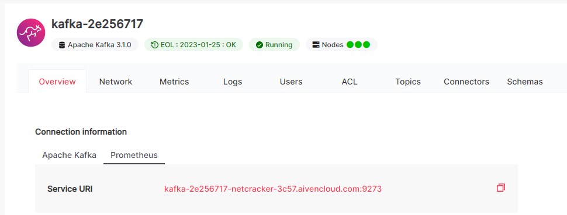

[[_TOC_]]

# Introduction

Kafka Service chart allows you to deploy Kafka side services (AKHQ, Monitoring, Backup Daemon) without deploying Kafka,
using Aiven for Apache Kafka bootstrap servers.

# Prerequisites

## Global

* External Kafka bootstrap servers are available from Kubernetes cluster where you are going to deploy side services.
* Monitoring services and Prometheus-operator should be pre-installed.

## Preparations for Monitoring

To monitor Aiven Kafka you need to perform the following steps before deploy:

1. Enable Prometheus on Aiven project:

   * Follow the [Aiven Prometheus guide](https://developer.aiven.io/docs/platform/howto/integrations/prometheus-metrics.html) 
     to enable metrics collecting.
   
   
   * Check that monitoring endpoints are available from EKS cluster. For example:

    ```bash
    curl -k -u prometheus_:prometheus_ https://kafka-2e256717-qubership-3c57.aivencloud.com:9273/metrics
    ```

2. Configure Prometheus scrappers for Kafka exporters:

    * Navigate to `monitoring` namespace in EKS.
    * Find scrape-config secret:
       * `additional-scrape-config` if Prometheus is used.
       * `vm-additional-scrape-config` if VictoriaMetrics is used.
    * Edit the secret and add the section with information about Kafka monitoring endpoints.
    For example:

    ```yaml
    - job_name: kafka-exporter
      honor_timestamps: true
      scrape_interval: 60s
      scrape_timeout: 20s
      metrics_path: /metrics
      scheme: https
      basic_auth:
        username: prometheus_
        password: prometheus_
      dns_sd_configs:
        - names:
            - kafka-2e256717-qubership-3c57.aivencloud.com
          type: A
          port: 9273
      tls_config:
        insecure_skip_verify: true
      metric_relabel_configs:
        - source_labels: [__name__]
          regex: 'kafka_(\w+)_(\w+)_(\w+)_(\w+)'
          target_label: "name"
          replacement: "$3"
        - source_labels: [__name__]
          regex: 'kafka_controller_KafkaController_([0-9A-Za-z]+)_Value'
          target_label: '__name__'
          replacement: 'kafka_controller_KafkaController_Value'
        - source_labels: [__name__]
          regex: 'kafka_server_KafkaServer_([0-9A-Za-z]+)_Value'
          target_label: '__name__'
          replacement: 'kafka_server_KafkaServer_Value'
        - source_labels: [__name__]
          regex: 'kafka_controller_ControllerStats_([0-9A-Za-z]+)_Count'
          target_label: '__name__'
          replacement: 'kafka_controller_ControllerStats_Count'
        - source_labels: [__name__]
          regex: 'kafka_controller_ControllerChannelManager_([0-9A-Za-z]+)_Value'
          target_label: '__name__'
          replacement: 'kafka_controller_ControllerChannelManager_Value'
        - source_labels: [__name__]
          regex: 'kafka_controller_ControllerEventManager_([0-9A-Za-z]+)_Count'
          target_label: '__name__'
          replacement: 'kafka_controller_ControllerEventManager_Count_total'
        - source_labels: [__name__]
          regex: 'kafka_controller_ControllerEventManager_([0-9A-Za-z]+)_Value'
          target_label: '__name__'
          replacement: 'kafka_controller_ControllerEventManager_Value'
        - source_labels: [__name__]
          regex: 'kafka_server_KafkaServer_([0-9A-Za-z]+)_Count'
          target_label: '__name__'
          replacement: 'kafka_controller_KafkaServer_Count'
        - source_labels: [__name__]
          regex: 'kafka_server_BrokerTopicMetrics_([0-9A-Za-z]+)_Count'
          target_label: '__name__'
          replacement: 'kafka_server_BrokerTopicMetrics_Count_total'
        - source_labels: [__name__]
          regex: 'kafka_server_ReplicaManager_([0-9A-Za-z]+)_Count'
          target_label: '__name__'
          replacement: 'kafka_server_ReplicaManager_Count_total'
        - source_labels: [__name__]
          regex: 'kafka_server_ReplicaManager_([0-9A-Za-z]+)_Value'
          target_label: '__name__'
          replacement: 'kafka_server_ReplicaManager_Value'
        - source_labels: [__name__]
          regex: 'kafka_network_RequestChannel_([0-9A-Za-z]+)_Value'
          target_label: '__name__'
          replacement: 'kafka_network_RequestChannel_Value'
        - source_labels: [__name__]
          regex: 'kafka_log_Log_([0-9A-Za-z]+)_Value'
          target_label: '__name__'
          replacement: 'kafka_log_Log_Value'
        - source_labels: [__name__]
          regex: 'java_lang_Memory_used'
          target_label: '__name__'
          replacement: 'java_Memory_HeapMemoryUsage_used'
        - source_labels: [__name__]
          regex: 'java_lang_Memory_max'
          target_label: '__name__'
          replacement: 'java_Memory_HeapMemoryUsage_max'
        - source_labels: [__name__]
          regex: 'java_lang_GarbageCollector_G1_Young_Generation_CollectionCount'
          target_label: 'name'
          replacement: 'G1 Young Generation'
        - source_labels: [__name__]
          regex: 'java_lang_GarbageCollector_G1_Young_Generation_CollectionCount'
          target_label: '__name__'
          replacement: 'java_GarbageCollector_CollectionCount_total'
        - source_labels: [__name__]
          regex: 'java_lang_GarbageCollector_G1_Young_Generation_CollectionTime'
          target_label: 'name'
          replacement: 'G1 Young Generation'
        - source_labels: [__name__]
          regex: 'java_lang_GarbageCollector_G1_Young_Generation_CollectionTime'
          target_label: '__name__'
          replacement: 'java_GarbageCollector_CollectionTime_total'
        - source_labels: [__name__]
          regex: 'kafka_server_group_coordinator_metrics_group_completed_rebalance_count'
          target_label: 'name'
          replacement: 'NumGroupsCompletingRebalance'
        - source_labels: [__name__]
          regex: 'kafka_server_group_coordinator_metrics_group_completed_rebalance_count'
          target_label: '__name__'
          replacement: 'kafka_coordinator_group_GroupMetadataManager_Value'
        - source_labels: [service]
          target_label: "cluster"
        - source_labels: [host]
          target_label: "broker"
        - source_labels: [host]
          target_label: "service"
        - target_label: "namespace"
          replacement: "kafka-aiven"    
    ```
    
    **Note:** Value of `job_name` and names of labels in `static_configs` are required and cannot be changed.
    
    **Pay attention**: This is an example, do not copy it as-is for your deployment. You need to change basic_auth,
     dns_sd_configs and namespace label for your specific configuration.

    * Save changes and make sure new targets have appeared in Prometheus or VictoriaMetrics.

## SSL

To configure interaction between Aiven Kafka and side services (AKHQ, Monitoring, Backup Daemon) you need to create
secret with certificates specified in Aiven Kafka connection information.

1. If Aiven Kafka doesn't use `SASL`, secret with the following content should be created:

    ```yaml
    kind: Secret
    apiVersion: v1
    metadata:
      name: ${SECRET_NAME}
      namespace: ${NAMESPACE}
    data:
      ca.crt: ${ROOT_CA_CERTIFICATE}
      tls.crt: ${CERTIFICATE}
      tls.key: ${PRIVATE_KEY}
    type: kubernetes.io/tls
    ```

    Where:
     * `${SECRET_NAME}` is the name of secret that contains all certificates. For example, `kafka-tls-secret`.
     * `${NAMESPACE}` is the namespace where the secret should be created. For example, `kafka-service`.
     * `${ROOT_CA_CERTIFICATE}` is the certificate in BASE64 format that is taken from `CA Certificate` field in Aiven Kafka connection 
       information.
     * `${CERTIFICATE}` is the certificate in BASE64 format that is taken from `Access Certificate` field in Aiven Kafka connection
       information.
     * `${PRIVATE_KEY}` is the private key in BASE64 format that is taken from `Access Key` field in Aiven Kafka connection information.

2. If Aiven Kafka uses `SASL`, secret with the following content should be created:

    ```yaml
    kind: Secret
    apiVersion: v1
    metadata:
      name: ${SECRET_NAME}
      namespace: ${NAMESPACE}
    data:
      ca.crt: ${ROOT_CA_CERTIFICATE}
    type: Opaque
    
    ```

    Where:
     * `${SECRET_NAME}` is the name of secret that contains all certificates. For example, `kafka-tls-secret`.
     * `${NAMESPACE}` is the namespace where the secret should be created. For example, `kafka-service`.
     * `${ROOT_CA_CERTIFICATE}` is the certificate in BASE64 format that is taken from `CA Certificate` field
       in Aiven Kafka connection information.

# Example of Deploy Parameters

Example of deployment parameters for external Aiven for Apache Kafka is presented below:

```yaml
global:
  name: kafka

  externalKafka:
    enabled: true
    bootstrapServers: "kafka-26d21ee2-qubership-3c57.aivencloud.com:21170"
    saslMechanism: ""
    enableSsl: true
    sslSecretName: "kafka-tls-secret"
    username: ""
    password: ""
  secrets:
    akhq:
      defaultUsername: "admin"
      defaultPassword: "admin"
    backupDaemon:
      username: "admin"
      password: "admin"
operator:
  replicas: 1
  kmmConfiguratorEnabled: false
kafka:
  install: false
monitoring:
  install: true
  kafkaTotalBrokerCount: 1
  securityContext: {
    "runAsUser": 1000
  }
  resources:
    requests:
      memory: 128Mi
      cpu: 50m
    limits:
      memory: 256Mi
      cpu: 200m
  lagExporter:
    enabled: true
    pollIntervalSeconds: 30
    cluster:
      name: "kafka"
      topicWhitelist:
        - ".*"
      groupWhitelist:
        - ".*"
akhq:
  install: true
  ingress:
    host: akhq-kafka-service.test.example.com
  securityContext: {
    "runAsUser": 1000
  }
  resources:
    requests:
      memory: 400Mi
      cpu: 50m
    limits:
      memory: 500Mi
      cpu: 300m
backupDaemon:
  install: true
  storageClass: current-storage
  backupSchedule: "0 0 * * *"
  evictionPolicy: "0/1d,7d/delete"
  resources:
    requests:
      memory: 64Mi
      cpu: 25m
    limits:
      memory: 256Mi
      cpu: 200m
```

**NOTE:** This is an example, do not copy it as-is for your deployment, be sure about each parameter in your installation.

# Aiven Kafka Features

## Monitoring

Aiven Kafka provides less information about its metrics, thus a lot of `Kafka Monitoring` dashboard panels are not applicable for it.
More information in [Monitoring](../monitoring.md).
