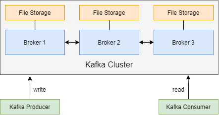
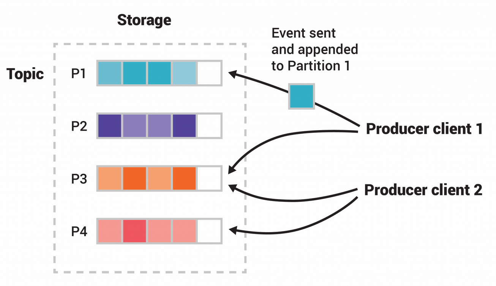

Kafka combines three key capabilities, so you can implement your use cases for event streaming end-to-end with a single battle-tested
solution:

* To **publish** (write) and **subscribe to** (read) streams of events, including continuous import/export of your data from other systems.
* To **store** streams of events durably and reliably for as long as you want.
* To **process** streams of events as they occur or retrospectively.

All this functionality is provided in a distributed, highly scalable, elastic, fault-tolerant, and secure manner.

# Kafka Architecture

Kafka is a distributed system consisting of **servers** and **clients** that communicate via a high-performance TCP network protocol. 
You can deploy it on bare-metal hardware, virtual machines, and containers in on premise as well as cloud environments.

**Servers** - Kafka is run as a cluster of one or more servers that can span multiple datacenters or cloud regions.
Servers form the storage layer called the **brokers**.

**Clients** - Clients allow you to write distributed applications and microservices that read, write, and process streams of events in
parallel, at scale, and in a fault-tolerant manner even in case of network problems or machine failures. 
Kafka ships with some such clients included. Dozens of clients provided by the Kafka community augment these clients.
Clients are available for Java and Scala including the higher-level Kafka Streams library, for Go, Python, C/C++, and
many other programming languages.

The Kafka Architecture overview is shown in the image below.

# Main Concepts and Terminology

An **event** records the fact that something happened in the world or in your business.
Also called record or message in the documentation. When you read or write data to Kafka, you do this in the form of events.
An example event is as follows:

* Event key: "Alice"
* Event value: "Made a payment of $200 to Bob"
* Event timestamp: "Jun. 25, 2020 at 2:06 p.m."

**Producers** are those client applications that publish or write events to Kafka, and consumers are those that subscribe to read and
process these events.
In Kafka, producers and consumers are fully decoupled and agnostic of each other,
which is a key design element to achieve the high scalability. 
For example, producers never need to wait for consumers.
Kafka provides various guarantees such as the ability to process events exactly-once.

Events are organized and durably stored in **topics**. 
A topic is similar to a folder in a filesystem, and the events are the files in that folder. 
An example topic name could be "payments". Topics in Kafka are always multi-producer and multi-subscriber. 
A topic can have zero, one, or many producers that write events to it, as well as zero, one, 
or many consumers that subscribe to these events. 
You can read the events in a topic as often as required.
Unlike the traditional messaging systems, events are not deleted after consumption. 
Instead, you can define for how long Kafka should retain your events through a per-topic configuration setting, 
after which old events are discarded. 
Kafka's performance is effectively constant with respect to data size, so storing data for a long time is perfectly fine.

Topics are **partitioned**, meaning a topic is spread over a number of buckets located on different Kafka brokers. 
This distributed placement of your data is very important for scalability because it allows client applications to both read and write
the data from/to many brokers at the same time.
When a new event is published to a topic, it is actually appended to one of the topic's partitions. Events with the same event key,
for example a customer or vehicle ID, are written to the same partition, and Kafka guarantees that any consumer of a given topic-partition 
always reads that partition's events in exactly the same order as they were written.

An example of topic with partitions is shown in the image below.

The above example topic has four partitions P1–P4. Two different producer clients are publishing, independently of each other, new events to
the topic by writing events over the network to the topic's partitions.
Events with the same key denoted by their color in the figure are written to the same partition.

Both producers can write to the same partition if appropriate.

# Kafka APIs

In addition to command line tooling for management and administration tasks, Kafka has the following core APIs for Java and Scala:

* The Admin API, [https://kafka.apache.org/documentation.html#adminapi](https://kafka.apache.org/documentation.html#adminapi) 
  to manage and inspect topics, brokers, and other Kafka objects.
* The Producer API, [https://kafka.apache.org/documentation.html#producerapi](https://kafka.apache.org/documentation.html#producerapi) 
  to publish (write) a stream of events to one or more Kafka topics.
* The Consumer API, [https://kafka.apache.org/documentation.html#consumerapi](https://kafka.apache.org/documentation.html#consumerapi)
  to subscribe to (read) one or more topics and to process the stream of events produced to them.
* The Kafka Streams API, [https://kafka.apache.org/documentation/streams](https://kafka.apache.org/documentation/streams)
  to implement stream processing applications and microservices.
